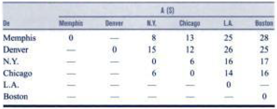

<div style="text-align: justify">
<br>
<br>


```{r setup, include = FALSE}
knitr::opts_chunk$set(echo = TRUE)
knitr::opts_chunk$set(warning = FALSE)
```

# EJERCICIO 1.
_PowerCo_ tiene tres centrales eléctricas que cubren las necesidades de cuatro ciudades. Cada central suministra los siguientes kilowatts-hora (kWh) de electricidad: **Planta 1 -** $35$ millones, **Planta 2 -** $50$ millones, **Planta 3 -** $40$ millones. Las demandas de potencia máxima en las ciudades, que ocurren al mismo tiempo ($2$ p.m.), son las siguientes (en kWh): **Ciudad 1 -** $40$ millones, **Ciudad 2 -** $20$ millones, **Ciudad 3 -** $30$ millones, **Ciudad 4 -** $30$ millones. Los costos por enviar un millon de kWh de electricidad desde cada planta a cada cuidad, dependen de la distancia que debe viajar la electricidad, y son los siguientes: $\$8$ desde la Planta 1 a la Ciudad 1, $\$6$ hacia la Ciudad 2, $\$10$ hacia la Ciudad 3 y $\$9$ hacia la Ciudad 4; $\$9$ desde la Planta 2 hacia la Ciudad 1, $\$12$ hasta la Ciudad 2, $\$13$ hasta la Ciudad 3, y $\$7$ hasta la Ciudad 4; finalmente, desde la Planta 3 hasta cada una de las cuatro ciudades son respectivamente $\$14$, $\$9$, $\$16$ y $\$5$.

(a) Formule un problema de Programación Lineal equilibrado para minimizar el costo de satisfacer la demanda de potencia máxima de electricidad de cada ciudad.
(b) Encuentre una solución factible inicial para el problema.
(c) Interprete los resultados óptimos obtenidos.


## SOLUCIÓN.
En este caso, debido a que la demanda disminuyó en una de las ciudades, nos enfrentamos a un problema de transporte que no está equilibrado. Por lo tanto, debemos equilibrarlo. Para esto, es necesario incluir un punto de demanda ficticio, que demande los $5$ millones de kWh de capacidad sin uso. En efecto, el problema queda formulado ahora así:

**Definición de las variables de decisión.** Sean las siguientes las variables de decisión del problema:
$$
\begin{array}{ll}
x_{11} : \text{millones de kWh producidos por la planta 1, enviados a la ciudad 1.} \\ 
x_{12} : \text{millones de kWh producidos por la planta 1, enviados a la ciudad 2.} \\  
x_{13} : \text{millones de kWh producidos por la planta 1, enviados a la ciudad 3.} \\  
x_{14} : \text{millones de kWh producidos por la planta 1, enviados a la ciudad 4.} \\
x_{15} : \text{millones de kWh producidos por la planta 1, enviados a la ciudad 5 (ficticia).} \\
x_{21} : \text{millones de kWh producidos por la planta 2, enviados a la ciudad 1.} \\  
x_{22} : \text{millones de kWh producidos por la planta 2, enviados a la ciudad 2.} \\  
x_{23} : \text{millones de kWh producidos por la planta 2, enviados a la ciudad 3.} \\  
x_{24} : \text{millones de kWh producidos por la planta 2, enviados a la ciudad 4.} \\ 
x_{25} : \text{millones de kWh producidos por la planta 2, enviados a la ciudad 5 (ficticia).} \\
x_{31} : \text{millones de kWh producidos por la planta 3, enviados a la ciudad 1.} \\ 
x_{32} : \text{millones de kWh producidos por la planta 3, enviados a la ciudad 2.} \\ 
x_{33} : \text{millones de kWh producidos por la planta 3, enviados a la ciudad 3.} \\ 
x_{34} : \text{millones de kWh producidos por la planta 3, enviados a la ciudad 4.} \\
x_{35} : \text{millones de kWh producidos por la planta 3, enviados a la ciudad 5 (ficticia).}
\end{array}
$$

De manera resumida podemos definir las 15 variables anteriores mediante una sola expresión. En efecto, para $i = 1, 2, 3$ y $j = 1, 2, 3, 4, 5$, sea:
$$
 x_{ij} : \text{millones de kWh producidos por la planta} \ i, \ \text{enviados a la ciudad} \ j.
$$

<br>

**Modelo matemático completo.** En base a la definición anterior para las variables de decisión, y a la información entregada, matemáticamente el modelo de Programación Lineal a resolver es el siguiente: 
$$
\begin{array}{ll}
\min Z = \ \ 8x_{11} + \ \ 6x_{12} + 10x_{13} + 9x_{14} + 0x_{15} \\
\ \ \ \ \ \ \ \ \ \ + \ \ 9x_{21} + 12x_{22} + 13x_{23} + 7x_{24} + 0x_{25}   \\
 \ \ \ \ \ \ \ \ \ \ + 14x_{31} + \ \ 9x_{32} + 16x_{33} + 5x_{34} + 0x_{35}  \\
\text{S.A.} \\
\ \ \ \ \ \ \ \ \ \ \ x_{11} + x_{12} + x_{13} + x_{14} + x_{15} = 35 \ \text{(suministro planta 1).} \\     
\ \ \ \ \ \ \ \ \ \ \ x_{21} + x_{22} + x_{23} + x_{24} + x_{25} = 50 \ \text{(suministro planta 2).} \\    
\ \ \ \ \ \ \ \ \ \ \ x_{31} + x_{32} + x_{33} + x_{34} + x_{35} = 40 \ \text{(suministro planta 3).} \\    
\ \ \ \ \ \ \ \ \ \ \ x_{11} + x_{21} + x_{31} \ \ \ \ \ \ \ \ \ \ \ \ \ \ \ \ \ \ \ \ = 40 \ \text{(demanda ciudad 1).} \\    
\ \ \ \ \ \ \ \ \ \ \ x_{12} + x_{22} + x_{32} \ \ \ \ \ \ \ \ \ \ \ \ \ \ \ \ \ \ \ \ = 20 \ \text{(demanda ciudad 2).} \\    
\ \ \ \ \ \ \ \ \ \ \ x_{13} + x_{23} + x_{33} \ \ \ \ \ \ \ \ \ \ \ \ \ \ \ \ \ \ \ \ = 30 \ \text{(demanda ciudad 3).} \\    
\ \ \ \ \ \ \ \ \ \ \ x_{14} + x_{24} + x_{34} \ \ \ \ \ \ \ \ \ \ \ \ \ \ \ \ \ \ \ \ = 30 \ \text{(demanda ciudad 4).} \\ 
\ \ \ \ \ \ \ \ \ \ \ x_{15} + x_{25} + x_{35} \ \ \ \ \ \ \ \ \ \ \ \ \ \ \ \ \ \ \ \ = \ \ 5 \ \text{(demanda ciudad ficticia 5).} \\
\ \ \ \ \ \ \ \ \ \ \ \ \ \ \ \ \ \ \ \ \ \ \ \ \ \ \ \ \ \ \ \ \ \ \ \ \ \ \ \ \ \ \ \ \ \ \ \ \ \ \ \  x_{ij} \geq \ \ 0 \ \text{(no negatividad de las variables).}
\end{array}
$$

<br>

**Transcribimos el modelo anterior a R.** 

* Matriz de costos
```{r}
cost_mat_1 <- matrix(c( 8,  6, 10, 9, 0,
                        9, 12, 13, 7, 0,
                       14,  9, 16, 5, 0), ncol = 5, byrow = TRUE)

cost_mat_1
```

* Direccion de las desigualdades de las restricciones para las filas (oferta)
```{r}
row_constr_signs_1 <- c("==", "==", "==")

row_constr_signs_1
```

* Coeficientes de las restricciones para las filas (oferta)
```{r}
row_rhs_1 <- c(35, 50, 40)

row_rhs_1
```

* Direccion de las desigualdades de las restricciones para las columnas (demanda)
```{r}
col_constr_signs_1 <- c("==", "==", "==", "==", "==")

col_constr_signs_1
```

* Coeficientes de las restricciones para las columnas (demanda)
```{r}
col_rhs_1 <- c(40, 20, 30, 30, 5)

col_rhs_1
```

<br>

**Resolvemos.** 
```{r}
#install.packages("lpSolve")
#library(lpSolve)

solucion_1 <- lp.transport(cost.mat = cost_mat_1,
                           direction = "min",
                           row.signs = row_constr_signs_1,
                           row.rhs = row_rhs_1,
                           col.signs = col_constr_signs_1,
                           col.rhs = col_rhs_1, 
                           presolve = 0)

solucion_1$solution
```

<br>

**Valores óptimos para las variables de decisión.** (Plan optimo de distribución)

* millones de kWh producidos por la planta 1 son transportados a la ciudad 2.  

$$x_{12} = 10$$

* millones de kWh producidos por la planta 1 son transportados a la ciudad 3.  

$$x_{13} = 25$$

* millones de kWh producidos por la planta 2 son transportados a la ciudad 1.  

$$x_{21} = 40$$

* millones de kWh producidos por la planta 2 son transportados a la ciudad 3.  

$$x_{23} = 5$$

* millones de kWh producidos por la planta 2 son transportados a la ciudad 5.  

$$x_{25} = 5$$

* millones de kWh producidos por la planta 3 son transportados a la ciudad 2.  

$$x_{32} = 10$$

* millones de kWh producidos por la planta 3 son transportados a la ciudad 4.  

$$x_{34} = 30$$

<br>

**Costo mínimo asociado al plan de transporte.**
```{r}
solucion_1
```

$$Z^* = \$975$$

Notar que debido a que $x_{25} = 5$, se tiene que hay $5$ millones de kWh de capacidad de la planta 2 que no se usan. Tanto las capacidades de las otras dos plantas, como las demandas de las cuatro ciudades reales, son completamente satisfechas.

<br>

# EJERCICIO 2.
Uno de los productos más importantes de la _P & T COMPANY_ es el chícharo enlatado. Los chícharos se preparan en tres enlatadoras: Bellingham, Eugene, y Albert Lea, y después se envían por camión a cuatro almacenes de distribución: Sacramento, Salt Lake City, Rapid City, y Albuquerque.
Debido a que los costos de embarque constituyen un gasto importante, la administración ha iniciado un estudio para reducirlos a su mínima expresión. Se ha estimado la producción de cada enlatadora durante la próxima temporada y se ha asignado a cada almacén cierta cantidad de la producción total de chícharos.
En la tabla se proporciona esta información —en unidades de carga de camión—, junto con el costo de transporte por camión cargado de cada combinación de enlatadora-almacén. Como se ve, hay un total de $300$ cargas de camión que se deben transportar.

<br>
<center>

{height="300px" width="500px"}

</center>
<br>

El problema es determinar el plan de estos embarques a las distintas combinaciones de enlatadora-almacén que minimice el costo total de transporte.

## SOLUCIÓN.
**Definición de las variables de decisión.** Sean las siguientes las variables de decisión del problema:
$$
\begin{array}{ll}
x_{11} : \text{cantidad de camiones cargados desde enlatadora 1, enviados a almacén 1.} \\ 
x_{12} : \text{cantidad de camiones cargados desde enlatadora 1, enviados a almacén 2.} \\  
x_{13} : \text{cantidad de camiones cargados desde enlatadora 1, enviados a almacén 3.} \\  
x_{14} : \text{cantidad de camiones cargados desde enlatadora 1, enviados a almacén 4.} \\
x_{21} : \text{cantidad de camiones cargados desde enlatadora 2, enviados a almacén 1.} \\
x_{22} : \text{cantidad de camiones cargados desde enlatadora 2, enviados a almacén 2.} \\  
x_{23} : \text{cantidad de camiones cargados desde enlatadora 2, enviados a almacén 3.} \\  
x_{24} : \text{cantidad de camiones cargados desde enlatadora 2, enviados a almacén 4.} \\  
x_{31} : \text{cantidad de camiones cargados desde enlatadora 3, enviados a almacén 1.} \\ 
x_{32} : \text{cantidad de camiones cargados desde enlatadora 3, enviados a almacén 2.} \\
x_{33} : \text{cantidad de camiones cargados desde enlatadora 3, enviados a almacén 3.} \\ 
x_{34} : \text{cantidad de camiones cargados desde enlatadora 3, enviados a almacén 4.}
\end{array}
$$

De manera resumida podemos definir las 12 variables anteriores mediante una sola expresión. En efecto, para $i = 1, 2, 3$ y $j = 1, 2, 3, 4$, sea:
$$
 x_{ij} : \text{cantidad de camiones cargados desde enlatadora} \ i, \ \text{enviados a almacén} \ j.
$$

<br>

**Modelo matemático completo.** En base a la definición anterior para las variables de decisión, y a la información entregada, matemáticamente el modelo de Programación Lineal a resolver es el siguiente: 
$$
\begin{array}{ll}
\min Z = \ \ 464x_{11} + 513x_{12} + 654x_{13} + 867x_{14} \\
\ \ \ \ \ \ \ \ \ \ \ \ \ + 352x_{21} + 416x_{22} + 690x_{23} + 791x_{24}   \\
\ \ \ \ \ \ \ \ \ \ \ \ \ + 995x_{31} + 682x_{32} + 388x_{33} + 685x_{34}  \\
\text{S.A.} \\
\ \ \ \ \ \ \ \ \ \ \ x_{11} + x_{12} + x_{13} + x_{14} = \ \ 75 \ \text{(producción enlatadora 1).} \\     
\ \ \ \ \ \ \ \ \ \ \ x_{21} + x_{22} + x_{23} + x_{24} = 125 \ \text{(producción enlatadora 2).} \\    
\ \ \ \ \ \ \ \ \ \ \ x_{31} + x_{32} + x_{33} + x_{34} = 100 \ \text{(producción enlatadora 3).} \\    
\ \ \ \ \ \ \ \ \ \ \ x_{11} + x_{21} + x_{31} \ \ \ \ \ \ \ \ \ \ = \ \ 80 \ \text{(demanda almacén 1).} \\    
\ \ \ \ \ \ \ \ \ \ \ x_{12} + x_{22} + x_{32} \ \ \ \ \ \ \ \ \ \ = \ \ 65 \ \text{(demanda almacén 2).} \\    
\ \ \ \ \ \ \ \ \ \ \ x_{13} + x_{23} + x_{33} \ \ \ \ \ \ \ \ \ \ = \ \ 70 \ \text{(demanda almacén 3).} \\    
\ \ \ \ \ \ \ \ \ \ \ x_{14} + x_{24} + x_{34} \ \ \ \ \ \ \ \ \ \ = \ \ 85 \ \text{(demanda almacén 4).} \\
\ \ \ \ \ \ \ \ \ \ \ \ \ \ \ \ \ \ \ \ \ \ \ \ \ \ \ \ \ \ \ \ \ \ \ \ \ \ \ \ \ \ x_{ij} \geq \ \ 0 \ \text{(no negatividad de las variables).}
\end{array}
$$

<br>

**Transcribimos el modelo anterior a R.** 

* Matriz de costos
```{r}
cost_mat_2 <- matrix(c(464, 513, 654, 867,
                       352, 416, 690, 791,
                       995, 682, 388, 685), 
                     ncol = 4, 
                     byrow = TRUE)

cost_mat_2
```

* Direccion de las desigualdades de las restricciones para las filas (oferta)
```{r}
row_constr_signs_2 <- c("==", "==", "==")

row_constr_signs_2
```

* Coeficientes de las restricciones para las filas (oferta)
```{r}
row_rhs_2 <- c(75, 125, 100)

row_rhs_2
```

* Direccion de las desigualdades de las restricciones para las columnas (demanda)
```{r}
col_constr_signs_2 <- c("==", "==", "==", "==")

col_constr_signs_2
```

* Coeficientes de las restricciones para las columnas (demanda)
```{r}
col_rhs_2 <- c(80, 65, 70, 85)

col_rhs_2
```

<br>

**Resolvemos.** 
```{r}
#install.packages("lpSolve")
#library(lpSolve)

solucion_2 <- lp.transport(cost.mat = cost_mat_2,
                           direction = "min",
                           row.signs = row_constr_signs_2,
                           row.rhs = row_rhs_2,
                           col.signs = col_constr_signs_2,
                           col.rhs = col_rhs_2, 
                           presolve = 0)

solucion_2$solution
```

<br>

**Valores óptimos para las variables de decisión.** (Plan optimo de transporte)

* cantidad de camiones cargados desde enlatadora 1, enviados a almacén 2.  

$$x_{12} = 20$$

* cantidad de camiones cargados desde enlatadora 1, enviados a almacén 4.  

$$x_{14} = 55$$

* cantidad de camiones cargados desde enlatadora 2, enviados a almacén 1.  

$$x_{21} = 80$$

* cantidad de camiones cargados desde enlatadora 2, enviados a almacén 2.  

$$x_{22} = 45$$

* cantidad de camiones cargados desde enlatadora 3, enviados a almacén 3.  

$$x_{33} = 70$$

* cantidad de camiones cargados desde enlatadora 3, enviados a almacén 4.  

$$x_{34} = 30$$

<br>

**Costo mínimo asociado al plan de transporte.**
```{r}
solucion_2
```

$$Z^* = \$152535$$

<br>

# EJERCICIO 3. 
La JOB SHOP COMPANY compró tres máquinas nuevas de diferentes tipos. Existen cuatro sitios disponibles dentro del taller en donde se podría instalar una máquina. Algunos de ellos son más adecuados que otros para ciertas máquinas en particular por su cercanía a los centros de trabajo que tendrían un flujo intenso de trabajo hacia y desde estas máquinas. (No habrá flujo de trabajos entre las nuevas máquinas). Por tanto, el objetivo es asignar las nuevas máquinas a los lugares disponibles de manera que se minimice el costo total del manejo de materiales. En la tabla se proporciona el costo estimado por unidad de tiempo del manejo de los materiales en cuestión, con cada una de las máquinas en los sitios respectivos. El lugar 2 no se considera adecuado para la máquina 2 por lo que no se proporciona un costo para este caso.

<br>
<center>

{height="300px" width="500px"}

</center>
<br>

**(a)** Formule correctamente este problema de asignación, definiendo las variables de decisión, la función objetivo y las restricciones.

**(b)** Encuentre el plan óptimo de asignación de cada planta, que minimiza los costos.

**(c)** Interprete los resultados.

## SOLUCIÓN.

* Definición de variables de decisión (se agrega una máquina ficticia para equilibrar el problema ya que hay más localidades que máquinas disponibles)

$$x_{ij}: \text{máquina i asignada al lugar j,} \ \ \ \text{con} \ \ i = 1, 2, 3, 4 \ \  \text{y} \ \ j = 1, 2, 3, 4$$

* Función objetivo (se asigna un costo muy grande $M$ a la asignación de la máquina $2$ en el lugar $2$)

$$
\begin{array}{ll}
\min Z = 13x_{11} + 16x_{12} + 12x_{13} + 11x_{14}  \\
\ \ \ \ \ \ \ \ \ \ \ + 15x_{21} + Mx_{22} + 13x_{23} + 20x_{24}   \\ 
\ \ \ \ \ \ \ \ \ \ \ + \ \ 5x_{31} + \ \ 7x_{32} + 10x_{33} + \ \ 6x_{34}  \\
\ \ \ \ \ \ \ \ \ \ \ + \ \ 0x_{41} + \ \ 0x_{42} + \ \ 0x_{43} + \ \ 0x_{44} \\
\text{S.A.} \\
\ \ \ \ \ \ \ \ \ \ \ x_{11} + x_{12} + x_{13} + x_{14} = 1  \\
\ \ \ \ \ \ \ \ \ \ \ x_{21} + x_{22} + x_{23} + x_{24} = 1  \\
\ \ \ \ \ \ \ \ \ \ \ x_{31} + x_{32} + x_{33} + x_{34} = 1  \\
\ \ \ \ \ \ \ \ \ \ \ x_{41} + x_{42} + x_{43} + x_{44} = 1  \\
\ \ \ \ \ \ \ \ \ \ \ x_{11} + x_{21} + x_{31} + x_{41} = 1  \\
\ \ \ \ \ \ \ \ \ \ \ x_{12} + x_{22} + x_{32} + x_{42} = 1  \\
\ \ \ \ \ \ \ \ \ \ \ x_{13} + x_{23} + x_{33} + x_{43} = 1  \\
\ \ \ \ \ \ \ \ \ \ \ x_{14} + x_{24} + x_{34} + x_{44} = 1
\end{array}
$$


* Matriz de costos (el costo de asignar la máquina 2 al lugar 2 es muy grande, se fija en $1.000$, para evitar esa asignación que no es factible en la realidad)

```{r}
cost_mat_3 <- matrix(c(13,   16, 12, 11,
                       15, 1000, 13, 20,
                        5,    7, 10,  6,
                        0,    0,  0,  0), 
                     ncol = 4, 
                     byrow = TRUE)
cost_mat_3
```


* Plan optimo de produccion.

```{r}
solucion_3 <- lp.assign (cost.mat = cost_mat_3, 
                         direction = "min", 
                         presolve = 0, 
                         compute.sens = 0)


solucion_3["solution"]
```


* Valores optimos para las variables de decision

 
   * la máquina 1 se asigna al lugar 4.
   
   $$x_{14} = 1$$


   * la máquina 2 se asigna al lugar 3.
   
   $$x_{23} = 1$$

   * la máquina 3 se asigna al lugar 1.
   
   $$x_{31} = 1$$


   * la máquina 4 (ficticia) se asigna al lugar 2. Esta posición queda entonces disponible para alguna asignación de máquina real futura.
   
   $$x_{42} = 1$$


* El costo minimo de asignacion de máquinas es: 


```{r}
solucion_3
```

  $$Z^* = 29\ \ \text{pesos/hora}$$
 
<br>
  
# EJERCICIO 4.
La BETTER PRODUCTS COMPANY ha decidido iniciar la fabricación de cuatro nuevos productos en tres plantas que por el momento tienen exceso de capacidad de producción. Los productos requieren de un esfuerzo productivo comparable por unidad, por lo que la capacidad de producción disponible en las plantas se mide por el número de unidades de cualquier producto que se pueden fabricar por día, como se muestra en la última columna de la tabla.

<br>
<center>

{height="300px" width="500px"}

</center>
<br>

El último renglón muestra la producción diaria que se requiere para satisfacer las ventas proyectadas. Cada planta puede producir cualquiera de estos productos, excepto la planta $2$ que no puede fabricar el producto $3$. Sin embargo, el costo variable por unidad de cada producto difiere entre una planta y otra, como se muestra en el cuerpo principal de la tabla. La administración necesita tomar la decisión de cómo dividir la producción entre las plantas, y para esto, decide no permitir la separación de productos, de tal manera que el solo producto se pueda fabricar en una planta.


**(a)** Formule correctamente este problema de asignación, definiendo las variables de decisión, la función objetivo y las restricciones.

**(b)** Encuentre el plan óptimo de asignación de cada planta, que minimiza los costos.

**(c)** Interprete los resultados.

## SOLUCIÓN.

Al no poder separarse los productos, cada uno de éstos debe asignarse a una sola planta. Entonces, la fabricación de productos se puede interpretar como las tareas en un problema de asignación y las plantas como los asignados. La administración ha especificado que debe asignarse al menos uno de los productos a cada planta. Se debe elaborar más productos (cuatro) que plantas (tres), por lo que se tendrá que asignar dos productos a una de las plantas. La planta $3$ tiene apenas la capacidad adicional para fabricar un producto (vea la tabla de la figura 2), por lo que la planta $1$ o bien la $2$ fabricará el otro producto. Para hacer posible la asignación de este producto adicional dentro de la formulación de un problema de asignación, las plantas $1$ y $2$ se dividen en dos asignados cada una, como se muestra en la siguiente tabla.

<br>
<center>

{height="300px" width="500px"}

</center>
<br>


* Definición de variables de decisión (se agrega una producto ficticio para equilibrar el problema ya que habrían más plantas que máquinas)

$$x_{ij}: \text{planta i produce producto j,} \ \ \ \text{con} \ \ i = 1, 2, 3, 4, 5 \ \  \text{y} \ \ j = 1, 2, 3, 4, 5$$

* Función objetivo (se asignan costos muy grande $M$ a aquellas asignaciones que no están permitidas)

$$
\begin{array}{ll}
\text{min} Z = 820x_{11} + 810x_{12} + 840x_{13} + 960x_{14} + \ \ 0x_{15}  \\
\ \ \ \ \ \ \ \ \ \ + 820x_{21} + 810x_{22} + 840x_{23} + 960x_{24} + \ \ 0x_{25}    \\
\ \ \ \ \ \ \ \ \ \ + 800x_{31} + 870x_{32} + \ \ Mx_{33} + 920x_{34} + \ \ 0x_{35}  \\
\ \ \ \ \ \ \ \ \ \ + 800x_{41} + 870x_{42} + \ \ Mx_{43} + 920x_{44} + \ \ 0x_{45}  \\
\ \ \ \ \ \ \ \ \ \ + 740x_{51} + 900x_{52} + 810x_{53} + 840x_{54} + Mx_{55} \\
\text{S.A.} \\
\ \ \ \ \ \ \ \ \ \ x_{11} + x_{12} + x_{13} + x_{14} + x_{15} = 1  \\
\ \ \ \ \ \ \ \ \ \ x_{21} + x_{22} + x_{23} + x_{24} + x_{25} = 1  \\
\ \ \ \ \ \ \ \ \ \ x_{31} + x_{32} + x_{33} + x_{34} + x_{35} = 1  \\
\ \ \ \ \ \ \ \ \ \ x_{41} + x_{42} + x_{43} + x_{44} + x_{45} = 1  \\
\ \ \ \ \ \ \ \ \ \ x_{51} + x_{52} + x_{53} + x_{54} + x_{55} = 1  \\
\ \ \ \ \ \ \ \ \ \ x_{11} + x_{21} + x_{31} + x_{41} + x_{51} = 1  \\
\ \ \ \ \ \ \ \ \ \ x_{12} + x_{22} + x_{32} + x_{42} + x_{52} = 1  \\
\ \ \ \ \ \ \ \ \ \ x_{13} + x_{23} + x_{33} + x_{43} + x_{53} = 1  \\
\ \ \ \ \ \ \ \ \ \ x_{14} + x_{24} + x_{34} + x_{44} + x_{54} = 1  \\
\ \ \ \ \ \ \ \ \ \ x_{15} + x_{25} + x_{35} + x_{45} + x_{55} = 1
\end{array}
$$

* Matriz de costos (el costo de asignar la máquina 2 al lugar 2 es muy grande, se fija en $100.000$, para evitar esa asignación que no es factible en la realidad)

```{r}
cost_mat_4 <- matrix(c(820,   810,    840, 960,      0,
                       820,   810,    840, 960,      0,
                       800,   870, 100000, 920,      0,
                       800,   870, 100000, 920,      0,
                       740,   900,    810, 840, 100000), 
                     ncol = 5, 
                     byrow = TRUE)
cost_mat_4
```


* Plan optimo de produccion.

```{r}
solucion_4 <- lp.assign (cost.mat = cost_mat_4, 
                         direction = "min", 
                         presolve = 0, 
                         compute.sens = 0)


solucion_4["solution"]
```


* Valores optimos para las variables de decision

 
   * la palnta 1 fabrica los productos 2 y 3.
   
   $$x_{13} = 1, \ \ x_{22} = 1$$


   * la planta 2 fabrica el producto 1 y eel producto ficticio 5.
   
   $$x_{31} = 1, \ \ x_{45} = 1$$

   * la planta 3 fabrica el producto 4.
   
   $$x_{54} = 1$$


* El costo minimo de asignacion es: 


```{r}
solucion_4
```

  $$Z^* = 3.290\ \ \text{pesos/dia}$$

<br>

# EJERCICIO 5.
Widgetco fabrica dispositivos mecánicos en dos fábricas, una en Memphis y una en Denver. La fábrica de Memphis puede producir $150$ dispositivos por día, y la fábrica en Denver puede producir $200$ cada día.

Los dispositivos se envían por aire a clientes en Los Ángeles y Boston. Los clientes en cada ciudad requieren $130$ dispositivos por día. Debido a la desregulación de tarifas, Widgetco cree que podría ser más barato enviar primero algunos dispositivos a New York o Chicago, y luego enviarlos a sus destinos finales.

Los costos de enviar por via aérea un dispositivo se muestran en las siguientes tabla.

<br>
<center>

{height="300px" width="500px"}

</center>
<br>

Widgetco quiere minimizar el costo total de enviar los dispositivos requeridos a sus clientes.


## SOLUCIÓN.
**PASO 1.** Establecer la cantidad de reserva. La suma de demandas es $130 + 130 = 260$, mientras que la suma de ofertas es $150 + 200 = 350$. Por lo tanto la cantidad de reserva es: $R = \max \{260;350\} = 350$.

**PASO 2.** A la oferta de cada origen y la demanda de cada destino se le suma la cantidad de reserva $R = 350$. Las ofertas quedan asi: Memphys con $500$ y Denver queda con $550$; mientras que las demandas se convierten en: Los Ángeles $480$ y Boston con $480$.

**PASO 3.** Colocar todos los destinos como orígenes asignándole una oferta igual a la cantidad de reserva $R$. Al colocar los destinos (distribuidores) Los Ángeles y Boston como orígenes (plantas) quedan con una oferta de $350$ unidades.

**PASO 4.** Colocar todos los orígenes como destinos asignándole una demanda igual a la cantidad de reserva $R$. Cuando se colocan los orígenes (Plantas) Memphys y Denver como destinos (distribuidores) se les asigna una demanda de $350$ unidades.

**PASO 5.** Establecer las condiciones de equilibrio entre oferta y demanda tal como se hace en el modelo del transporte. En este caso hay más oferta que demanda, por lo que hay que agregar un destino ficticio.

<br>

**Definición de las variables de decisión.** De manera resumida podemos definir las $42$ variables anteriores mediante una sola expresión. En efecto, para $i = 1, 2, 3, 4, 5, 6$ y $j = 1, 2, 3, 4, 5, 6, 7$, sea:
$$
 x_{ij} : \text{cantidad de dispositivos enviados diariamente desde elorigen} \ i, \ \text{al destino} \ j.
$$

<br>

**Modelo matemático completo.** En base a la definición anterior para las variables de decisión, y a la información entregada, matemáticamente el modelo de Programación Lineal a resolver es el siguiente: 
$$
\begin{array}{ll}
\min Z = \ \            0x_{11} + Mx_{12} + \ \ \ 8x_{13} + 13x_{14} + 25x_{15} + 28x_{16} + 0x_{17} \\
\ \ \ \ \ \ \ \ \ \ \ + Mx_{21} + \ \ 0x_{22} + 15x_{23} + 12x_{24} + 26x_{25} + 25x_{26} + 0x_{27} \\
\ \ \ \ \ \ \ \ \ \ \ + Mx_{31} + Mx_{32} + \ \ \ 0x_{33} + \ \ 6x_{34} + 16x_{35} + 17x_{36} + 0x_{37} \\
\ \ \ \ \ \ \ \ \ \ \ + Mx_{41} + Mx_{42} + \ \ \ 6x_{43} + \ \ 0x_{44} + 14x_{45} + 16x_{46} + 0x_{47} \\
\ \ \ \ \ \ \ \ \ \ \ + Mx_{51} + Mx_{52} + \ \ Mx_{53} + Mx_{54} + \ \ 0x_{55} + Mx_{56} + 0x_{57} \\
\ \ \ \ \ \ \ \ \ \ \ + Mx_{61} + Mx_{62} + \ \ Mx_{63} + Mx_{64} + Mx_{65} + \ \ 0x_{66} + 0 x_{67}\\
\text{S.A.} \\
\ \ \ \ \ \ \ \ \ \ x_{11} + x_{12} + x_{13} + x_{14} + x_{15} + x_{16} + x_{17} = 500 \ \text{(oferta origen 1).} \\     
\ \ \ \ \ \ \ \ \ \ x_{21} + x_{22} + x_{23} + x_{24} + x_{25} + x_{26} + x_{27} = 550 \ \text{(oferta origen 2).} \\    
\ \ \ \ \ \ \ \ \ \ x_{31} + x_{32} + x_{33} + x_{34} + x_{35} + x_{36} + x_{37} = 350 \ \text{(oferta origen 3).} \\ 
\ \ \ \ \ \ \ \ \ \ x_{41} + x_{42} + x_{43} + x_{44} + x_{45} + x_{46} + x_{47} = 350 \ \text{(oferta origen 4).} \\ 
\ \ \ \ \ \ \ \ \ \ x_{51} + x_{52} + x_{53} + x_{54} + x_{55} + x_{56} + x_{57} = 350 \ \text{(oferta origen 5).} \\ 
\ \ \ \ \ \ \ \ \ \ x_{61} + x_{62} + x_{63} + x_{64} + x_{65} + x_{66} + x_{67} = 350 \ \text{(oferta origen 6).} \\ 
\ \ \ \ \ \ \ \ \ \ x_{11} + x_{21} + x_{31} + x_{41} + x_{51} + x_{61} \ \ \ \ \ \ \ \ \ \ = 350 \ \text{(demanda destino 1).} \\    
\ \ \ \ \ \ \ \ \ \ x_{12} + x_{22} + x_{32} + x_{42} + x_{52} + x_{62} \ \ \ \ \ \ \ \ \ \ = 350 \ \text{(demanda destino 2).} \\    
\ \ \ \ \ \ \ \ \ \ x_{13} + x_{23} + x_{33} + x_{43} + x_{53} + x_{63} \ \ \ \ \ \ \ \ \ \ = 350 \ \text{(demanda destino 3).} \\    
\ \ \ \ \ \ \ \ \ \ x_{14} + x_{24} + x_{34} + x_{44} + x_{54} + x_{64} \ \ \ \ \ \ \ \ \ \ = 350 \ \text{(demanda destino 4).} \\ 
\ \ \ \ \ \ \ \ \ \ x_{15} + x_{25} + x_{35} + x_{45} + x_{55} + x_{65} \ \ \ \ \ \ \ \ \ \ = 480 \ \text{(demanda destino 5).} \\
\ \ \ \ \ \ \ \ \ \ x_{16} + x_{26} + x_{36} + x_{46} + x_{56} + x_{66} \ \ \ \ \ \ \ \ \ \ = 480 \ \text{(demanda destino 6).} \\
\ \ \ \ \ \ \ \ \ \ x_{17} + x_{27} + x_{37} + x_{47} + x_{57} + x_{67} \ \ \ \ \ \ \ \ \ \ = \ \ 90 \ \text{(demanda destino 7).} \\
\ \ \ \ \ \ \ \ \ \ \ \ \ \ \ \ \ \ \ \ \ \ \ \ \ \ \ \ \ \ \ \ \ \ \ \ \ \ \ \ \ \ \ \ \ \ \ \ \ \ \ \ \ \ \ \ \ \ \ \ \ \ \ \ \ \ \ \ \ \ x_{ij} \geq \ \ \ \ 0 \ \text{(no negatividad de las variables).}
\end{array}
$$

<br>

**Transcribimos el modelo anterior a R.** 

* Matriz de costos
```{r}
cost_mat_5 <- matrix(c(   0, 1000,    8,   13,   25,   28, 0,
                       1000,    0,   15,   12,   26,   25, 0,
                       1000, 1000,    0,    6,   16,   17, 0,
                       1000, 1000,    6,    0,   14,   16, 0,
                       1000, 1000, 1000, 1000,    0, 1000, 0,
                       1000, 1000, 1000, 1000, 1000,    0, 0),
                     ncol = 7,
                     byrow = TRUE)

cost_mat_5
```

* Direccion de las desigualdades de las restricciones para las filas (oferta)
```{r}
row_constr_signs_5 <- c("==", "==", "==", "==", "==", "==")

row_constr_signs_5
```

* Coeficientes de las restricciones para las filas (oferta)
```{r}
row_rhs_5 <- c(500, 550, 350, 350, 350, 350)

row_rhs_5
```

* Direccion de las desigualdades de las restricciones para las columnas (demanda)
```{r}
col_constr_signs_5 <- c("==", "==", "==", "==", "==", "==", "==")

col_constr_signs_5
```

* Coeficientes de las restricciones para las columnas (demanda)
```{r}
col_rhs_5 <- c(350, 350, 350, 350, 480, 480, 90)

col_rhs_5
```

<br>

**Resolvemos.**
```{r}
library(lpSolve)

solucion_5 <- lp.transport(cost.mat = cost_mat_5,
                           direction = "min",
                           row.signs = row_constr_signs_5,
                           row.rhs = row_rhs_5,
                           col.signs = col_constr_signs_5,
                           col.rhs = col_rhs_5, 
                           presolve = 1)

solucion_5$solution
```

<br>

**Valores optimos para las variables de decision.** (Plan optimo de transporte)

* Memphys envía $150$ unidades a New York. Esta asignación es la que genera el transbordo:  

$$x_{13} = 150$$

* Denver envía directamente $110$ unidades a Boston:  

$$x_{26} = 110$$

* Denver envía $90$ unidades a localidad ficticia:  

$$x_{27} = 90$$

* New York envía $130$ unidades a Los Ángeles:  

$$x_{36} = 130$$

* New York envía $20$ unidades a Boston:  

$$x_{37} = 20$$

<br>

**Costo mínimo asociado al plan de transporte.**
```{r}
solucion_5
```

$$Z^* = \$6370$$

<br>

# EJERCICIO 6.
La _DISTRIBUTION UNLIMITED CO._ fabricará un nuevo producto en dos plantas distintas y después tendrá que enviarlo a dos almacenes de distribución, donde cualquiera de las dos fábricas puede abastecer a cualquiera de los dos almacenes.

La red de distribución disponible para el envío de este producto se muestra en la figura, donde $F1$ y $F2$ son las dos fábricas, $A1$ y $A2$ son los dos almacenes y $CD$ es el centro de distribución. Las cantidades que deben enviarse desde $F1$ y $F2$ se muestran a la izquierda, y las cantidades que deben recibirse en $A1$ y $A2$ se presentan a la derecha. Cada flecha representa un canal factible de envío.

<br>
<center>

{height="300px" width="500px"}

</center>
<br>

$F1$ puede enviar directamente a $A1$ y tiene tres rutas posibles para mandar bienes a $A2$. La fábrica $F2$ tiene sólo una ruta a $A2$. El costo por unidad enviada a través de cada canal se muestra al lado de la flecha.

La decisión que debe tomarse se refiere a qué cantidades enviar a través de cada canal de distribución. El objetivo es minimizar el costo total de envío.

## SOLUCIÓN.
**PASO 1.** Establecer la cantidad de reserva. La suma de demandas es $30 + 60 = 90$, mientras que la suma de ofertas es $50 + 40 = 90$. Por lo tanto la cantidad de reserva es: $R = \max \{90;90\} = 90$.

**PASO 2.** A la oferta de cada origen y la demanda de cada destino se le suma la cantidad de reserva $R = 90$. Las ofertas quedan asi: $F1$ con $140$ y $F2$ queda con $130$; mientras que las demandas se convierten en: $A1$ con $120$ y $A2$ con $150$.

**PASO 3.** Colocar todos los destinos como orígenes asignándole una oferta igual a la cantidad de reserva $R$. Al colocar los destinos $A1$ y $A2$ como orígenes quedan con una oferta de $90$ unidades.

**PASO 4.** Colocar todos los orígenes como destinos asignándole una demanda igual a la cantidad de reserva $R$. Cuando se colocan los orígenes $F1$ y $F2$ como destinos se les asigna una demanda de $900$ unidades.

**PASO 5.** Establecer las condiciones de equilibrio entre oferta y demanda tal como se hace en el modelo del transporte. En este caso el problema está equilibrado.

<br>

**Definición de las variables de decisión.** De manera resumida podemos definir las $25$ variables anteriores mediante una sola expresión. En efecto, para $i = 1, 2, 3, 4, 5$ y $j = 1, 2, 3, 4, 5$, sea:
$$
 x_{ij} : \text{cantidad de productos enviados desde el origen} \ i, \ \text{al destino} \ j.
$$

<br>

**Modelo matemático completo.** En base a la definición anterior para las variables de decisión, y a la información entregada, matemáticamente el modelo de Programación Lineal a resolver es el siguiente: 
$$
\begin{array}{ll}
\min Z = \ \            0x_{11} + 200x_{12} + 400x_{13} + 900x_{14} + \ \ Mx_{15} \\
\ \ \ \ \ \ \ \ \ \ \ + Mx_{21} + \ \ \ \ 0x_{22} + 300x_{23} + \ Mx_{24} + \ \ Mx_{25} \\
\ \ \ \ \ \ \ \ \ \ \ + Mx_{31} + \ \ Mx_{32} + \ \ \ \ 0x_{33} + \ Mx_{34} + 100x_{35} \\
\ \ \ \ \ \ \ \ \ \ \ + Mx_{41} + \ \ Mx_{42} + \ \ Mx_{43} + \ \ \ 0x_{44} + 300x_{45} \\
\ \ \ \ \ \ \ \ \ \ \ + Mx_{51} + \ \ Mx_{52} + \ \ Mx_{53} + \ \ Mx_{54} + \ \ \ 0x_{55} \\
\text{S.A.} \\
\ \ \ \ \ \ \ \ \ \ x_{11} + x_{12} + x_{13} + x_{14} + x_{15} + x_{16} + x_{17} = 140 \ \text{(oferta origen 1).} \\     
\ \ \ \ \ \ \ \ \ \ x_{21} + x_{22} + x_{23} + x_{24} + x_{25} + x_{26} + x_{27} = 130 \ \text{(oferta origen 2).} \\    
\ \ \ \ \ \ \ \ \ \ x_{31} + x_{32} + x_{33} + x_{34} + x_{35} + x_{36} + x_{37} = \ \ 90 \ \text{(oferta origen 3).} \\ 
\ \ \ \ \ \ \ \ \ \ x_{41} + x_{42} + x_{43} + x_{44} + x_{45} + x_{46} + x_{47} = \ \ 90 \ \text{(oferta origen 4).} \\ 
\ \ \ \ \ \ \ \ \ \ x_{51} + x_{52} + x_{53} + x_{54} + x_{55} + x_{56} + x_{57} = \ \ 90 \ \text{(oferta origen 5).} \\
\ \ \ \ \ \ \ \ \ \ x_{11} + x_{21} + x_{31} + x_{41} + x_{51} \ \ \ \ \ \ \ \ \ \ \ \ \ \ \ \ \ \ \ \ = \ \ 90 \ \text{(demanda destino 1).} \\    
\ \ \ \ \ \ \ \ \ \ x_{12} + x_{22} + x_{32} + x_{42} + x_{52} \ \ \ \ \ \ \ \ \ \ \ \ \ \ \ \ \ \ \ \ = \ \ 90 \ \text{(demanda destino 2).} \\    
\ \ \ \ \ \ \ \ \ \ x_{13} + x_{23} + x_{33} + x_{43} + x_{53} \ \ \ \ \ \ \ \ \ \ \ \ \ \ \ \ \ \ \ \ = \ \ 90 \ \text{(demanda destino 3).} \\    
\ \ \ \ \ \ \ \ \ \ x_{14} + x_{24} + x_{34} + x_{44} + x_{54} \ \ \ \ \ \ \ \ \ \ \ \ \ \ \ \ \ \ \ \ = 120 \ \text{(demanda destino 4).} \\ 
\ \ \ \ \ \ \ \ \ \ x_{15} + x_{25} + x_{35} + x_{45} + x_{55} \ \ \ \ \ \ \ \ \ \ \ \ \ \ \ \ \ \ \ \ = 150 \ \text{(demanda destino 5).} \\
\ \ \ \ \ \ \ \ \ \ \ \ \ \ \ \ \ \ \ \ \ \ \ \ \ \ \ \ \ \ \ \ \ \ \ \ \ \ \ \ \ \ \ \ \ \ \ \ \ \ \ \ \ \ \ \ \ \ \ \ \ \ \ \ \ \ \ \ \ \ \ x_{ij} \geq \ \ \ \ 0 \ \text{(no negatividad de las variables).}
\end{array}
$$

<br>

**Transcribimos el modelo anterior a R.** 

* Matriz de costos
```{r}
cost_mat_6 <- matrix(c(    0,   200,   400,   900, 10000,
                       10000,     0,   300, 10000, 10000,
                       10000, 10000,     0, 10000,   100,
                       10000, 10000, 10000,     0,   300,
                       10000, 10000, 10000, 10000,     0),
                     ncol = 5,
                     byrow = TRUE)

cost_mat_6
```

* Direccion de las desigualdades de las restricciones para las filas (oferta)
```{r}
row_constr_signs_6 <- c("==", "==", "==", "==", "==")

row_constr_signs_6
```

* Coeficientes de las restricciones para las filas (oferta)
```{r}
row_rhs_6 <- c(140, 130, 90, 90, 90)

row_rhs_6
```

* Direccion de las desigualdades de las restricciones para las columnas (demanda)
```{r}
col_constr_signs_6 <- c("==", "==", "==", "==", "==")

col_constr_signs_6
```

* Coeficientes de las restricciones para las columnas (demanda)
```{r}
col_rhs_6 <- c(90, 90, 90, 120, 150)

col_rhs_6
```

<br>

**Resolvemos.**
```{r}
library(lpSolve)

solucion_6 <- lp.transport(cost.mat = cost_mat_6,
                           direction = "min",
                           row.signs = row_constr_signs_6,
                           row.rhs = row_rhs_6,
                           col.signs = col_constr_signs_6,
                           col.rhs = col_rhs_6, 
                           presolve = 1)

solucion_6$solution
```

<br>

**Valores optimos para las variables de decision.** (Plan optimo de transporte)

* $F1$ envía $20$ unidades a $DC$. Esta asignación es la que genera el trasbordo:  

$$x_{13} = 20$$

* $F1$ envía $30$ unidades a $F2$.  

$$x_{14} = 30$$

* $F2$ envía $40$ unidades $DC$. Esta asignación también genera el trasbordo:  

$$x_{23} = 40$$

* $DC$ envía $60$ unidades a $A2$:  

$$x_{35} = 60$$

<br>

**Costo mínimo asociado al plan de transporte.**
```{r}
solucion_6
```

$$Z^* = \$53000$$


