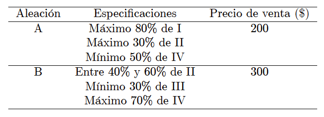
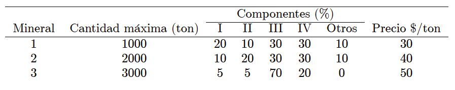

<div style="text-align: justify">
<br>
<br>


```{r setup, include = FALSE}
knitr::opts_chunk$set(echo = FALSE)
knitr::opts_chunk$set(warning = FALSE)
```


# **Ejercicio 1.** 
Se fabrican dos aleaciones, $A$ y $B$, con cuatro metales $I$, $II$, $III$ y $IV$ de acuerdo con las siguientes especificaciones:

<br>
<center>

{height="300px" width="500px"}

</center>
<br>

A su vez, los cuatro metales son obtenidos a partir de tres minerales, de acuerdo con los siguientes datos:

<br>
<center>

{height="300px" width="500px"}

</center>
<br>

(a) Defina correctamente todas las variables de decisión. Sugerencia: sea $x_{ik}$ las toneladas del mineral $i$ asignadas a la aleación $k$, y defina $w_k$ como las toneladas producidas de la aleación $k$.  
(b) Escriba la funcion objetivo que optimiza la utilidad para la elaboración de las aleaciones.  
(c) Escriba las restricciones asociadas al problema.  
(d) Plantee matemáticamente el modelo completo asociado al problema.  
(e) Encuentre el plan óptimo de producción e interprete los resultados.  
(f) Encuentre el valor óptimo de la función objetivo de acuerdo al plan óptimo de producción obtenido e interprete los resultados.


<br>
<br>

# **Ejercicio 2.** 
Una fábrica de muebles produce pupitres unipersonales, bipersonales y mesas, para los cuales ha establecido que rinden una utilidad unitaria de $30$, $20$, y $50$ unidades monetarias. Para la producción de dichos artículos la compañía cuenta con una disponibilidad semanal de $4300$ metros de madera, $4600$ metros de tubo y $4200$ metros de fórmica. Se sabe que para producir un pupitre unipersonal se requieren un metro de madera, $3$ metros de tubo y un metro de fórmica, que para producir un pupitre bipersonal se requieren $2$ metros de madera y $4$ metros de formica; mientras que para producir una mesa se necesita un metro de madera y $2$ metros de tubo.

(a) Defina correctamente todas las variables de decisión.  
(b) Escriba la función objetivo que optimiza la utilidad para la elaboración de los productos.  
(c) Escriba las restricciones asociadas al problema.  
(d) Plantee matemáticamente el modelo completo asociado al problema.  
(e) Encuentre el plan óptimo de producción e interprete los resultados.  
(f) Encuentre el valor óptimo de la función objetivo de acuerdo al plan óptimo de producción obtenido e interprete los resultados.  
(g) Realice un análisis de sensibilidad completo.  
(h) Si la empresa pudiese incrementar la cantidad de materia prima a usar, ¿cuál tendrá la prioridad? Explique fundamentadamente.  
(i) Se sugiere aumentar la cantidad de madera y tubo al costo adicional de $15$$/m$ para cada una. ¿Es esto aconsejable? Explique fundamentadamente.  
(j) Si la cantidad de fórmica se reduce en $100$ metros, ¿cómo impactará este incremento al ingreso óptimo? Explique fundamentadamente.  
(k) Suponga que la disponibilidad de madera se incrementa en $200$ metros, ¿cómo afectará este incremento al ingreso óptimo? Explique fundamentadamente.  
(l) Suponga que los ingresos unitarios producidos para los productos $1$ y $2$ cambian a $60$ y $30$ unidades monetarias respectivamente, y de manera independiente. ¿Permanecerá igual el óptimo actual? Explique fundamentadamente y calcule el valor de la función objetivo en este nuevo escenario.

<br>
<br>

# **Ejercicio 3.** 
Una empresa fabrica dos productos en dos máquinas. Una unidad del producto $1$ requiere $4$ horas en la máquina $1$, y $2$ hora en la máquina $2$. Una unidad del producto $2$ requiere $2$ hora en la máquina $1$, y $6$ horas en la máquina $2$. Los ingresos por unidad de los productos $1$ y $2$ son de $\$60$ y $\$40$, respectivamente. El tiempo de procesamiento diario total disponible en cada máquina es de $16$ horas. Responda las siguientes preguntas.

(a) Defina correctamente todas las variables de decisión.  
(b) Escriba la funcion objetivo que optimiza la utilidad para la elaboración de los productos.  
(c) Escriba las restricciones asociadas al problema.  
(d) Plantee matemáticamente el modelo completo asociado al problema.  
(e) Encuentre el plan óptimo de producción e interprete los resultados.  
(f) Encuentre el valor óptimo de la función objetivo de acuerdo al plan óptimo de producción obtenido e interprete los resultados.  
(g) Realice un análisis de sensibilidad completo.  
(h) Si la empresa puede incrementar la capacidad de ambas máquinas, ¿cuál máquina tendrá la prioridad? Explique fundamentadamente.  
(i) Se sugiere incrementar las capacidades de las máquinas $1$ y $2$ al costo adicional de $\$20/h$ para cada máquina. ¿Es esto aconsejable? Explique fundamentadamente.  
(j) Si la capacidad de la máquina $1$ se incrementa de $16$ a $26$ horas, ¿cómo impactará este incremento al ingreso óptimo? Explique fundamentadamente.  
(k) Suponga que la capacidad de la máquina $1$ se incrementa a $40$ horas, ¿cómo afectará este incremento al ingreso óptimo? Explique fundamentadamente.  
(l) Suponga que los ingresos unitarios producidos para los productos $1$ y $2$ cambian a $\$70$ y $\$50$, respectivamente, y de manera independiente. ¿Permanecerá igual el óptimo actual? Explique fundamentadamente y calcule el valor de la función objetivo en este nuevo escenario.


