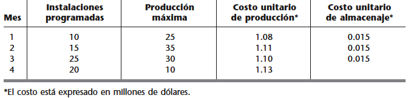
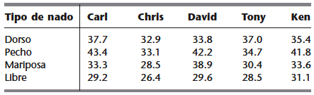

<div style="text-align: justify">
<br>
<br>


```{r setup, include = FALSE}
knitr::opts_chunk$set(echo = FALSE)
knitr::opts_chunk$set(warning = FALSE)
```


# **Ejercicio 1.** 
La _NORTHERN AIRPLANE COMPANY_ construye aviones comerciales para varias líneas aéreas de todo el mundo. La última etapa del proceso de producción consiste en fabricar las turbinas de jet e instalarlas —una operación muy rápida— en la estructura del avión terminado. La compañía tiene varios contratos de trabajo que la obligan a entregar un número considerable de aviones en un futuro cercano y en este momento debe programar la producción de motores de turbina para los próximos cuatro meses.

En la segunda columna de la tabla se indica la cantidad de motores que debe estar lista para su instalación a fin de cumplir con las fechas de entrega contratadas. De ella se desprende que el número acumulado de motores que deben producirse al final de los meses $1$, $2$, $3$ y $4$ debe ser por lo menos de $10$, $25$, $50$ y $70$ unidades, respectivamente.

Las instalaciones disponibles para producir las turbinas varían de acuerdo con otros programas de producción, mantenimiento y renovación durante el periodo. Las diferencias mensuales debidas al número máximo que se puede producir y el costo unitario de producción (en millones de dólares) se presentan en la tercera y cuarta columnas de la tabla.

Dadas las variaciones de los costos de producción, podría valer la pena fabricar algunas turbinas uno o más meses antes de su fecha de instalación; en la actualidad se estudia esta posibilidad. El inconveniente es que esas turbinas deberán almacenarse hasta que sean instaladas, pues la estructura de los aviones no estará lista antes. El costo de almacenamiento de cada turbina es de $15$ mil dólares por mes, como se muestra en la última columna de la tabla.

<br>
<center>

{height="300px" width="500px"}

</center>
<br>

El gerente de producción quiere desarrollar la programación del número de turbinas que se deben fabricar en cada uno de los cuatro meses, de manera que se minimicen los costos totales de producción y almacenamiento.

(a) Formule este problema como uno de transporte.
(b) Obtenga una solución óptima.
(c) Interprete los resultados óptimos obtenidos.

<br>
<br>

# **Ejercicio 2.** 
Electromaquinas Ltda. produce máquinas de coser en dos plantas ubicadas en $A$ y $B$; en las cuales hay una capacidad de producción semanal de $2.000$ y $3.000$ máquinas respectivamente. El producto es comercializado por tres distribuidores ubicados en $C$, $D$ y $E$; en los cuales se ha establecido una demanda de $1.500$, $1.700$ y $1.800$ máquinas de coser por semana. Además, se sabe que para llevar el producto a los distribuidores, se debe enviar a través de dos almacenes temporales ubicados en $F$ y $G$, y que no se puede enviar producto directamente desde las plantas a los distribuidores. El costo de transporte de cada máquina se ha evaluado de la siguiente forma: de $A$ a $F$ $\$5$, de $A$ a $G$ $\$8$, de $B$ a $F$ $\$3$, de $B$ a $G$ $\$11$, de $F$ a $G$ y viceversa $\$4$, de $F$ a $C$ $\$14$, de $F$ a $D$ $\$11$, de $F$ a $E$ $\$12$, de $G$ a $C$ $\$13$, de $G$ a $D$ $\$13$ y de $G$ a $E$ $\$10$.

¿Cuál es el plan óptimo de envíos que minimiza los costos de la operación? No olvide definir, formular matemáticamente, resolver e interpretar.

**Tenga en consideración que: como no se puede enviar producto directamente desde las plantas a los distribuidores, los nodos destinos no pueden ser origenes, y los nodos orígenes no pueden ser destino.**

<br>
<br>

# **Ejercicio 3.** 
El entrenador de un equipo de natación debe asignar competidores para la prueba de 200 metros de relevo combinado que irá a las Olimpiadas Juveniles. Como muchos de sus mejores nadadores son rápidos en más de un estilo, no es fácil decidir cuál de ellos asignar a cada uno de los cuatro estilos. Los cinco mejores nadadores y sus mejores tiempos (en segundos) en cada estilo son los siguientes:

<br>
<center>

{height="300px" width="500px"}

</center>
<br>

El entrenador quiere determinar cómo asignar cuatro nadadores a los cuatro estilos de nado para minimizar la suma de los mejores tiempos correspondientes.

(a) Formule este problema como uno de asignación.
(b) Obtenga una solución óptima.
(c) Interprete los resultados óptimos obtenidos.