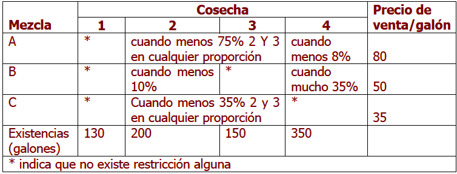

<div style="text-align: justify">
<br>
<br>


```{r setup, include = FALSE}
knitr::opts_chunk$set(echo = TRUE)
knitr::opts_chunk$set(warning = FALSE)
```

# **EJERCICIO 1.** 
La administración de _High Tech Service (HTS)_ desea desarrollar un modelo que le ayude a asignar el tiempo de sus técnicos entre llamada de servicio por contrato a clientes tanto normales como nuevos. En el período de planeación de dos semanas hay disponible un máximo de $80$ horas de tiempo de técnico. A fin de satisfacer los requisitos de flujo de caja, deben generarse por lo menos $800$ dólares de ingresos (por técnico) durante el período de dos semanas. El tiempo de técnico para los clientes normales genera $25$ dólares por hora, pero para clientes nuevos sólo genera un promedio de $84$ dólares la hora, porque en muchos casos el contacto con el cliente no llega a generar servicios facturables. Para asegurarse de que se mantienen contactos nuevos, el tiempo de técnico utilizado en contactos con clientes nuevos debe ser por lo menos $60\%$ del tiempo utilizado en contactos con clientes normales. Para los requerimientos de ingresos y políticas enunciadas, _HTS_ desearía determinar cómo asignar el tiempo de los técnicos entre clientes normales y nuevos, a fin de maximizar el número total de clientes en contacto durante el período de dos semanas. Los técnicos requieren un promedio de $50$ minutos por cada contacto de cliente normal y de una hora por cada contacto con cliente nuevo.

(a) Plantee el problema como un Problema de Programación Lineal, definiendo claramente las variables de decisión, la función objetivo y las restricciones.  
(b) Usando el método gráfico, resuelva, analice y concluya. 

<br>
<br>

# **EJERCICIO 2.** 
La _Ebel Mining Company_ es propietaria de dos minas que producen cierto tipo de mineral. Dichas minas está localizadas en distintas partes del país y, en consecuencia, presentan diferencias en sus capacidades de producción y en la calidad de su mineral. Después de ser molido el mineral se clasifica en tres clases dependiendo de la calidad: alta, media y baja. _Ebel_ ha sido contratada para suministrar semanalmente a la planta de fundición de su compañía matriz $12$ toneladas de mineral de alta calidad, $8$ toneladas de calidad mediana y $24$ toneladas de calidad baja. A Ebel le cuesta $\$ 20.000$ diarios operar la primera mina y $\$ 16.000$ la segunda. Sin embargo en un día de operación la primera mina produce $6$ tonelada de mineral de alta calidad, $2$ toneladas de mediana y $4$ toneladas de baja, mientras que la segunda produce $2$ toneladas diarias de material de alta calidad, $2$ de mediana y $12$ de baja. ¿Cuántos días a la semana tendrá que funcionar cada mina para cumplir los compromisos de Ebel de la manera más económica posible? (En este caso resulta aceptable programar la operación de las minas en fracciones de día).


(a) Plantee el problema como un Problema de Programación Lineal, definiendo claramente las variables de decisión, la función objetivo y las restricciones.    
(b) Usando el método gráfico, resuelva, analice y concluya.

<br>
<br>

# **EJERCICIO 3.** 
La administración de un viñedo desea combinar cuatro cosechas distintas para producir tres tipos distintos de vinos en forma combinada. Las existencias de las cosechas y los precios de venta de los vinos combinados se muestran en la tabla, junto con ciertas restricciones sobre los porcentajes incluidos en la composición de las tres mezclas. En particular, las cosechas $2$ y $3$ en conjunto deberán constituir cuando menos $75\%$ de la mezcla de $A$ y cuando menos $35\%$ de la mezcla $C$. Además, la mezcla $A$ deberá contener cuando menos el $8\%$ de la cosecha $4$, mientras que la mezcla $B$ deberá contener por lo menos $10\%$ de la cosecha $2$ y a lo sumo $35\%$ de la cosecha $4$. Se podrá vender cualquier cantidad que se elabore de las mezclas $A$, $B$ y $C$.

<br>
<center>

{height="300px" width="500px"}

</center>
<br>

(a) Plantee el modelo de programación lineal que se genera, definiendo claramente las variables de decisión, la función objetivo y las restricciones.


