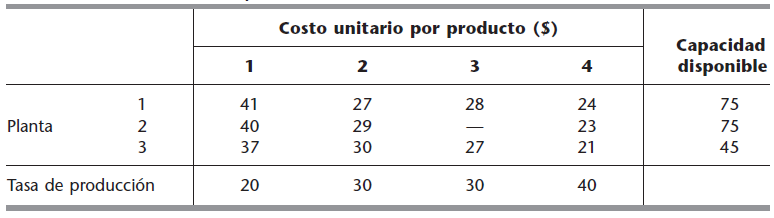

<div style="text-align: justify">
<br>
<br>


```{r setup, include = FALSE}
knitr::opts_chunk$set(echo = TRUE)
knitr::opts_chunk$set(warning = FALSE)
```


# **Ejercicio 1.** 
La _BETTER PRODUCTS COMPANY_ ha decidido iniciar la fabricación de cuatro nuevos productos en tres plantas que por el momento tienen exceso de capacidad de producción. Los productos requieren de un esfuerzo productivo comparable por unidad, por lo que la capacidad de producción disponible en las plantas se mide por el número de unidades de cualquier producto que se pueden fabricar por día, como se muestra en la última columna de la tabla.

<br>
<center>

{height="300px" width="500px"}

</center>
<br>

El último renglón muestra la producción diaria que se requiere para satisfacer las ventas proyectadas. Cada planta puede producir cualquiera de estos productos, excepto la planta $2$ que no puede fabricar el producto $3$. Sin embargo, el costo variable por unidad de cada producto difiere entre una planta y otra, como se muestra en elcuerpo principal de la tabla. La administración necesita tomar la decisión de cómo dividir la producción entre las plantas, y para esto, decide permitir la separación de productos, de tal manera que el mismo producto se pueda fabricar en más de una planta.

(a) Formule correctamente este problema de Transporte, definiendo las variables de decisión, la función objetivo, los nodos, los suministros, las demandas, los arcos, las capacidades y los costos.
(b) Encuentre el plan óptimo de producción de cada planta, que minimiza los costos.
(c) Interprete los resultados.


