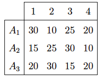

<div style="text-align: justify">
<br>
<br>


```{r setup, include = FALSE}
knitr::opts_chunk$set(echo = TRUE)
knitr::opts_chunk$set(warning = FALSE)
```


# **Ejercicio 1.** 
Una empresa produce un único artículo en tres plantas, $A1$, $A2$ y $A3$. La capacidad de producción mensual de la empresa está limitada a $1500$ unidades mensuales en cada una de las plantas. La empresa tiene cuatro clientes mayoristas cuyas demandas mensuales son $1000$, $1200$, $1500$ y $1000$ unidades respectivamente.

El beneficio unitario que le proporciona su producto, considerados los costes de producción y el precio de venta, es de $110$ unidades. Los costes de envío a los
$4$ clientes mayoristas que la empresa tiene vienen dados por la siguiente tabla.

<br>
<center>

{height="300px" width="500px"}

</center>
<br>

El objetivo de la empresa es organizar la producción en cada uno de los meses
para obtener el máximo beneficio. 

(a) Formule correctamente este problema de Transporte, definiendo las variables de decisión, la función objetivo, los nodos, los suministros, las demandas, los arcos, las capacidades y los costos.
(b) Encuentre el plan óptimo de de transporte que satisface los requerimientos de la empresa.
(c) Interprete los resultados.


