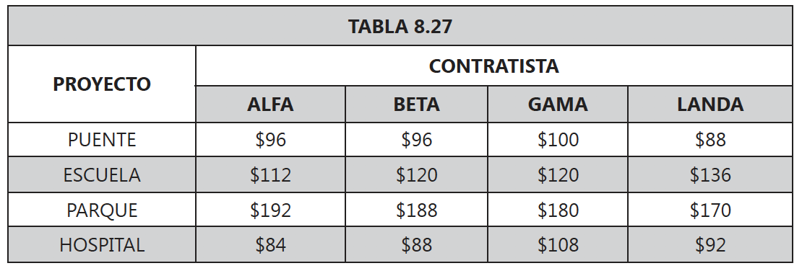

<div style="text-align: justify">
<br>
<br>


```{r setup, include = FALSE}
knitr::opts_chunk$set(echo = TRUE)
knitr::opts_chunk$set(warning = FALSE)
```


# **Ejercicio 1.** 
La alcaldía de la ciudad está interesada en asignar 4 proyectos a 4 contratistas de forma tal que se genere el menor costo posible para la ciudad. En la tabla se presenta el costo de elaboración de cada proyecto por cada uno de los contratistas.

<br>
<center>

{height="300px" width="500px"}

</center>
<br>

¿Cómo se deben asignar los proyectos para garantizar un costo mínimo para la alcaldía de la ciudad? Se debe garantizar la asignación de un proyecto a cada uno de los contratistas.

(a) Formule matemáticamente este problema de Asignación, definiendo las variables de decisión, la función objetivo y las restricciones.
(b) Encuentre el plan óptimo de asignación, que minimiza los costos.
(c) Interprete los resultados.


