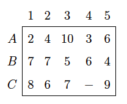

<div style="text-align: justify">
<br>
<br>


```{r setup, include = FALSE}
knitr::opts_chunk$set(echo = TRUE)
knitr::opts_chunk$set(warning = FALSE)
```


# **Ejercicio 1.** 
Una empresa convoca unas pruebas de selección para cubrir las vacantes que hay en $3$ puestos de trabajo, $A$, $B$, y $C$. Realizadas las pruebas la empresa asigna a las $5$ personas que se han presentado una puntuación entre $1$ y $10$. Las puntuaciones se recogen en la tabla. 

<br>
<center>

{height="300px" width="500px"}

</center>
<br>

En la casilla $(C, 4)$ no hay puntuación porque la persona $4$ no está capacitada para realizar el trabajo $C$. Se trata de hacer la asignación que maximice la adecuación total de las tres personas elegidas para los $3$ puestos de trabajo.

(a) Formule matemáticamente este problema de Asignación, definiendo las variables de decisión, la función objetivo y las restricciones.
(b) Encuentre el plan óptimo de asignación que satisface los requerimientos de la empresa.
(c) Interprete los resultados.

-----
**Considere lo siguiente para resolver un problema de asignación cuando lo que se requiere es maximizar:** A aquellas asignaciones que no están permitidas, hay que asociarles un valor $m$ muy pequeño al correspondiente coeficiente $c_{ij}$. Es decir, lo opuesto a lo que se hace con el método de la _Gran M_.
