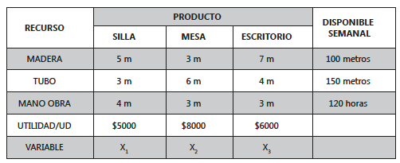
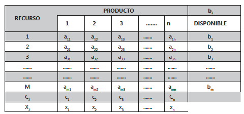

<div style="text-align: justify">
<br>
<br>


```{r setup, include = FALSE}
knitr::opts_chunk$set(echo = TRUE)
knitr::opts_chunk$set(warning = FALSE)
```


----

> ### PRESENTACIÓN
Se establece el proceso lógico que se debe llevar para el correcto planteamiento del modelo matemático de problemas de programación lineal y reglas de equivalencia de la función objetivo y las restricciones de un modelo de programación lineal; además de las formas generales del modelo de programación lineal y sus suposiciones.
>
> ### OBJETIVO GENERAL
Al finalizar el capítulo el estudiante debe estar en capacidad de identificar un problema de programación lineal.
>
> ### OBJETIVOS ESPECÍFICOS
* Conocer las diferentes formas generales del modelo de programación lineal.
* Identificar variables.
* Aplicar las reglas de equivalencia.
* Identificar parámetros.
>
> ### COMPETENCIAS
El estudiante aprenderá a identificar las diferentes formas de modelo de programación lineal, los proceso en los cuales pueda aplicar la programación lineal y seguir el procedimiento de obtención del modelo matemático de programación lineal.
>
> ### INDICADORES DE LOGRO
El estudiante deberá manejar los conceptos de planteamiento e identificación de variables, identificación de parámetros y aplicaciones de la programación lineal; así como el manejo de las reglas de equivalencia.
>
> ### CONOCIMIENTOS PREVIOS
* Manejo de ecuaciones lineales simultáneas.
* Conocimiento de propiedades de las desigualdades.
* Concepto de máximos y mínimos.

----


# 1.1. GENERALIDADES
La programación lineal es básicamente la lucha o disputa de una cantidad de actividades (productos) por unos recursos de carácter limitado, de tal forma que se obtenga un máximo de rendimiento. Cuando se hace referencia a rendimiento, se está hablando de la optimización del sistema que puede ser de dos formas así:

* Maximización, cuando lo que se persigue es el máximo de utilidad o ingreso.
* Minimización, se persigue un mínimo de costos o egresos de una empresa.


La programación lineal es una de las técnicas más útiles de la investigación de operaciones y puede ser aplicada a una amplia gama de problemas empresariales, tales como: económicos, industriales, financieros, productivos, hospitalarios, etc.

# 1.2. EJEMPLO PROTOTIPO
Una fábrica de muebles produce sillas, mesas y escritorios para los cuales ha establecido que rinden una contribución a las utilidades de $\$5.000$, $\$8.000$ y $\$6.000$ por unidad respectivamente. Para la producción de dichos artículos la compañía cuenta con una disponibilidad semanal de $100$ metros de madera, $150$ metros de tubo y $120$ horas de mano de obra (horas-hombre). Además, mediante un estudio se ha determinado que para producir una silla se requieren $5$ metros de madera, $3$ metros de tubo y $4$ horas de mano de obra; para producir una mesa se necesitan $3$ metros de madera, $6$ metros de tubo y $3$ horas hombre de trabajo; mientras que para producir un escritorio se requieren $7$ metros de madera, $4$ metros de tubo y $3$ horas de mano de obra.

Se desea plantear elmodelo de programación lineal que se genera a fin de incrementar al máximo las utilidades de la compañía.

## **Análisis de la información**

La información paramétrica que ofrece el modelo es la utilidad de cada uno de los artículos, los recursos disponibles y el consumo de cada recurso por cada unidad producida.

Por lo tanto hay que determinar qué cantidad de cada uno de los artículos se debe fabricar a fin de conseguir el máximo de utilidad de la empresa. Esta cantidad se presenta por medio de variables.

En resumen la información se puede presentar como se realiza en el siguiente cuadro:



<br>

Las variables de decisión se definen de la siguiente forma:
$$
\begin{array}{ll}
x_{1} : \text{cantidad de sillas a producir por semana.} \\
x_{2} : \text{cantidad de mesas a producir por semana.} \\  
x_{3} : \text{cantidad de escritorios a producir por semana.}
\end{array}
$$ 

Teniendo en cuenta lo dicho anteriormente, el objetivo es incrementar al máximo posible la utilidad total de la compañía, la cual está representada por la siguiente función lineal, llamada **Función Objetivo**:

$$Z = 5000x_{1} + 8000x_{2} + 6000x_{3}$$

La anterior función debe ser maximizada teniendo en cuenta que los recursos madera, tubo y mano de obra son de carácter limitado y no se puede utilizar más de su disponibilidad. Es decir:
$$
\begin{array}{ll}
5x_{1} + 3x_{2} + 7x_{3} \leq 100 \ \ \text{(restricción para la madera)} \\  
3x_{1} + 6x_{2} + 4x_{3} \leq 150 \ \ \text{(restricción para el tubo)} \\  
4x_{1} + 3x_{2} + 3x_{3} \leq 120 \ \ \text{(restricción para la mano de obra)}
\end{array}
$$ 

Las anteriores inecuaciones se les denominan **restricciones funcionales del problema**.

Por lógica, se sabe que no se pueden producir cantidades negativas, entonces todas las variables del problema se deben restringir a valores no negativos. En efecto:

$$
x_{1}, x_{2}, x_{3} \geq 0 \ \ \text{(restricciones de no negatividad).}
$$

En resumen, el modelo matemático de programación lineal queda como se muestra a continuación:

$$
\begin{array}{ll}
\max Z = 5000x_{1} + 8000x_{2} + 6000x_{3} \\
\text{S.A.}  \\
5x_{1} + 3x_{2} + 7x_{3} \leq 100 \ \ \text{(metros de madera)} \\   
3x_{1} + 6x_{2} + 4x_{3} \leq 150 \ \ \text{(metros de tubo)} \\  
4x_{1} + 3x_{2} + 3x_{3} \leq 120 \ \ \text{(horas de mano de obra)} \\  
\qquad \ \ \ x_{1}, x_{2}, x_{3} \geq \ \ \ \ 0 \ \ \text{(no negatividad)} 
\end{array}
$$

# 1.3. MODELO GENERAL DE PROGRAMACIÓN LINEAL
Generalizando, si se tienen $n$ productos o **actividades** y $m$ recursos disponibles el problema se transforma en:



<br>

En la tabla anterior, en forma generalizada, se define lo siguiente:
$$
\begin{array}{ll}
b_{i}  : \text{cantidad disponible del recurso} \ i \ \ (\text{con} \ i = 1, 2, ..., m) \\  
c_{j}  : \text{costo o precio unitrio del producto o actividad} \ j \ \ (\text{con} \ j = 1, 2, ..., n) \\
x_{j}  : \text{cantidad a fabricar del producto} \ i \ \ (\text{con} \ j = 1, 2, ..., n ) \\ 
a_{ij} : \text{cantidad del recurso} \ i \ \ \text{necesario para fabricar una unidad del producto} \ j
\end{array}
$$

## 1.3.1. Forma estándar del modelo de programación lineal
Esta es la forma más conocida y trabajada del modelo de programación lineal. Su planteamiento se presenta a continuación:
$$
\begin{array}{ll}
\max Z = c_{1}x_{1} + c_{2}x_{2} + \cdots + c_{n}x_{n} \ \ \text{(función objetivo)}  \\
\text{S.A.} \\  
a_{11}x_{1} \ + a_{12}x_{2} + \cdots + a_{1n}x_{n} \leq b_{1} \ \ \text{(restricción para el recurso 1)} \\  
a_{21}x_{1} \ + a_{22}x_{2} + \cdots + a_{2n}x_{n} \leq b_{2} \ \ \text{(restricción para el recurso 2)} \\  
\cdots \\  
a_{m1}x_{1} + a_{m2}x_{2} + \cdots + a_{mn}x_{n} \leq b_{m} \ \ \text{(restricción para el recurso m)} \\  
\qquad \qquad \quad \ \ \ x_{1}, x_{2}, \cdots, x_{n} \geq 0 \ \ \ \ \text{(no negatividad de las variables de decisión)}
\end{array}
$$

## 1.3.2. Forma matricial del modelo de programación lineal
Para definir la forma matricial del modelo de programación lineal, es necesario definir los siguientes vetores y matrices:

**Matriz A**. Esta matriz contiene todos los elementos de asignación unitaria de recursos (o coeficientes tecnológicos).

$$ A =
\left( \begin{array}{cccc}
 a_{11} & a_{12} & \cdots & a_{1n} \\ 
 a_{21} & a_{22} & \cdots & a_{2n} \\
 \vdots & \vdots & \ddots & \vdots \\
 a_{m1} & a_{m2} & \cdots & a_{mn}
\end{array} \right) $$

**Vector X**. Este vector contiene todas las variables de decisión del problema y está defindo como un vector columna.

$$ X =
\left( \begin{array}{cccc}
 x_{1} \\ 
 x_{2} \\
 \vdots \\
 x_{n}
\end{array} \right) $$

**Vector b**. Este vector contiene todas las disponibilidades de recursos o términos independientes. También es un vector columna.

$$ B =
\left( \begin{array}{cccc}
 b_{1} \\ 
 b_{2} \\
 \vdots \\
 b_{m}
\end{array} \right) $$

**Vector c**. Este vector contiene todos los coeficientes de costos unitarios, utilidad unitaria, ingreso unitario o precio unitrario. Es un vector fila.

$$ C =
\left( \begin{array}{cccc}
 c_{1} & c_{2} & \cdots & c_{n}
\end{array} \right) $$

**Vector Nulo**. Este vector contiene tantos ceros como variables de decisión involucre el problema, y garantiza las restricciones de no negatividad. También es un vector columna.

$$ \mathbf{0} =
\left( \begin{array}{cccc}
 0 \\ 
 0 \\
 \vdots \\
 0
\end{array} \right) $$

Así, el modelo matemático de programación lineal, en su forma matricial, se formula como se muestra a continuación:

$$ \max Z = \left( \begin{array}{cccc}
 c_{1} & c_{2} & \cdots & c_{n}
\end{array} \right) \left( \begin{array}{cccc}
 x_{1} \\ 
 x_{2} \\
 \vdots \\
 x_{n}
\end{array} \right) $$  

S.A  
$$ \left( \begin{array}{cccc}
 a_{11} & a_{12} & \cdots & a_{1n} \\ 
 a_{21} & a_{22} & \cdots & a_{2n} \\
 \vdots & \vdots & \ddots & \vdots \\
 a_{m1} & a_{m2} & \cdots & a_{mn}
\end{array} \right) \left( \begin{array}{cccc}
 x_{1} \\ 
 x_{2} \\
 \vdots \\
 x_{n} \end{array} \right) \leq \left( \begin{array}{cccc}
 b_{1} \\ 
 b_{2} \\
 \vdots \\
 b_{m}
\end{array} \right) \\
\qquad \qquad \qquad \qquad \ \left( \begin{array}{cccc}
 x_{1} \\ 
 x_{2} \\
 \vdots \\
 x_{n}
\end{array} \right) \geq \left( \begin{array}{cccc}
 0 \\ 
 0 \\
 \vdots \\
 0
\end{array} \right)$$

## 1.3.3. Forma sumatorial del modelo de programación lineal
El modelo matemático de programación lineal utilizando sumatorias es como se muestra a continuación:

$$
\begin{array}{ll}
\max Z = \sum_{j = 1}^{n} c_{j} x_{j} \\
\text{S.A.} \\  
\sum_{j = 1}^{n} a_{ij} x_{j} \leq b_{i}, \qquad  \forall \ i = 1, 2, \cdots, m \\
\ \ \ \ \ \ \ \ \ \ \ \ \ x_{j} \geq 0, \qquad \ \forall \ j = 1, 2, \cdots, n 
\end{array}
$$

## 1.3.4. Forma canónica del modelo de programación lineal
La forma canónica del modelo matemático de programación lineal, es tal vez la más simple como se encuentra este modelo y con base en ésta es como se desarrollan todas sus demostraciones. Su forma es la siguiente:

$$
\begin{array}{ll}
\max Z = CX \\
\text{S.A.} \\
AX \leq B \\
\ \ \ X \geq \mathbf{0}
\end{array}
$$

# 1.4. OTRAS FORMAS DEL MODELO
Puede observar que se ha utilizado en todas las formas una función objetivo de maximización y las restricciones funcionales son del tipo menor o igual que. Esto no indica que siempre es así, eso depende de la formulación del problema y puede incluir lo siguiente:

* La función objetivo puede ser de minimización.
* Las restricciones pueden ser del tipo mayo o igual.
* Las restricciones pueden ser de igualdad estricta.

# 1.5. PROCEDIMIENTO PARA LA CONSTRUCCIÓN DE MODELOS
Con base en lo escrito hasta acá se recomienda seguir estos pasos para la construcción de modelos matemáticos (no se nombra sólo hasta la construcción del modelo, sino además, hasta la implantación):

**PASO 1: Formulación del modelo**  
A esto es lo que se llama en la literatura el problema, aquí se debe estructurar toda la información de parámetros y variables y la interacción entre ellas.

**PASO 2: Análisis de la información**  
En este paso se debe realizar minuciosamente el análisis de cada parámetro del modelo y cómo influye en él; además de permitir una visualización de lo que se quiere conseguir (objetivo) y definir a grandes rasgos las limitantes del sistema.

**PASO 3: Definición de las variables**  
Este tal vez es el paso más importante, ya que si la variable queda mal definida, la solución del problema arrojará malos resultados, conllevando a malas decisiones. Aquí se debe establecer qué se desea conocer (incógnitas) para lograr la solución de un problema particular.

**PASO 4: Establecer la función objetivo**  
Basándose en la definición de las variables objetivos se debe estructurar que es lo que más le conviene a la empresa o persona donde se está realizando la solución del problema. En general se llama maximización a todo aquello que entra a la empresa en términos de de beneficios, como por ejemplo maximizar ingresos, utilidades y productividad entre otras, y se habla de minimización a todo lo que no le convenga a la empresa pero que necesariamente lo debe realizar. Se habla acá de minimizar egresos y costos básicamente. En esta función cada variable debe tener un coeficiente de rendimiento según sea maximizar o minimizar.

**PASO 5: Determinar las restricciones**  
Definida precisamente la función objetivo se debe evaluar qué restricciones impiden lograr un valor máximo o mínimo de la función objetivo; pues necesariamente no habrá recursos infinitos para su utilización (si esto fuera así, no habría necesidad de plantear y resolver un problema de optimización). Entonces se parte del hecho que hay unos recursos de carácter limitado, entre los cuales se pueden nombrar los siguientes: dinero disponible, mano de obra disponible, materia prima disponible, restricciones gubernamentales, capacidad de producción, capacidad de almacenaje, restricciones del mercado, etc. Al igual que la función objetivo, en cada una de las restricciones cada variable debe tener un coeficiente. No olvide que las restricciones de no-negatividad también forman parte de las restricciones.

**PASO 6: Solución del modelo matemático**  
La función objetivo, junto con las restricciones (pasos $4$ y $5$) en conjunto, es lo que se llama el modelo matemático. Éste se debe solucionar en lo posible con una técnica de optimización (hay más técnicas, como por ejemplo la simulación que no arroja soluciones óptimas), la cual permite hallar los valores de las variables definidas en el paso tres.

**PASO 7: Prueba del modelo y de la solución**  
Con base en la solución del modelo, se debe realizar las pruebas pertinentes, especialmente corroborar en las restricciones, que se cumpla con la mejor utilización de los recursos y que la función objetivo tenga su valor óptimo. En este paso, se debe evaluar el funcionamiento del modelo con su respectiva solución, a fin de verificar el cumplimiento de los objetivos.

**PASO 8: Implantación del modelo**  
Realizadas todas las pruebas de rigor en el punto anterior, no queda más que implementar la solución en la práctica. No olvide que la mayoría de modelos arrojan soluciones óptimas; que casi siempre en la realidad no funcionan perfectamente por diferentes factores. Por lo tanto no olvide aplicar el paso nueve.

**PASO 9: Controlar y retroalimentar**   
En todo momento se debe estar atento a cualquier modificación en la información y parámetros del modelo, con el objeto de ir evaluando los posibles cambios que se deban realizar y que no descontrolen el sistema.

# 1.6. REGLAS DE EQUIVALENCIA
**Primera regla:** Maximizar $CX$ es equivalente a Minimizar $-CX$. También se puede plantear que Minimizar $CX$ es equivalente a Maximizar $-CX$.

**Segunda regla:** Una desigualdad $AX \leq B$ es equivalente a $-AX \geq -B$. Esta regla también se puede dar al revés, es decir, una desigualdad $AX \geq B$ es equivalente a $-AX \leq -B$.

**Tercera regla:** Toda restricción de la forma $AX = B$ se puede establecer como la intersección de las siguientes desigualdades: $AX \leq B$ y $AX \geq B$.

*Ejemplo.* Las siguiente igualdad

$$4x_{1} + 3x_{2} + 3x_{3} = 120$$

es equivalente a las dos desigualdades
$$
\begin{array}{ll}
4x_{1} + 3x_{2} + 3x_{3} \leq 120 \\
4x_{1} + 3x_{2} + 3x_{3} \geq 120
\end{array}
$$

**Cuarta regla:** Toda desigualdad de la forma $AX \leq B$ puede convertirse en una igualdad mediante la adición de un vector $H$ en el lado izquierdo de la restricción. Este vector contienen $m$ componentes no negativas y se le denomina vector de holgura. Sus componentes son por lo tanto llamadas variables de holgura.

*Ejemplo.* Las siguientes desigualdades

$$
\begin{array}{ll}
5x_{1} + 3x_{2} + 7x_{3} \leq 100 \\
3x_{1} + 6x_{2} + 4x_{3} \leq 150 \\
4x_{1} + 3x_{2} + 3x_{3} \leq 120
\end{array}
$$

son equivalentes a
$$ 
\begin{array}{ll}
5x_{1} + 3x_{2} + 7x_{3} + H_{1} \qquad \qquad = 100 \\
3x_{1} + 6x_{2} + 4x_{3} \qquad + H_{2} \qquad = 150 \\
4x_{1} + 3x_{2} + 3x_{3} \qquad \qquad + H_{3} = 120 \\
\qquad \qquad \qquad \ \ \ \ \ \ \ \ \ H_{1}, H_{2}, H_{3} \geq \ \ \ \ 0
\end{array}
$$
   
**Quinta regla:** Toda desigualdad de la forma $AX \geq B$ puede convertirse en una igualdad mediante la resta de un vector $S$ en el lado izquierdo de la restricción. Este vector contienen $m$ componentes no negativas y se le denomina vector de exceso o superflúo. Sus componentes son por lo tanto llamadas variables de exceso.

*Ejemplo.* Las siguientes desigualdades

$$
\begin{array}{ll}
5x_{1} + 3x_{2} + 7x_{3} \geq 100 \\
3x_{1} + 6x_{2} + 4x_{3} \geq 150 \\
4x_{1} + 3x_{2} + 3x_{3} \geq 120
\end{array}
$$

son equivalentes a

$$
\begin{array}{ll}
5x_{1} + 3x_{2} + 7x_{3} - S_{1} \qquad \qquad = 100 \\
3x_{1} + 6x_{2} + 4x_{3} \qquad - S_{2} \qquad = 150 \\
4x_{1} + 3x_{2} + 3x_{3} \qquad \qquad - S_{3} = 120 \\
\qquad \qquad \qquad \ \ \ \ \ \ \ \ \ \ \ S_{1}, S_{2}, S_{3} \geq \ \ \ 0
\end{array}
$$

**Sexta regla:** Una variable no restringida (o irrestricta), es aquella que puede tomar cualquier clase de valor: positivos, cero o negativos. Este tipo de variable puede escribirse como la diferencia entre otras dos variables no negativas.

*Ejemplo.* Si la variable $X_{1}$ es no restringida, entonces puede ser expresada como:

$$x_{1} = R_{1} - R_{2}$$

donde $R_{1}$ y $R_{2}$ son variables no negativas. Así:

* $x_{1}$ será positiva si $R_{1}$ es mayor que $R_{2}$.
* $x_{1}$ será cero si $R_{1}$ es igual a $R_{2}$.
* $x_{1}$ será negativa si $R_{1}$ es menor que $R_{2}$.

# 1.7. SUPOSICIONES DE LA PROGRAMACIÓN LINEAL
En todo problema de programación lineal se consideran presentes las siguientes suposiciones.

**Suposición de proporcionalidad.** Se refiere a que si fabricar una unidad del producto $x_{j}$ se obtiene una utilidad (costo) igual a $c_{j}$, entonces fabricar $N$ unidades de $x_{j}$ significará obtener una utilidad (costo) igual a $N c_{j}$. De igual manera, esta suposición es válida para el consumo de recursos en cada una de las restricciones.

**Suposición de aditividad.** Se refiere a que hay que sumar las utilidades generadas independientemente por cada artículo para establecer la utilidad total y para calcular el consumo total de cada recurso, también se suman los consumos independientes de los mismos.

**Suposición de divisibilidad.** Se refiere a que en todo problema de programación lineal las variables pueden tomar cualquier valor fraccionario.

**Suposición de certidumbre.** se conocen exactamente los coeficientes de las variables en la función objetivo (costos, utilidades, etc.), los consumosSunitarios de recursos (coeficientes de las variables en las restricciones) y la disponibilidad de cada uno de los recursos (lado derecho de las restricciones); esto es conocer perfectamente todos los parámetros del modelo. Con un solo parámetro que se desconozca, se genera incertidumbre.