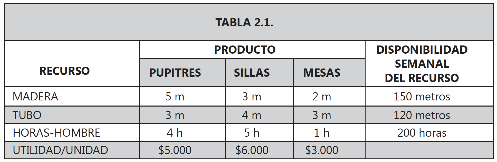
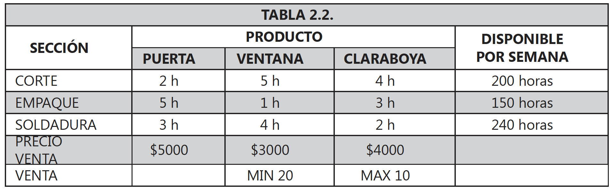
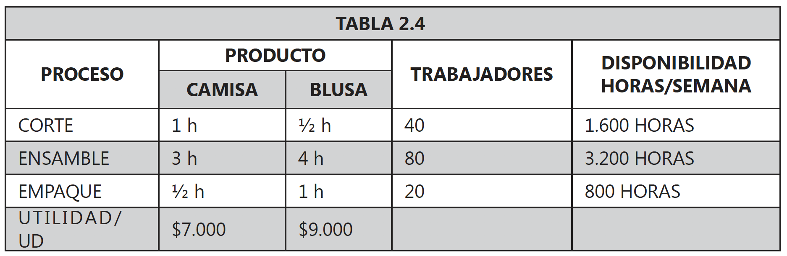
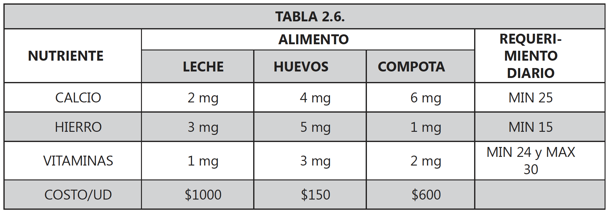
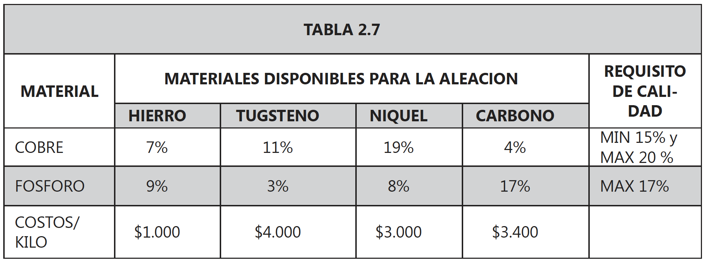
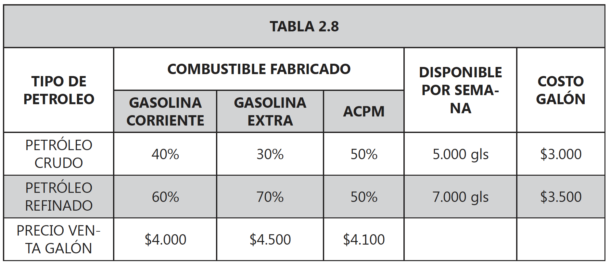

<div style="text-align: justify">
<br>
<br>


```{r setup, include = FALSE}
knitr::opts_chunk$set(echo = TRUE)
knitr::opts_chunk$set(warning = FALSE)
```


----

> ### PRESENTACIÓN
Se presentan algunos ejemplos de aplicación de la programación lineal, haciendo énfasis en la construcción del modelo matemático.
>
> ### OBJETIVO GENERAL
Al finalizar el capítulo el estudiante debe estar en capacidad de construir modelos matemáticos de programación lineal, dada una formulación del problema.
>
> ### OBJETIVOS ESPECÍFICOS
* Identificar variables de decisión del modelo.
* Identificar parámetros del modelo.
* Estructurar la función objetivo.
* Estructurar las restricciones.
>
> ### COMPETENCIAS
El estudiante aprenderá a identificar procesos en los cuales pueda aplicar la programación lineal y construir modelos matemáticos de programación lineal con base en una formulación. La aplicación se realizará en el entorno empresarial en producción, mercados, dietas entre otros.
>
> ### INDICADORES DE LOGRO
El estudiante deberá construir modelos de programación lineal a partir de una formulación, identificando variables y parámetros; así como manejar la aplicación práctica de la programación lineal.
>
> ### CONOCIMIENTOS PREVIOS
* Manejo de ecuaciones lineales simultáneas.
* Conocimiento de propiedades de las desigualdades.
* Concepto de maximización y minimización.

----


# 2.1. APLICACIONES EN PRODUCCIÓN
## EJEMPLO 2.1.1. 
La compañía _SIGMA_ fabrica pupitres, sillas y mesas, para los cuales ha establecido que rinden una contribución a las utilidades de $\$5.000$, $\$6.000$ y $\$3.000$ por unidad respectivamente. Para la producción de dichos artículos la compañía cuenta con una disponibilidad semanal de $150$ metros de madera, $120$ metros de tubo y $200$ horas-hombre de trabajo. Plantee el modelo matemático de programación lineal que se genera si sabe que para producir un pupitre se requiere de $5$ metros de madera, $3$ metros de tubo y $4$ horas-hombre de trabajo; para producir una silla se requieren $3$ metros de madera, $4$ metros de tubo y $5$ horas-hombre de trabajo; mientras que, para producir una mesa se requieren $2$ metros de madera, $3$ metros de tubo y $1$ hora-hombre de trabajo.

### SOLUCIÓN.
**Análisis de la información.** Primero se organiza la información en la siguiente tabla.



<br>

**Definición de las variables.** Se debe decidir cuántos pupitres, sillas y mesas se deberán producir por semana para lograr un máximo de utilidad; por lo cual las variables de decisión son:

$$
\begin{array}{ll}
x_{1} : \text{cantidad de pupitres a producir por semana.} \\
x_{2} : \text{cantidad de sillas a producir por semana.} \\
x_{3} : \text{cantidad de mesas a producir por semana.}
\end{array}
$$

**Función objetivo.** La compañía debe garantizar un máximo de utilidad, por lo tanto la función objetivo es la siguiente:

$$Z = 5000x_{1} + 6000x_{2} + 3000x_{3}$$

**Restricciones del modelo.** Además, la compañía debe tener en cuenta las siguientes limitaciones en los recursos:

$$ 
\begin{array}{ll}
5x_{1} + 3x_{2} + 2x_{3} \leq 150 \ \ \text{(restricción para los metros de madera)} \\  
3x_{1} + 4x_{2} + 3x_{3} \leq 120 \ \ \text{(restricción para los metros de tubo)}  \\
4x_{1} + 5x_{2} + \ \ x_{3} \leq 200 \ \ \text{(restricción para las hora-hombre)}
\end{array}
$$ 

También, se deben considerar las restricciones de no negatividad (restricciones de signo de las variables), ya que en este caso, no se pueden producir unidades negativas de ningún producto. Tales restricciones son las siguientes:

$$x_{1}, x_{2}, x_{3} \geq 0 \ \ \text{(restricciones de no negatividad)}$$

**Modelo matemático completo.** El modelo matemático de programación lineal para la compañía SIGMA queda de la siguiente manera: 

$$ 
\begin{array}{ll}
\max Z = 5000x_{1} + 6000x_{2} + 3000x_{3} \\  
\text{S.A.}  \\
5x_{1} + 3x_{2} + 2x_{3} \leq 150 \  \text{(metros de madera)}   \\
3x_{1} + 4x_{2} + 3x_{3} \leq 120 \  \text{(metros de tubo)}  \\
4x_{1} + 5x_{2} + \ \ x_{3} \leq 200 \ \text{(horas-hombre)}  \\
\qquad \ \ \ x_{1}, x_{2}, x_{3} \geq 0 \quad \text{(no negatividad)}
\end{array}
$$

## EJEMPLO 2.1.2.
La compañía _BETA_ ha sacado del mercado un producto que ya no le era rentable, lo cual genera que haya una capacidad disponible semanal que no se esta utilizando en sus $3$ departamentos así: $200$ horas en corte, $240$ horas en soldadura y $150$ horas en empaque.

El departamento de producción propone que dicha capacidad sea utilizada en la producción de puertas, ventanas y claraboyas en la forma más eficiente posible, para dichos artículos se ha establecido un posible precio de venta de $\$5000$, $\$3000$ y $\$4000$ por unidad respectivamente. Además se ha determinado que para producir una puerta se requiere de $2$ horas en corte, $3$ horas en soldadura y $5$ horas en empaque. Para producir una ventana se requiere $5$ horas en corte, $4$ horas en soldadura y $1$ hora en empaque; mientras que para producir una claraboya se requiere $4$ horas en corte, $2$ horas en soldadura y $3$ horas en empaque.

Plantee el modelo de programación lineal que se genera si se sabe que el departamento de mercadeo informo que mínimo se venderán $20$ ventanas y como máximo $10$ claraboyas.

### SOLUCIÓN.
**Análisis de la información.** Primero se organiza la información en la siguiente tabla.



<br>

**Definición de las variables.** Se debe decidir cuántas puertas, ventanas y claraboyas se deberán producir por semana para lograr un máximo de utilidad; por lo cual las variables de decisión son:
$$
\begin{array}{ll}
x_{1} : \text{cantidad de puertas a producir por semana.} \\ 
x_{2} : \text{cantidad de ventanas a producir por semana.} \\  
x_{3} : \text{cantidad de claraboyas a producir por semana.}
\end{array}
$$

**Función objetivo.** La compañía debe garantizar un máximo de utilidad, por lo tanto la función objetivo es la siguiente:
$$Z = 5000x_{1} + 3000x_{2} + 4000x_{3}$$

**Restricciones del modelo.** Además, la compañía debe tener en cuenta las siguientes limitaciones en los recursos:
$$
\begin{array}{ll}
2x_{1} + 5x_{2} + 4x_{3} \leq 200 \ \ \text{(restricción de horas para corte)} \\  
5x_{1} + \ \ x_{2} + 3x_{3} \leq 150 \ \ \text{(restricción de horas para empaque)} \\  
3x_{1} + 4x_{2} + 2x_{3} \leq 240 \ \ \text{(restricción de horas para soldadura)}
\end{array}
$$

También, se deben considerar las restricciones generadas por el pronóstico del departamento de mercado, las cuales son:
$$
\begin{array}{ll}
x_{2} \geq 20 \ \ \text{(restricción de ventas mínimas para las ventanas)} \\   
x_{3} \leq 10 \ \ \text{(restricción de ventas máximas para las claraboyas)}
\end{array}
$$

No olvidar las restricciones de no negatividad (restricciones de signo de las variables), ya que en este caso, no se pueden producir unidades negativas de ningún producto. Es decir:
$$x_{1}, x_{2}, x_{3} \geq 0\ \ \text{(restricciones de no negatividad)}$$

**Modelo matemático completo.** El modelo matemático de programación lineal para la compañía BETA queda de la siguiente manera: 
$$
\begin{array}{ll}
\max Z = 5000x_{1} + 3000x_{2} + 4000x_{3}  \\
\text{S.A.}  \\
2x_{1} + 5x_{2} + 4x_{3} \leq 200 \ \ \text{(horas disponibles para corte)}   \\
5x_{1} + \ \ x_{2} + 3x_{3} \leq 150 \ \ \text{(horas disponibles para empaque)} \\ 
3x_{1} + 4x_{2} + 2x_{3} \leq 240 \ \ \text{(horas disponibles para soldadura)}  \\
\qquad \qquad \ \ \ \ \ x_{2} \geq \ \ 20 \ \ \text{(venta mínima para ventanas)}  \\
\qquad \qquad \ \ \ \ \ x_{3} \leq \ \ 10 \ \ \text{(venta máxima para clarboyas)} \\ 
\qquad \ \ \ \ x_{1}, x_{2}, x_{3} \geq \ \ \ \ 0 \ \ \text{(no negatividad)}
\end{array}
$$


## EJEMPLO 2.1.3.
La compañía _GAMA_ fabrica camisas y blusas en una línea de producción con tres procesos que son: corte, ensamble y empaque. Se ha establecido que una camisa genera una utilidad de $\$7000$ y una blusa una utilidad de $\$9000$. Mediante un estudio de tiempos se estableció que una camisa requiere de $1$ hora en corte, $3$ horas en ensamble y $\frac{1}{2}$ hora en empaque; mientras que una blusa requiere de $\frac{1}{2}$ hora en corte, $4$ horas en ensamble y $1$ hora en empaque. Se sabe que la compañía _GAMA_ trabaja $8$ horas diarias durante $5$ días a la semana. ¿Cómo queda el modelo de programación lineal si se sabe que actualmente se cuenta con $40$ trabajadores en la sección de corte, $80$ trabajadores en la sección de ensamble y $20$ trabajadores en la sección de empaque?

### SOLUCIÓN.
**Análisis de la información.** Primero se organiza la información en la siguiente tabla. Tenga en cuenta que las horas disponibles en cada proceso se calculan multiplicando los $5$ días laborales en cada semana por $8$ horas laborables por día; y este resultado multiplicado por la cantidad de trabajadores disponibles en cada proceso. Así, para el proceso de corte la disponibilidad es: 
$$5 \ \text{día} * 8 \ \frac{\text{horas}}{\text{día}} * 40 \ \text{trabajadores} = 1600 \ \text{horas disponibles en la semana.}$$ 

<br>



<br>

**Definición de las variables.** Se debe decidir cuántas camisas y blusas se deberán producir por semana para lograr un máximo de utilidad; por lo cual las variables de decisión son:
$$
\begin{array}{ll}
x_{1} : \text{cantidad de camisas a producir por semana.} \\  
x_{2} : \text{cantidad de blusas a producir por semana.}
\end{array}
$$

**Función objetivo.** La compañía debe garantizar un máximo de utilidad, por lo tanto la función objetivo es la siguiente:

$$Z = 7000x_{1} + 9000x_{2} $$

**Restricciones del modelo.** Además, la compañía debe tener en cuenta las siguientes limitaciones en los recursos, relacionadas con la disponibilidad de horas en cada proceso:
$$
\begin{array}{ll}
\ \ \ \ \ x_{1} + 0.5x_{2} \leq 1600 \ \ \text{(restricción de horas para corte)} \\  
\ \ \ 3x_{1} + \ \ \ 4x_{2} \leq 3200 \ \ \text{(restricción de horas para ensamble)} \\  
0.5x_{1} + \ \ \ \ \  x_{2} \leq \ \ 800 \ \ \text{(restricción de horas para empaque)}
\end{array}
$$

También, se deben considerar las restricciones de no negatividad (restricciones de signo de las variables), ya que en este caso, no se pueden producir unidades negativas de ningún producto. Es decir:
$$x_{1}, x_{2} \geq 0\ \ \text{(restricciones de no negatividad)}$$

**Modelo matemático completo.** El modelo matemático de programación lineal para la compañía BETA queda de la siguiente manera: 
$$
\begin{array}{ll}
\max Z = 7000x_{1} + 9000x_{2} \\
\text{S.A.} \\  
\ \ \ \ \ x_{1} + 0.5x_{2} \leq 1600 \ \ \text{(horas disponibles para corte)} \\  
\ \ \ 3x_{1} + \ \ \ 4x_{2} \leq 3200 \ \ \text{(horas disponibles para ensamble)} \\ 
0.5x_{1} + \ \ \ \ \  x_{2} \leq \ \ 800 \ \ \text{(horas disponibles para empaque)} \\   
\qquad \ \ \ \ x_{1}, x_{2} \geq \ \ \ \ \ \ 0 \ \ \text{(no negatividad)}
\end{array}
$$

# 2.2. APLICACIONES EN DIETAS
## EJEMPLO 2.1.1.
Una compañía dispone de un jardín infantil para darle albergue a los hijos de los empleados. La nutricionista de la empresa estableció que a cada niño se le debe suministrar diariamente un mínimo $25$ miligramos de calcio, $15$ miligramos de hierro y $24$ miligramos de vitaminas, pero no más de $30$ mg. En el transcurso del día los niños son alimentados con leche por valor de $\$1000$ por litro, huevos a $\$150$ cada uno y compotas que cuestan $\$600$ el frasco. Plantee el modelo de programación lineal que se genera si se sabe que un litro de leche contiene $2$ miligramos de calcio, $3$ miligramos de hierro y $1$ miligramo de vitaminas; un huevo contiene $4$ miligramos de calcio, $5$ miligramos de hierro y $3$ miligramos de vitaminas; mientras que un frasco de compota contiene $6$ miligramos de calcio, $1$ miligramo de hierro y $2$ miligramos de vitaminas.

### SOLUCIÓN.
**Análisis de la información.** Este tipo de problemas consiste en determinar la cantidad de alimentos que se deben comprar, para satisfacer unos requerimientos alimentitos de tal forma que el costo se haga mínimo. Primero se organiza la información en la siguiente tabla.



<br>

**Definición de las variables.** El jardín infantil debe decidir qué cantidad de cada alimento debe suministrar a cada niño diariamente, por consiguiente las variables de decisión a utilizar se definen a continuación:
$$
\begin{array}{ll}
x_{1} : \text{cantidad de litros de leche a suministrar a cada niño por día.} \\  
x_{2} : \text{cantidad de huevos a suministrar a cada niño por día.} \\
x_{3} : \text{cantidad de frascos de compota a suministrar a cada niño por día.}
\end{array}
$$

**Función objetivo.** A la compañía en este caso le conviene invertir en los alimentos la menor cantidad de dinero posible, por lo tanto la función objetivo queda como sigue a continuación:

$$Z = 1000x_{1} + 150x_{2} + 600x_{3}$$

**Restricciones del modelo.** Las restricciones tienen que ver con garantizar los requerimientos nutricionales de cada niño. Así:
$$
\begin{array}{ll}
2x_{1} + 4x_{2} + 6x_{3} \geq 25 \ \ \text{(restricción mínima de consumo de calcio)} \\  
3x_{1} + 5x_{2} + \ \  x_{3} \geq 15 \ \ \text{(restricción mínima de consumo de hierro} \\
\ \  x_{1} + 3x_{2} + 2x_{3} \geq 24 \ \ \text{(restricción mínima de consumo de vitamina)} \\ 
\ \  x_{1} + 3x_{2} + 2x_{3} \leq 30 \ \ \text{(restricción náxima de consumo de vitamina)}
\end{array}
$$

Observe, que estas dos últimas restricciones en su lado izquierdo son la misma, pero una garantiza un consumo mínimo y la otra un consumo máximo de vitaminas.

También, se deben considerar las restricciones de no negatividad (restricciones de signo de las variables), ya que en este caso, no se pueden consumir cantidades negativas de ningún nutriente. Tales restricciones son las siguientes:

$$x_{1}, x_{2}, x_{3} \geq 0 \ \ \text{(restricciones de no negatividad)}$$

**Modelo matemático completo.** El modelo matemático de programación lineal para la compañía SIGMA queda de la siguiente manera: 

$$
\begin{array}{ll}
\min Z = 1000x_{1} + 150x_{2} + 600x_{3} \\  
\text{S.A.} \\  
2x_{1} + 4x_{2} + 6x_{3} \geq 25 \ \ \text{(milígramos mínimos de consumo de calcio)} \\   
3x_{1} + 5x_{2} + \ \  x_{3} \geq 15 \ \ \text{(milígramos mínimos de consumo de hierro)} \\  
\ \  x_{1} + 3x_{2} + 2x_{3} \geq 24 \ \ \text{(milígramos mínimos de consumo de vitaminas)} \\  
\ \  x_{1} + 3x_{2} + 2x_{3} \leq 30 \ \ \text{(milígramos máximos de consumo de vitaminas)} \\  
\qquad \ \ \ x_{1}, x_{2}, x_{3} \geq \ \ 0 \ \ \text{(no negatividad)}  
\end{array}
$$

# 2.3. APLICACIONES DE MEZCLA
## EJEMPLO 2.3.1.
Una compañía siderurgica dispone de un horno, el cual debe ser cargado con $2$ toneladas de materiales para elaborar una aleación de carácter especial, la cual por requisitos de calidad contener mínimo el $15 \%$ de cobre pero no más del $20 \%$ y máximo $17 \%$ de fósforo. Para cargar el horno la compañía cuenta con hierro, tungsteno, níquel y carbono. Mediante un estudio químico se estableció que el hierro contiene $7 \%$ de cobre y $9 \%$ de fósforo, el tungsteno contiene $11 \%$ de cobre y $3 \%$ de fósforo, el níquel contiene $19 \%$ de cobre y $8 \%$ de fósforo; mientras que el carbono contiene $4 \%$ de cobre y $17 \%$ de fósforo. Plantee el modelo de programación lineal que se genera si sabe que un kilo de hierro cuesta $\$1.000$, un gramo de tungsteno cuesta $\$4$, una tonelada de níquel cuesta $\$3.000.000$ y medio kilo de carbono cuesta $\$1.700$.

### SOLUCIÓN.
**Análisis de la información.** La información suministrada se organiza en la siguiente tabla.



<br>

**Definición de las variables.** El problema que tiene la siderúrgica consiste en determinar la cantidad en kilos de hierro, tungsteno, níquel y carbono que debe comprar para utilizar en la aleación, por consiguiente las variables se definen así:

$$
\begin{array}{ll}
x_{1}: \text{kilos de hierro a utilizar en la aleación.} \\  
x_{2}: \text{kilos de tungsteno a utilizar en la aleación.} \\  
x_{3}: \text{kilos de níquel a utilizar en la aleación.} \\
x_{4}: \text{kilos de carbono a utilizar en la aleación.}
\end{array}
$$

**Función objetivo.** Se establece que la compañía debe reducir el gasto en los materiales comprados, pero garantizando los requisitos de calidad, por lo tanto la función objetivo es:

$$Z = 1000x_{1} + 4000x_{2} + 3000x_{3} + 3400x_{4} $$

**Restricciones del modelo.** Para este problema las restricciones tienen que ver con garantizar los contenidos de cobre y fósforo en la aleación (requisitos de calidad). Tenga cuidado con los requisitos de calidad impuestos en forma porcentual! Por ejemplo, el contenido de cobre en la aleación se halla multiplicando el porcentaje de cobre en cada material por la cantidad de kilos de dicho material (las variables en este caso), y este contenido debe ser mínimo el $15 \%$ de toda la aleación, es decir, $0.15 * 2000  = 300$. Además, debe tener en cuenta que las unidades de medida deben ser consistentes en los dos lados de todas las restricciones!

Las restricciones son entonces:

$$
\begin{array}{ll}
0.07x_{1} + 0.11x_{2} + 0.19x_{3} + 0.04x_{4} \geq 300 \ \ \text{(restricción mínimo de cobre)} \\
0.07x_{1} + 0.11x_{2} + 0.19x_{3} + 0.04x_{4} \leq 400 \ \ \text{(restricción máximo de cobre)} \\
0.09x_{1} + 0.03x_{2} + 0.08x_{3} + 0.17x_{4} \leq 340 \ \ \text{(restricción mínimo de fósforo)}  
\end{array}
$$
Además, el horno debe ser cargado con dos toneladas de material, por lo tanto se genera la siguiente restricción: 

$$x_{1} + x_{2} + x_{3} + x_{4} = 2000 \ \ \text{(restricción carga total del horno)} $$

También, se deben considerar las restricciones de no negatividad (restricciones de signo de las variables):

$$x_{1}, x_{2}, x_{3}, x_{4} \geq 0 \ \ \text{(restricciones de no negatividad)}$$

**Modelo matemático completo.** El modelo matemático de programación lineal para la compañía SIGMA queda de la siguiente manera: 

$$
\begin{array}{ll}
\min Z = 1000x_{1} + 4000x_{2} + 3000x_{3} + 3400x_{4} \\  
\ \ \text{S.A.} \\
0.07x_{1} + 0.11x_{2} + 0.19x_{3} + 0.04x_{4} \geq \ \ 300 \ \ \ \text{(mínimo de cobre)} \\ 
0.07x_{1} + 0.11x_{2} + 0.19x_{3} + 0.04x_{4} \leq \ \ 400 \ \ \ \text{(máximo de cobre)} \\ 
0.09x_{1} + 0.03x_{2} + 0.08x_{3} + 0.17x_{4} \leq \ \ 340 \ \ \ \text{(mínimo de fósforo)} \\  
\ \ \ \ \ \ \ x_{1} + \ \ \ \ \ \ \ x_{2} + \ \ \ \ \ \ \ x_{3} + \ \ \ \ \ \ \ x_{4} = 2000 \ \ \ \text{(carga total del horno)} \\  
\qquad \qquad\qquad \ \ \ \ \ \ \ \ \ \ x_{1}, x_{2}, x_{3}, x_{4} \geq \ \ \ \ \ \ 0 \ \ \ \text{(no negatividad)} 
\end{array}
$$

## EJEMPLO 2.3.2.
Una refinería produce gasolina corriente, gasolina extra y acpm para los cuales ha establecido un precio de venta de $\$4000$, $\$4500$ y $\$4100$ por galón respectivamente. Para la producción de esos combustibles la compañía cuenta con una disponibilidad semanal de $5000$ galones de petróleo crudo y $7000$ galones de petróleo refinado. Además, se ha establecido que el costo de un galón de petróleo crudo es $\$3000$ y el petróleo refinado cuesta $\$3500$ por galón. Por requerimientos de calidad se sabe que la gasolina corriente debe contener $40 \%$ de petróleo crudo y $60 \%$ de petróleo refinado; la gasolina extra debe contener $30 \%$ de petróleo crudo y $70 \%$ de petróleo refinado; mientras que el acpm debe contener $50 \%$ de cada uno de los dos petróleos. Plantee el modelo matemático de programación lineal que se genera con el fin de optimizar el beneficio de la compañía.

### SOLUCIÓN.
**Análisis de la información.** La información suministrada se organiza en la siguiente tabla.



<br>

**Definición de las variables.** Este tipo de problemas especiales, donde disponemos del precio de venta de cada artículo y el costo de cada materia prima; y la obligación de distinguir de que está compuesto cada producto terminado hace que se tenga que definir muchas variables. Por ejemplo, hay que distinguir el petróleo crudo en la gasolina corriente (esto seria una variable), el petróleo crudo en la gasolina extra (esto seria otra variable) y el petróleo crudo en el acpm (una tercera variable). Así se tendría que definir $m*n$ variables, dependiendo de la cantidad de recursos y productos que se tenga. Para evitar esto, y definir todas las variables en un solo paso, se procede mediante las llamadas variables bidimensionales; donde una dimensión podría representar por ejemplo los recursos y la otra representaría los productos. En este caso, las variables se definen entonces como:

$$X_{ij}: \text{galones de producto} \ j \ \text{fabricados semanalmente, y obtenidos a partir del petróleo tipo} \ i.$$

En este caso:  

$$
\begin{array}{ll}
i = 1: \text{petróleo crudo} \\ 
i = 2: \text{petróleo refinado} \\ 
j = 1: \text{gasolina corriente} \\
j = 2: \text{gasolina extra} \\
j = 3: \text{acpm}
\end{array}
$$

Así, por ejemplo, $x_{12}$ representaría la cantidad de galones de gasolina extra fabricados semanalmente a partir de petróleo crudo.

**Función objetivo.** La función objetivo tiene que ver con establecer la utilidad de la compañía, ya que se tiene ingreso generado por las ventas y costos de cada tipo de materia prima, en este caso los tipos de petróleo. 

El ingreso se calcula multiplicando el precio de venta de cada galón por la cantidad producida así:

$$I_{total} = 4000(x_{11} + x_{21}) + 4500(x_{12} + x_{22}) + 4100(x_{13} + x_{23})$$

Por otro lado, el costo total de la fabricación se multiplica el costo de cada galón de petróleo por la cantidad utilizada de este mismo recurso así:

$$C_{total} = 3000(x_{11} + x_{12} + x_{13}) + 3500(x_{21} + x_{22} + x_{23})$$

Finalmente, la función objetivo será:  

$$
\begin{align*}
   Z &=  I_{total} - C_{total} \\
     &=  4000(x_{11} + x_{21}) + 4500(x_{12} + x_{22}) + 4100(x_{13} + x_{23}) - 3000(x_{11} + x_{12} + x_{13}) - 3500(x_{21} + x_{22} + x_{23}) 
\end{align*}
$$

**Restricciones del modelo.** Esta función objetivo debe estar restringida a la disponibilidad de los dos tipos de petróleo de la siguiente manera:

$$
\begin{array}{ll}
x_{11} + x_{12} + x_{13} \leq 5000 \ \ \text{(restricción galones máximos de petróleo crudo)} \\  
x_{21} + x_{22} + x_{23} \leq 7000 \ \ \text{(restricción galones máximos de petróleo refinado)}
\end{array}
$$

Además, se debe garantizar los porcentajes de cada uno de los petróleos en cada uno de los combustibles fabricados de la siguiente manera: 

$$
\begin{array}{ll}
0.4(x_{11} + x_{21}) = x_{11} \ \ \text{(restricción de 40% de petróleo crudo en la gasolina corriente)} \\  
0.6(x_{11} + x_{21}) = x_{21} \ \ \text{(restricción de 60% de petróleo refinado en la gasolina corriente)} \\  
0.3(x_{12} + x_{22}) = x_{12} \ \ \text{(restricción de 30% de petróleo crudo en la gasolina extra)} \\  
0.7(x_{12} + x_{22}) = x_{22} \ \ \text{(restricción de 70% de petróleo refinado en la gasolina extra)} \\  
0.5(x_{13} + x_{23}) = x_{13} \ \ \text{(restricción de 50% de petróleo crudo en el acpm)} \\
0.5(x_{13} + x_{23}) = x_{23} \ \ \text{(restricción de 50% de petróleo refinado en el acpm)} 
\end{array}
$$

También, se deben considerar las restricciones de no negatividad (restricciones de signo de las variables):

$$x_{ij} \geq 0 \ \ \text{(restricciones de no negatividad)}$$

**Modelo matemático completo.** El modelo matemático de programación lineal para la refinería queda de la siguiente manera: 

$$
\begin{array}{ll}
\max Z =  4000(x_{11} + x_{21}) + 4500(x_{12} + x_{22}) + 4100(x_{13} + x_{23}) - 3000(x_{11} + x_{12} + x_{13}) - 3500(x_{21} + x_{22} + x_{23}) \\
\text{S.A.} \\  
x_{11} + x_{12} + x_{13} \leq 5000 \ \ \ \text{(galones máximos disponibles de petróleo crudo)} \\   
x_{21} + x_{22} + x_{23} \leq 7000 \ \ \ \text{(galones máximos disponibles de petróleo refinado)} \\  
\ \ 0.4(x_{11} + x_{21}) = x_{11} \ \ \ \ \ \ \text{(40% de petróleo crudo en la gasolina corriente)} \\  
\ \ 0.6(x_{11} + x_{21}) = x_{21} \ \ \ \ \ \ \text{(60% de petróleo refinado en la gasolina corriente)} \\  
\ \ 0.3(x_{12} + x_{22}) = x_{12} \ \ \ \ \ \ \text{(30% de petróleo crudo en la gasolina extra)} \\  
\ \ 0.7(x_{12} + x_{22}) = x_{22} \ \ \ \ \ \ \text{(70% de petróleo refinado en la gasolina extra)} \\  
\ \ 0.5(x_{13} + x_{23}) = x_{13} \ \ \ \ \ \ \text{(50% de petróleo crudo en el acpm)} \\  
\ \ 0.5(x_{13} + x_{23}) = x_{23} \ \ \ \ \ \ \text{(50% de petróleo refinado en el acpm)} \\  
\qquad \qquad \ \ \ x_{ij} \geq 0 \ \ \ \ \ \ \ \ \ \text{(no negatividad)}  
\end{array}
$$

Para poder resolver este ejercicio hay que realizar todas las operaciones algebraícas, para que cada variable quede con un único coeficiente y que el término independiente en las restricciones quede al lado derecho.