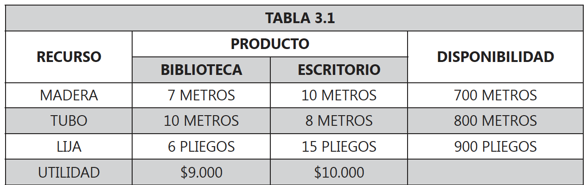
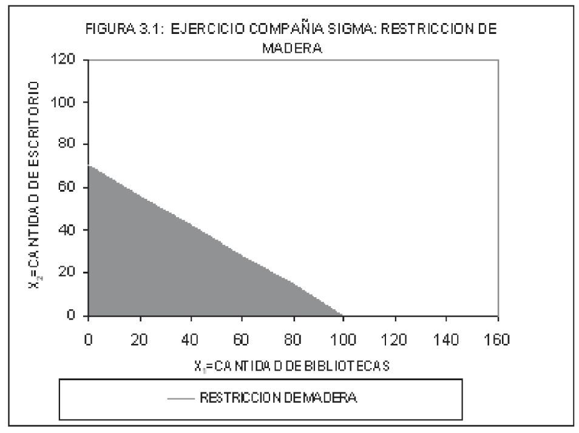
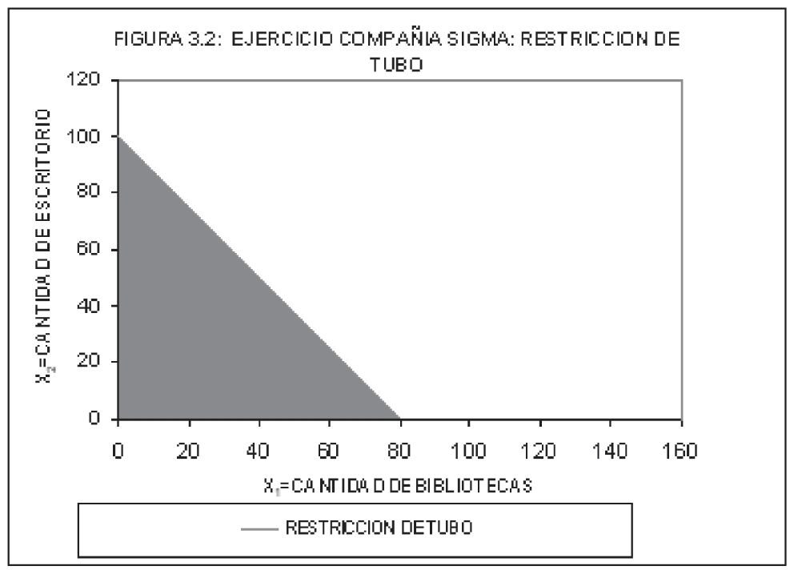
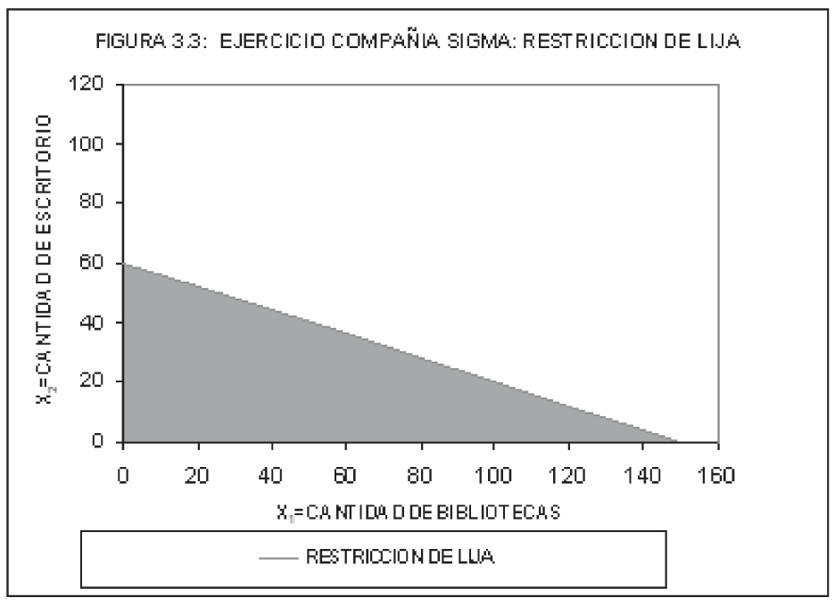
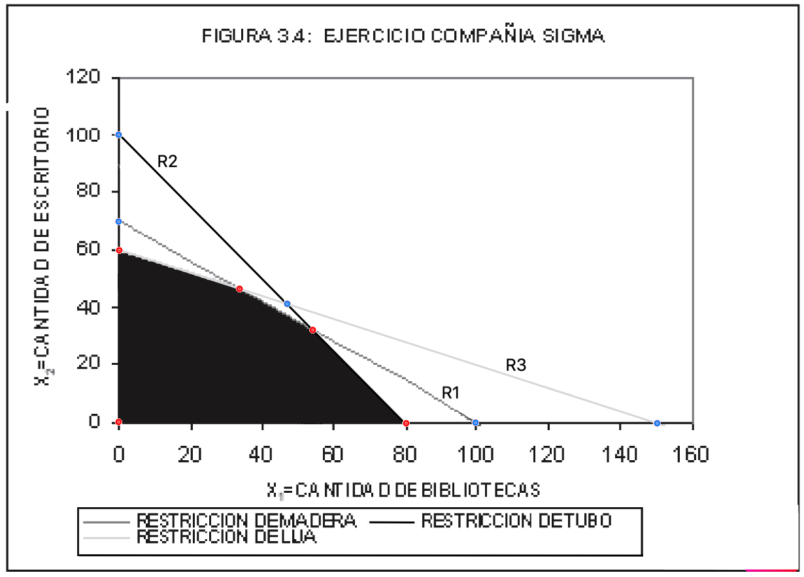
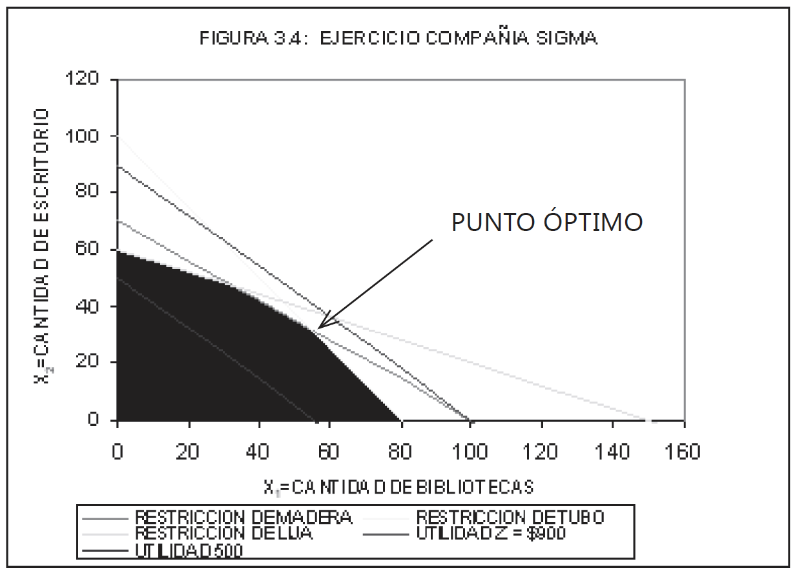
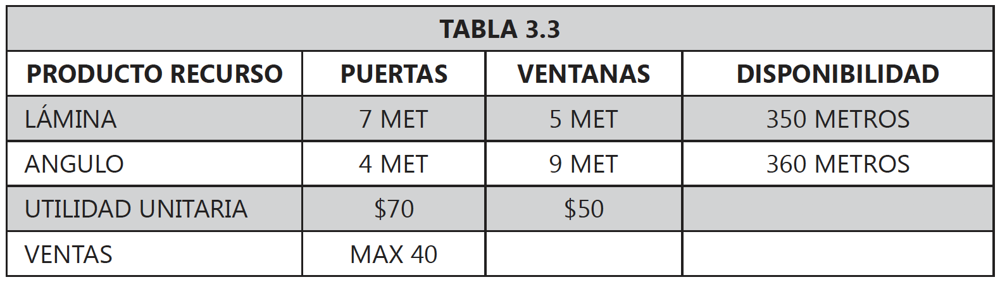
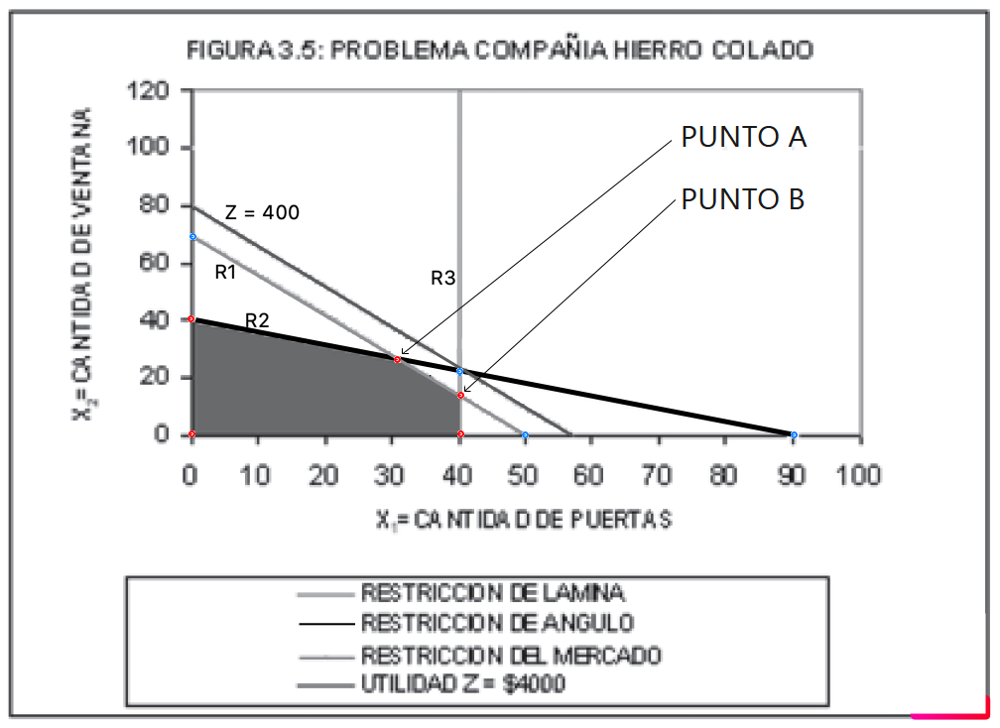
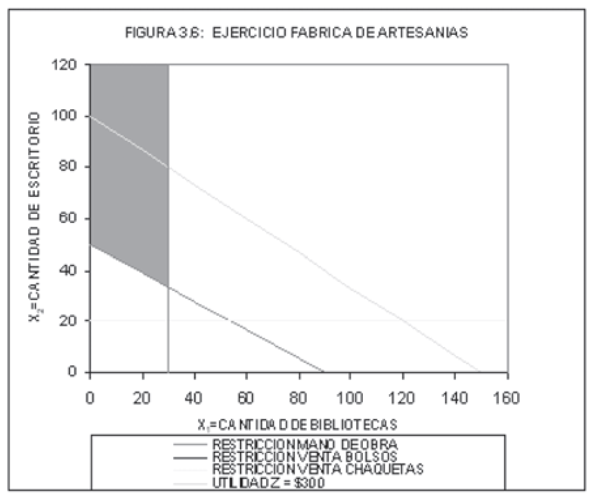
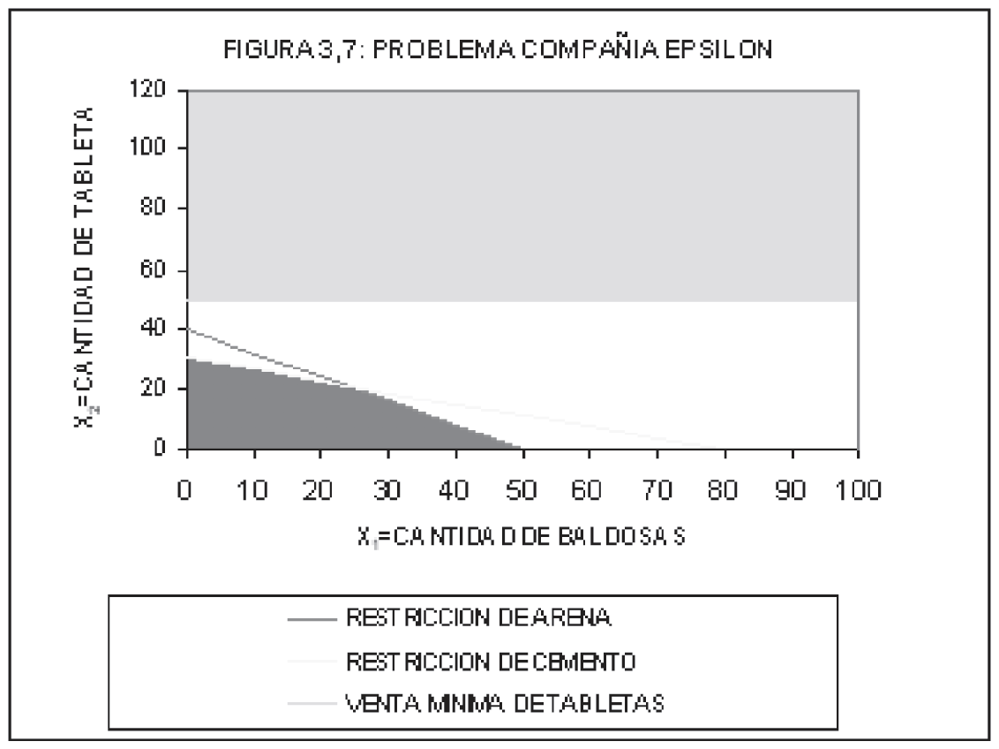

<div style="text-align: justify">
<br>
<br>


```{r setup, include = FALSE}
knitr::opts_chunk$set(echo = TRUE)
knitr::opts_chunk$set(warning = FALSE)
```


----

> ### PRESENTACIÓN
En este capítulo se presenta el método gráfico de solución de problemas de programación loneal incluyendo problemas de maximización y minimización.
>
> ### OBJETIVO GENERAL
Al finalizar el capítulo el estudiante debe estar en capacidad de solucionar un problema de programación lineal utilizando el método gráfico; así como interpretar correctamente la solución y analizar el consumo de recursos.
>
> ### OBJETIVOS ESPECÍFICOS
* Graficar las restricciones con base en ecuaciones lineales para determinar el área factible de solución.
* Graficar la función objetivo para establecer el punto o puntos de solución óptima de problemas de programación lineal.
* Establecer la solución óptima del problema mediante el uso de ecuaciones simultáneas.
* Interpretar la solución del problema con base en el planteamiento y formulación del problema; así como el respectivo análisis de consumo de recursos.
>
> ### COMPETENCIAS
El estudiante tendrá la capacidad de utilizar el método gráfico de solución de problemas de programación lineal; y con base en ésta interpretar el tipo de solución del problema.
>
> ### INDICADORES DE LOGRO
El estudiante deberá demostrar el manejo en el planteamiento de modelos de programación lineal, obtener la solución a través del método gráfico e interpretar la solución.
>
> ### CONOCIMIENTOS PREVIOS
* Gráfica de funciones lineales.
* Solución algebraíca de sistemas de ecuaciones lineales.
* Concepto de máximos y mínimos en una gráfica.

----


# 3.1. PROBLEMAS DE MAXIMIZACIÓN
## 3.1.1. SOLUCIÓN ÓPTIMA ÚNICA
Un problema de programación lineal tiene solución única cuando un solo punto del **área factible** de solución, es la solución óptima del problema. **Ese punto óptimo debe ser un vértice del área factible de solución.**

### EJEMPLO 3.1.1.
La compañía _Sigma_ produce bibliotecas y escritorios para los cuales se ha establecido un precio de venta por unidad de $\$9.000$ y $\$10.000$ respectivamente. Para la producción de dichos artículos la compañía cuenta con una disponibilidad mensual de $700$ metros de madera, $800$ metros de tubo y $900$ pliegos de papel de lija. ¿Qué cantidad de bibliotecas y escritorios se debe fabricar mensualmente si se sabe que una biblioteca consume $7$ metros de madera, $10$ metros de tubo y $6$ pliegos de papel de lija; mientras que para producir un escritorio se requieren $10$ metros de madera, $8$ metros de tubo y $15$ pliegos de papel de lija?

#### SOLUCIÓN.
**Análisis de la información.** Primero se organiza la información en la siguiente tabla.



<br>

**Definición de las variables.** Se debe decidir cuántas bibliotecas y escritorios se deberán producir por mes para lograr un máximo de utilidad; por lo cual las variables de decisión son:

$$
\begin{array}{ll}
x_{1}: \ \text{cantidad de bibliotecas a producir por mes.} \\ 
x_{2}: \ \text{cantidad de escritorios a producir por mes.}
\end{array}
$$

**Modelo matemático completo.** El modelo matemático de programación lineal para la compañía SIGMA queda de la siguiente manera: 

$$
\begin{array}{ll}
\max Z = 9000x_{1} + 10000x_{2} \\  
\text{S.A.} \\  
\ \ 7x_{1} + 10x_{2} \leq 700 \ \text{(metros de madera)} \\ 
10x_{1} + \ \ 8x_{2} \leq 800 \ \text{(metros de tubo)} \\
\ \ 6x_{1} + 15x_{2} \leq 900 \ \text{(pliegos papel lija)} \\
\qquad \ \ x_{1}, x_{2} \geq 0 \quad \text{(no negatividad)}
\end{array}
$$

**Gráfica de las restricciones.** Se grafican las restricciones asumiendo que se satisface la igualdad en éstas. Es decir, para la primera restricción se tiene:

$$7x_{1} + 10x_{2} = 700$$

Ahora, se buscan los puntos de intersección con los ejes. En efecto:
```{r table2, echo=FALSE, message=FALSE, warnings=FALSE, results='asis'}
tabl <- "
| $x_{1}$ | $x_{2}$ |
|:-------:|:-------:|
| $0$     | $70$    |
| $100$   | $0$     |
"
cat(tabl)
```


Luego, usando estos puntos se grafica el área factible de esta restricción. Obsérvese que se ha sombreado toda la región comprendida desde la recta graficada hasta el origen, porque la restricción es menor o igual a $700$, y además las variables de decisión deben ser no-negativas. El área sombreada es donde se garantiza consumir como máximo $700$ metros de madera.



<br>

A continuación se procede de igual manera con la segunda restricción $10x_{1} + 8x_{2} = 800$. Es decir, se asume la igualdad en la restricción, y se buscan los puntos de intersección con los ejes. Éstos son:

| $x_{1}$ | $x_{2}$ |
|:-------:|:-------:|
| $0$     | $100$   |
| $80$    | $0$     |

Se grafica la recta que une estos puntos, donde el área sombreada garantiza consumir como máximo $800$ metros de tubo.



<br>

Finalmente, la tercera restricción $6x_{1} + 15x_{2} = 900$ intersecta a los ejes en los puntos:

| $x_{1}$ | $x_{2}$ |
|:-------:|:-------:|
| $0$     | $60$    |
| $150$   | $0$     |

La gráfica de la región factible para esta restricción se muestra en la siguiente figura.



<br>

**El área factible de solución corresponderá a la intersección de todas las restricciones. Por lo tanto, hay que encontrar los puntos de intersección entre ellas.** Esto significa resolver el sistema de ecuaciones:

$$  
\begin{align*}  
R_{1}: \qquad 7x_{1} + 10x_{2} &= 700 \\
R_{2}: \qquad 10x_{1} + 8x_{2} &= 800 \\
R_{3}: \qquad 6x_{1} + 15x_{2} &= 900
\end{align*}
$$

Luego de resolver, se encuentra los siguientes puntos:

|                 | $x_{1}$ | $x_{2}$ |
|:---------------:|:-------:|:-------:|
| $R_{1} - R_{2}$ | $54.54$ | $31.81$ |
| $R_{1} - R_{3}$ | $33.33$ | $46.66$ |
| $R_{2} - R_{3}$ | $47.06$ | $41.18$ |



<br>

Notar que el punto de intersección entre $R_{2}$ y $R_{3}$ no pertenece a la región factible de solución, al igual que los otros puntos azules. **Son los puntos rojos los que definen los vértices de la región factible de solución y, de acuerdo con un Teorema, son éstos las posibles soluciones óptimas del problema**.

Para encontrar cual de los puntos rojos es la solución óptima, hay que graficar la función objetivo, para distintos valores de $Z$ (esto es equivalente a desplazarla paralelamente en el espacio de variables ($x_{1}$, $x_{2}$). En efecto, consideremos por ejemplo dos valores, $Z = 900.000$ y $Z = 500.000$. La siguiente gráfica muestra las rectas.



<br>

Notar que la recta $Z = 900.000$ queda fuera de la región de solución indicando que con esos recursos no se alcanzará una utilidad de $\$900.000$ pesos. Por otro lado, la recta $Z = 500.000$ atraviesa el área factible de solución, lo que indica que en cualquier combinación de producción entre los dos artículos sobre esta recta quedarían sobrando recursos.

Para hallar el punto óptimo, basta con graficar una sola recta $Z$ y si queda por encima del área factible, se traslada paralelamente hacia el origen hasta cuando toque el primer punto del área factible de solución y si queda cortando el área factible de solución, se traslada paralelamente en sentido contrario al origen hasta cuando toque el ultimo punto del área factible de solución.  

En general, el punto óptimo de un problema de maximización es el punto que se encuentra dentro del área factible de solución y está más lejano del origen teniendo en cuenta la inclinación de la función objetivo, $Z$.

Así, de los $5$ puntos rojos, solo tenemos dos que son los posibles candidatos a ser solución óptima. Para decidir cual de los dos es, evaluamos en la función objetivo y elegimos el que dé un mayor valor. En efecto:

|                 | $x_{1}$ | $x_{2}$ | $Z$           |
|:---------------:|:-------:|:-------:|:-------------:|
| $R_{1} - R_{2}$ | $54.54$ | $31.81$ | $809090.9091$ |
| $R_{1} - R_{3}$ | $33.33$ | $46.66$ | $766666.6664$ |

**Interpretación de la solución.** Basados en la solución anterior, la compañía _SIGMA_ debe producir mensualmente:

$$
\begin{array}{ll}
x_{1} = 54.54 \ \ \text{unidades de bibliotecas} \\ 
x_{2} = 31.81 \ \ \text{unidades de escritorios}
\end{array}
$$

para así obtener una utilidad máxima mensual de $Z = 766666.6664$ unidades monetarias.

**Análisis de Recursos.** Con base en la solución obtenida se puede calcular cuánto de cada recurso se consume y cuánto de cada recurso sobra; tan solo basta reemplazar los valores de las variables en cada una de las restricciones. En efecto:

| RECURSO | DISPONIBLE   | CONSUMO                       | SOBRANTE       |
|:-------:|:------------:|:-----------------------------:|:--------------:|
| MADERA  | $700$ metros | $7*54.54 + 10*31.81 = 700.00$ | $0$ metros     |
| TUBO    | $800$ metros | $10*54.54 + 8*31.81 = 800.00$ | $0$ metros     |
| LIJA    | $900$ metros | $6*54.54 + 15*31.81 = 804.54$ | $95.45$ metros |


## 3.1.2. Solución óptima múltiple
Una solución óptima múltiple se establece cuando al trasladar la recta Z no toca un solo punto extremo del área factible de solución; sino que por el contrario toca un segmento de recta. Cualquier combinación de producción sobre ese segmento de recta, será solución óptima para el problema.

### EJEMPLO 3.1.2.
La compañía _Hierro Colado_ dispone semanalmente para la fabricación de sus artículos de $350$ metros de lámina y $360$ metros de ángulo. Además, se ha establecido que con esos recursos se fabrican puertas y ventanas para los cuales se ha determinado que rinden una contribución a las utilidades de $\$70$ y $\$50$ pesos por unidad respectivamente. También, se sabe por medio de un estudio de consumo de materiales que una puerta requiere de $7$ metros de lámina y $4$ metros de ángulo y que una ventana requiere de $5$ metros de lámina y $9$ metros de ángulo. ¿Qué cantidad de cada artículo se debe fabricar si se sabe que el departamento de mercados estableció que máximo se venderán $40$ puertas?

#### SOLUCIÓN.
**Análisis de la información.** Primero se organiza la información en la siguiente tabla.



<br>

**Definición de las variables.** Se debe decidir cuántas bibliotecas y escritorios se deberán producir por mes para lograr un máximo de utilidad; por lo cual las variables de decisión son:

$$
\begin{array}{ll}
x_{1}: \ \text{cantidad de puertas a fabricar por semana.} \\
x_{2}: \ \text{cantidad de ventanas a fabricar por semana.}
\end{array}
$$

**Modelo matemático completo.** El modelo matemático de programación lineal para la compañía SIGMA queda de la siguiente manera: 

$$
\begin{array}{ll}
\max Z = 70x_{1} + 50x_{2} \\  
\text{S.A.} \\  
7x_{1} + 5x_{2} \leq 350 \ \ \text{(metros de lámina)} \\   
4x_{1} + 9x_{2} \leq 360 \ \ \text{(metros de ángulo)} \\  
\qquad \ \ \ \ x_{1}  \leq \ \ 40 \ \ \text{(venta máxima de puertas)} \\  
\quad \ \ \ x_{1}, x_{2} \geq \ \ \ \ 0 \quad \ \text{(no negatividad)}
\end{array}
$$

**Gráfica de las restricciones.** Se grafican las restricciones asumiendo que se satisface la igualdad en éstas. Es decir, para la primera restricción se tiene:

$$7x_{1} + 5x_{2} = 350$$

Ahora, se buscan los puntos de intersección con los ejes. En efecto:

| $x_{1}$ | $x_{2}$ |
|:-------:|:-------:|
| $0$     | $70$    |
| $50$    | $0$     |

Para la segunda restricción se tiene:

$$4x_{1} + 9x_{2} = 360$$

Luego, se buscan los puntos de intersección con los ejes. En efecto:

| $x_{1}$ | $x_{2}$ |
|:-------:|:-------:|
| $0$     | $40$    |
| $90$    | $0$     |

Para la Tercera restricción se tiene:

$$x_{1} = 40$$

Así, los puntos de intersección con los ejes son:

| $x_{1}$ | $x_{2}$         |
|:-------:|:---------------:|
| $40$    | cualquier valor |

Finalmente, graficamos la función objetivo $Z$ para el valor, por ejemplo, $4.000$. En la siguiente gráfica se observa la región factible, los puntos de intersección, la función objetivo $Z = 400$, y los puntos $A$ y $B$.



<br>

Tal como se observa en la figura, tanto el punto $A$ como el punto $B$ son soluciones óptimas del problema; así como cualquier punto intermedio comprendido entre esos dos puntos. Si se toma la recta $Z = 4.000$, y se traslada paralelamente hacia el área factible de solución hasta que toque el primer punto de dicha área, tocará simultáneamente todos los puntos del segmento de recta $AB$. Por lo tanto se dice que este problema tiene soluciones óptimas múltiples.

Por ejemplo, analizamos el punto $A$ y el punto $B$ para encontrar el valor óptimo de la función objetivo $Z$ y la utilización de recursos en cada caso.

| Punto| $x_{1}$  | $x_{2}$  | $Z$    | RECURSO | DISPONIBLE    | CONSUMO                        | SOBRANTE         |
|:----:|:---------|:---------|:------:|:-------:|:-------------:|:------------------------------:|:----------------:|
| A    | $31.395$ | $26.046$ | $3500$ | LÁMINA  | $350$ metros  | $7*31.395 + 5*26.046 = 350.00$ | $0$ metros       | 
|      |          |          |        | ÁNGULO  | $360$ metros  | $4*31.395 + 9*26.046 = 360.00$ | $0$ metros       |
|      |          |          |        | VENTAS  | $40$ unidades | $31.395$                       | $8.605$ unidades |
| B    | $40$     | $14$     | $3500$ | LÁMINA  | $350$ metros  | $7*40 + 5*14 = 350.00$         | $0$ metros       |
|      |          |          |        | ÁNGULO  | $360$ metros  | $4*40 + 9*14 = 286.00$         | $74$ metros      |
|      |          |          |        | VENTAS  | $40$ unidades | $40$                           | $0$ unidades     |

Notar algo interesante: a pesar que el plan de producción es distinto en ambas soluciones óptimas, y por ende la utilización de recursos, el óptimo de utilidades alcanzado es el mismo! Si probáramos con cualquier otro punto perteneciente al segmento $AB$, obtendríamos un plan productivo óptimo distinto, una utilización de recursos distinta, pero una utilidad máxima igual.

## 3.1.3. Solución óptima no acotada
En este tipo de problemas la solución se presenta en el infinito, ya que por más que se traslade la recta $Z$ paralelamente para buscar el punto más lejano del área factible de solución, nunca llegará. Esto se aprecia fácilmente con la aplicación del siguiente ejercicio.

### EJEMPLO 3.1.3.
Una fábrica de artesanías se dedica a la producción de bolsos y chaquetas, los cuales comercializa directamente a los clientes en la plaza España. La venta de un bolso genera una utilidad de $\$2.000$ y consume $5$ horas de mano de obra; mientras que la venta de una chaqueta genera una utilidad de $\$3.000$ y consume $9$ horas de mano de obra. Por políticas de la compañía se requiere no mantener en ocio a sus trabajadores y por lo tanto se debe consumir en la producción un mínimo de $450$ horas de mano de obra por mes. ¿Qué cantidad de bolsos y chaquetas se debe fabricar, si por estudio de mercados se sabe que mínimo se venderán $20$ chaquetas y como máximo $30$ bolsos por mes?

#### SOLUCIÓN. (Hágalo usted!)



<br>

Tal como se observa en la figura, el área factible de solución es la parte sombreada que termina hacia arriba en el infinito. Para este problema se está buscando un punto máximo, pero, si se trata de trasladar la recta $Z$ en sentido contrario al origen hasta alcanzar el último punto del área factible de solución; no se llegaría nunca, pues este punto se encuentra en el infinito.

## 3.1.4. Problema sin solución óptima
Un problema no tiene solución cuando no tiene área factible de solución; esto es que no hay un solo punto que satisfaga la totalidad de las restricciones del problema. Para que un problema tenga solución debe tener por lo menos un punto común en todas las restricciones.

### EJEMPLO 3.1.4.
La compañía _Epsilon_ produce baldosas y tabletas, las cuales generan una contribución a las utilidades de $\$5.000$ y $\$4.000$ por metro cuadrado respectivamente. Para la producción de dichos artículos se cuenta con una disponibilidad de $200$ metros cuadrados de arena y $240$ metros cuadrados de cemento por semana. ¿Qué cantidad de cada uno de los artículos se debe fabricar si se sabe que para producir un metro cuadrado de baldosas se requieren $4$ metros cuadrados de arena y $3$ metros cuadrados de cemento; mientras que para producir un metro cuadrado de tableta se requieren $5$ metros cuadrados de arena y $8$ metros cuadrados de cemento?. Suponga además, que el cliente garantiza comprar como mínimo $50$ metros cuadrados de tableta.

#### SOLUCIÓN. (Hágalo usted!)



<br>

Como se puede observar en la figura, las primeras dos restricciones tienen un área común, pero ésta no se intercepta en ningún punto con el área factible de la tercera restricción, por lo tanto se concluye que el problema no tiene solución. 

Una explicación más técnica de esta aplicación es que la empresa se comprometió a vender $50$ metros cuadrados de tabletas, sin contar que los recursos (arena y cemento); los cuales no alcanzan para producir esa cantidad. Para que este problema tenga solución hay que incrementar la capacidad de los recursos o disminuir la cantidad a vender.

# 3.2. PROBLEMAS DE MINIMIZACIÓN
Cuando un problema de programación lineal es de minimización y se desea resolver usando el método gráfico, se procede de la misma manera que el de maximización pero teniendo en cuenta que hay que buscar el punto perteneciente a la región factible que esté más cerca del origen. En este tipo de problemas también pueden haber soluciones óptimas únicas, múltiples, no acotadas, o no haber solución óptima.

### EJEMPLO 3.2.1.
_Los Horses_, una empresa dedicada al criadero de caballos de paso, ha establecido que a cada uno de ellos se le debe suministrar diariamente un mínimo de $200$ miligramos de vitamina $A$, un mínimo de $160$ miligramos de vitamina $B$ y un mínimo de $150$ miligramos de vitamina $C$. Los caballos son alimentados con fardos de pasto y mineral, las cuales le cuestan a la compañía $\$300$ por fardo de pasto y $\$500$ por libra de mineral. ¿Qué cantidad de cada alimento se le debe suministrar a cada caballo diariamente? si se sabe que un fardo de pasto contiene $4$ miligramos de vitamina $A$, $2$ miligramos de vitamina $B$ y $5$ miligramos de vitamina $C$; mientras que una libra de mineral contiene $5$ miligramos de vitamina $A$, $8$ miligramos de vitamina $B$ y $3$ miligramos de vitamina $C$.

### EJEMPLO 3.2.2.
_Combustibles Dextra_ produce gasolina y ACPM a un costo de $\$2.000$ y $\$4000$ pesos por galón respectivamente. Mediante un estudio se ha establecido que para producir un galón de gasolina se requieren $4$ horas hombre de trabajo, $6$ horas máquina y $8$ litros de petróleo; mientras que para producir un galón de ACPM se requieren $8$ horas hombre de trabajo, $5$ horas máquina y $10$ litros de petróleo. Además, se sabe que para que no haya subutilización de los recursos se deben consumir mínimo $320$ horas hombre y mínimo $300$ horas máquina al mes. ¿Qué cantidad de cada combustible se debe fabricar si se sabe hay una disponibilidad mensual de $800$ litros de petróleo?

### EJEMPLO 3.2.3.
La compañía _Siderurgia Ltda._ produce un tipo de aleación especial compuesta por sílice y aluminio; los cuales compra a $\$3.000$ y $\$5.000$ por kilogramo respectivamente. Además, se sabe que la utilización de un kilogramo de sílice consume $5$ miligramos de material radioactivo y $2$ litros de agua; mientras que la utilización de un kilogramo de aluminio consume $4$ miligramos de material radioactivo y da lugar a la aparición de $3$ litros de agua. Por política de la compañía se debe consumir mínimo $20$ miligramos de material radiactivo y se cuenta con una disponibilidad de $6$ litros de agua. ¿Qué cantidad de sílice y aluminio se debe utilizar en la aleación si se sabe que se debe utilizar como máximo $8$ kilogramos de sílice y que el gobierno nacional subsidia con $\$15.000$ la utilización de cada kilogramo de aluminio?

### EJEMPLO 3.2.4.
La compañía fabricante de calzado _El Pie Feliz_ ha establecido que máximo venderá $30$ pares de zapatos y como mínimo $40$ pares de zapatillas. Para la producción de estos artículos se cuenta con una disponibilidad mensual de $180$ metros de cuero y se ha establecido que el costo de producción de cada par de zapatos es de $\$5000$ y de cada par de zapatillas es de $\$4000$. Utilice el método gráfico para determinar que cantidad de cada uno de los productos se debe fabricar a fin de minimizar los costos totales de fabricación, si se sabe que un par de zapatos consume $3$ metros de cuero y un par de zapatillas consume $6$ metros de cuero.

# 3.3. PROBLEMAS CON SOLUCIONES DEGENERADAS
Un problema de programación lineal genera solución básica factible degenerada cuando dentro del mismo hay restricciones de carácter redundante; es decir, hay más de una restricción que genera la misma área factible, por lo tanto la solución no varia si se elimina una de estas restricciones (si hay más de dos restricciones que generen la misma área factible, se pueden eliminar todas menos una y la solución no cambiará).

### EJEMPLO 3.3.1.
La compañía _Los Cristales_ produce vidrios florentinos y martillados para los cuales ha establecido un costo de $\$20.000$ y $\$40.000$ por unidad respectivamente (una unidad equivale a un vidrio de $120$ centímetros de ancho, $180$ centímetros de largo y $5$ milímetros de espesor). Para la fabricación de estos productos se cuenta con una disponibilidad semanal de $240$ horas hombre, $420$ horas horno y $480$ unidades de materia prima. Establezca qué cantidad de cada tipo de vidrio se debe fabricar a fin de minimizar el costo de producción si se sabe que para producir un vidrio florentino se requieren $8$ horas-hombre, $6$ horas en el horno y $16$ unidades de materia prima; mientras que para producir un vidrio martillado se requieren $3$ horas hombre, $7$ horas de proceso en el horno y $6$ unidades de materia prima. Suponga, que el departamento de ventas ha pronosticado que mínimo se venderán $40$ vidrios entre los $2$ tipos.