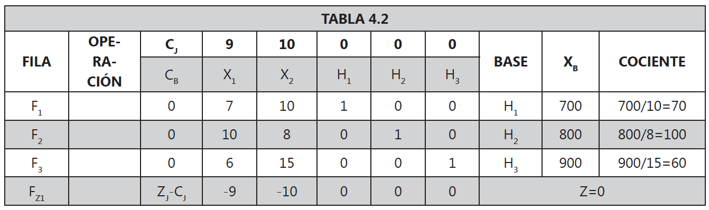
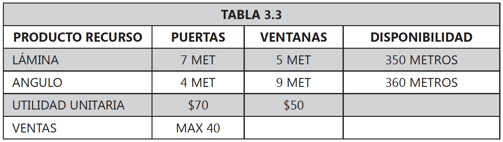

<div style="text-align: justify">
<br>
<br>


```{r setup, include = FALSE}
knitr::opts_chunk$set(echo = TRUE)
knitr::opts_chunk$set(warning = FALSE)
```


----

> ### PRESENTACIÓN
En este capítulo se presenta el método simplex de solución de problemas de programación lineal incluyendo problemas de maximización y minimización.
>
> ### OBJETIVO GENERAL
Al finalizar el capítulo el estudiante debe estar en capacidad de solucionar un problema de programación lineal utilizando el método gráfico; así como interpretar correctamente la solución y analizar el consumo de recursos.
>
> ### OBJETIVOS ESPECÍFICOS
* Manejar las reglas de equivalencia para llevar todas las desigualdades a igualdades.
* Dominar el procedimiento de avance hacai la optimalidad del método simplex.
* Determinar mediante el método simplex el momento en el que se llega a la solución óptima, tanto en problemas de maximización como de minimización.
* Identificar el tipo de solución del problema con el uso del tablero simplex.
* Interpretar soluciones obtenidas.
>
> ### COMPETENCIAS
El estudiante tendrá la capacidad de utilizar el método simplex en la solución de problemas de programación lineal; y con base en ésta interpretar el tipo de solución del provlema, así como el uso de variables de holgura, de exceso y artificiales.
>
> ### INDICADORES DE LOGRO
El estudiante deberá demostrar el manejo en el planteamiento de modelos de programación lineal, obtener la solución a través del método simplex e interpretar la solución.
>
> ### CONOCIMIENTOS PREVIOS
* Gauss Jordan. 
* Vectores y matrices.

----

# 4.1. ALGORITMO SIMPLEX
Para la aplicación y solución de un problema mediante el método simplex se deben tener en cuenta los siguientes pasos:

**PASO 1.** Lleve la función objetivo a maximización mediante la aplicación de la primera regla de la sección 1.6.

**PASO 2.** Transforme todas las restricciones a igualdades de la siguiente manera (esto se realiza para formar los vectores unitarios que generan la primera solución básica factible):

* Restricción $\leq$: sume una variable de holgura, tal como see realizó en la cuarta regla de equivalencia de la sección 1.6.
* Restricción $\geq$: reste una variable sobrante y sume una variable artificial para generar el vector unitario. Penalice (restar) la función objetivo con la variable artificial, asignándole a ésta un coeficiente infinitamente grande. Por ejemplo $-MA_{1}$, donde $M$ tiende al infinito.
* Restricción $=$: sume una variable artificial para geneerar eel vector unitario y penalice la función objetivo (tal como en el caso anterior).

**PASO 3.** LLeve todos los coeficientes al *tablero simplex* tal como se muestra en la tabla 4.1.

* En la fila $C_{j}$ ubique todos los coeficientes de las variables de la función objetivo.
* En la columna $C_{B}$ coloque los coeficientes de la función objetivo, pero sólo los correspondientes a las variables básicas.
* Ubique en la columna *BASE* las variables básicas, que son aquellas que generan dentro de las restricciones los vectores unitarios (siempre serán las variables de holgura y las variables artificales).
* En la columna $X_{B}$ se asignan los valores deel término independiente en cada una de las restricciones (en el tablero inicial).
* Debajo de cada variable ubique el vector de cada una de ellas en las restricciones (coeficientes de las variables en las restricciones).


<br>

**PASO 4.** Evalúe si la solución actual es óptima. Para esto, calcule los $Z_{j} - C_{j}$ de la siguiente manera:

$$Z_{j} - C_{j} = \sum_{B = 1}^m (C_{B}K_{B}) - C_{j}$$
donde $C_{B}$ son los coeficientes de las variables básicas en la función objetivo, $C_{j}$ son los coeficientes de la función objetivo y $K_{B}$ es cada uno dee los vectores de las variables a través de las diferentes soluciones.

Los vectores $C_{B}$ y $K_{B}$ van cambiando cada iteración a medida que se avanza hacia la solución óptima.

**Si todos los $Z_{j} - C_{j}$ son mayores o iguales que cero, la solución se hace óptima.** De lo contrario, continué con el paso 5.

**PASO 5.** Seleccione la variable que entra a la base: entra a la base aquella variable que tenga el $Z_{j} - C_{j}$ más negativo. En caso de haber empate entre dos o más variables, elija alguna de ellas.

**PASO 6.** Seleccione la variable que sale de la base: para esto calcule $\min \frac{X_{B}}{K_{B}}$ teniendo en cuenta sólo aquellos valores de $K_{B}$ mayores que cero (positivos). $K_{B}$ es el vector columna de la variable que entra a la base.

**PASO 7.** Seleccione el pivote: el pivote es aquella posición donde se intercepta la columna de la variable que entra ($K_{B}$) y la fila de la variable que sale.

**PASO 8.** Mediante operaciones matriciales entre filas convierta la posiciópn pivote a uno.

**PASO 9.** Utilizando operaciones matriciales convierta las demás posiciones del vector $K_{B}$ en ceros.

**PASO 10.** Determine nuevamente el vector $C_{B}$ y regrese al paso 4. Continúe con este ciclo hasta que se den las condiciones de optimalidad que pide el cuarto paso.

<br>

# 4.2. PROBLEMAS DE MAXIMIZACIÓN
## 4.2.1. SOLUCIÓN ÚNICA
### EJEMPLO 4.2.1.
La compañía Sigma produce bibliotecas y escritorios para los cuales se ha establecido un precio de venta por unidad de $9.000$ y $10.000$ respectivamente. Para la producción de dichos artículos la compañía cuenta con una disponibilidad mensual de $700$ metros de madera, $800$ metros de tubo y $900$ pliegos de papel de lija. ¿Qué cantidad de bibliotecas y escritorios se debe fabricar mensualmente si se sabe que una biblioteca consume  $7$ metros de madera, $10$ metros de tubo y $6$ pliegos de papel de lija; mientras que para producir un escritorio se requieren $10$ metros de madera, $8$ metros de tubo y $15$ pliegos de papel de lija?

#### SOLUCIÓN.
**Análisis de la información.** Primero se organiza la información en la siguiente tabla.


<br>

**Definición de las variables.** Se debe decidir cuántas bibliotecas y escritorios se deberán producir por mes para lograr un máximo de utilidad; por lo cual las variables de decisión son:

$$
\begin{array}{ll}
x_{1} : \text{cantidad de bibliotecas a producir por mes.}  \\
x_{2} : \text{cantidad de escritorios a producir por mes.}
\end{array}
$$

**Modelo matemático completo.** El modelo matemático de programación lineal para la compañía SIGMA queda de la siguiente manera: 

$$
\begin{array}{ll}
\max Z = 9000x_{1} + 10000x_{2} \\  
\text{S.A.} \\  
\ \ 7x_{1} + 10x_{2} \leq 700 \ \text{(metros de madera)} \\ 
10x_{1} + \ \ 8x_{2} \leq 800 \ \text{(metros de tubo)} \\
\ \ 6x_{1} + 15x_{2} \leq 900 \ \text{(pliegos papel lija)} \\
\qquad \ \ x_{1}, x_{2} \geq 0 \quad \text{(no negatividad)}
\end{array}
$$

**Tablero Simplex.** Para llevar este modelo al tablero simplex se requiere llevar a igualdad todas las restricciones; por lo cual, con base en las reglas de equivalencia a todas las restricciones menores o iguales se le agrega una variable de holgura. El problema queda como aparece a continuación:

$$
\begin{array}{ll}
\max Z = 9000x_{1} + 10000x_{2} + 0H_{1} + 0H_{2} + 0H_{3}\\  
\text{S.A.} \\  
\ \ 7x_{1} + 10x_{2} + H_{1} \ \ \ \ \ \ \ \ \ \ \ \ \ \ \ \ \ \ \ \ = 700 \ \text{(metros de madera)} \\ 
10x_{1} + \ \ 8x_{2} \ \ \ \ \ \ \ \ \ \ + H_{2} \ \ \ \ \ \ \ \ \ \ = 800 \ \text{(metros de tubo)} \\
\ \ 6x_{1} + 15x_{2} \ \ \ \ \ \ \ \ \ \ \ \ \ \ \ \ \ \ \ \ + H_{3} = 900 \ \text{(pliegos papel lija)} \\
\qquad \ \ \ \ \ \ \ \ \ \ \ \ \ \ \ \ \ \ \ \ \ \ \ \ \ \ \ \ \ \ \ x_{1}, x_{2} \geq 0 \quad \text{(no negatividad)}
\end{array}
$$

Como se puede observar, las variables de holgura también entran a formar parte de la función objetivo sin alterarla, por eso aparecen con coeficiente cero. El primer tablero simplex para este problema aparece en la siguiente tabla:



<br>

**Transcribimos el modelo original anterior a R.** 

* Coeficientes de la función objetivo. 
 
```{r}  
C <- c(9000, 10000)  

C  
```

* Matriz de coeficientes de las restricciones

```{r}
A <- matrix(c( 7, 10,
              10,  8,
               6, 15), 
            ncol = 2, 
            byrow = TRUE)

A
```

* Direccion de las desigualdades de las restricciones

```{r}
D <- c("<=", "<=", "<=")

D
```

* Coeficientes lado derecho de las restricciones

```{r}
B <- c(700, 800, 900)

B
```

**Plan optimo de produccion.** Resolvemos

```{r}
#install.packages("lpSolve")
library(lpSolve)

sol <- lp(direction = "max", 
          const.mat = A,
          const.rhs = B,
          objective.in = C, 
          const.dir = D)

sol
```

**Valor optimo de la funcion objetivo.** La utilidad óptima que obtendrá la compañia al producir según el plan óptimo de producción es:

*  Unidades monetarias de utilidad:

$$Z^* = 809090.9$$ 

**Valores optimos para las variables de decision (incluidas las variables auxiliares de holgura).** El plan óptimo de producción es:

```{r}
sol$solution
```

* Bibliotecas a producir por mes (variable basica ya que es distinta de cero).

$$x_1 = 54.54545$$

* Escritorios a producir por mes (variable basica ya que es distinta de cero).  

$$x_2 = 31.81818$$

* Holgura primera restricción: 

```{r}
7*sol$solution[1] + 10*sol$solution[2]
```

Se utilizan los $700$ metros de madera, por lo tanto la primera variable de holgura es:

$$S_1 = 0$$

* Holgura segunda restricción:

```{r}
10*sol$solution[1] + 8*sol$solution[2]
```

Se utilizan los $800$ metros de tubo, por lo tanto la segunda variable de holgura es:

$$S_2 = 0$$ 

* Holgura tercera restriccion: 

```{r}
6*sol$solution[1] + 15*sol$solution[2]
```

Se utilizan $804.5455$ pliegos de papel lija, por lo tabnto la tercera variable de holgura es:

$$S_3 = 900 -  804.5455 = 95.4545$$

Esto significa que sobran $95.4545$ pliegos de papel lija.

<br>

## 4.2.2. SOLUCIÓN ÓPTIMA MÚLTIPLE
### EJEMPLO 4.2.2.
La compañía Hierro Colado dispone semanalmente para la fabricación de sus artículos de $350$ metros de lámina y $360$ metros de ángulo. Además, se ha establecido que con esos recursos se fabrican puertas y ventanas para los cuales se ha determinado que rinden una contribución a las utilidades de $\$70$ y $\$50$ pesos por unidad respectivamente. También, se sabe por medio de un estudio de consumo de materiales que una puerta requieren $7$ metros de lámina y $4$ metros de ángulo y que una ventana requieren $5$ metros de lámina y $9$ metros de ángulo. ¿Qué cantidad de cada artículo se debe fabricar si se sabe que el departamento de mercados estableció que máximo se venderán $40$ puertas?

#### SOLUCIÓN.
**Análisis de la información.** Primero se organiza la información en la siguiente tabla.



<br>

**Definición de las variables.** Se debe decidir cuántas puertas y ventanas se deberán producir por semana para lograr un máximo de utilidad; por lo cual las variables de decisión son:

$$
\begin{array}{ll}
x_{1} : \text{cantidad de puertas a producir por semana.} \\  
x_{2} : \text{cantidad de ventanas a producir por semana.}
\end{array}
$$

**Modelo matemático completo.** El modelo matemático de programación lineal para la compañía queda de la siguiente manera: 


$$
\begin{array}{ll}
\max Z = 70x_{1} + 50x_{2} \\  
\text{S.A.} \\  
7x_{1} + 5x_{2} \leq 350 \ \ \text{(metros de lámina)} \\   
4x_{1} + 9x_{2} \leq 360 \ \ \text{(metros de ángulo)} \\  
\ \ x_{1} \ \ \ \ \ \ \ \ \ \ \ \leq \ 40 \ \ \text{(venta máxima de puertas)} \\  
\quad \ \ \ x_{1}, x_{2} \geq \ \ \ 0 \ \ \text{(no negatividad)}
\end{array}
$$

**Tablero Simplex.** Para llevar este modelo al tablero simplex se requiere llevar a igualdad todas las restricciones; por lo cual, con base en las reglas de equivalencia a todas las restricciones menores o iguales se le agrega una variable de holgura. El problema queda como aparece a continuación:

$$
\begin{array}{ll}
\max Z = 70x_{1} + 50x_{2} + 0H_{1} + 0H_{2} + 0H_{3}\\  
\text{S.A.} \\  
7x_{1} + 5x_{2} + H_{1} \ \ \ \ \ \ \ \ \ \ \ \ \ \ \ \ \ \ =  350 \ \ \text{(metros de lámina)} \\   
4x_{1} + 9x_{2} \ \ \ \ \ \ \ \ \ + H_{2} \ \ \ \ \ \ \ \ \ =  360 \ \ \text{(metros de ángulo)} \\  
\ \ x_{1} \ \ \ \ \ \ \ \ \ \ \ \ \ \ \ \ \ \ \ \ \ \ \ \ \ \ \ \ + H_{3} = \ \ 40 \ \ \text{(venta máxima de puertas)} \\  
\quad \ \ \ \ \ \ \ \ \ \ \ \ \ \ \ \ \ \ \ \ \ \ \ \ \ \ \ \ \ \ x_{1}, x_{2} \geq \ \ \ 0 \ \ \text{(no negatividad)}
\end{array}
$$

Como se puede observar, las variables de holgura también entran a formar parte de la función objetivo sin alterarla, por eso aparecen con coeficiente cero. El primer tablero simplex para este problema aparece en la siguiente tabla:


<br>

**Transcribimos el modelo original anterior a R.** 

* Coeficientes de la función objetivo. 
 
```{r}  
C <- c(70, 50)  

C  
```

* Matriz de coeficientes de las restricciones

```{r}
A <- matrix(c(7, 5,
              4, 9,
              1, 0), 
            ncol = 2, 
            byrow = TRUE)

A
```

* Direccion de las desigualdades de las restricciones

```{r}
D <- c("<=", "<=", "<=")

D
```

* Coeficientes lado derecho de las restricciones

```{r}
B <- c(350, 360, 40)

B
```

**Plan optimo de produccion.** Resolvemos

```{r}
#install.packages("lpSolve")
library(lpSolve)

sol <- lp(direction = "max", 
          const.mat = A,
          const.rhs = B,
          objective.in = C, 
          const.dir = D)

sol
```

**Valor optimo de la funcion objetivo.** La utilidad óptima que obtendrá la compañia al producir según el plan óptimo de producción encontrado es:

*  Unidades monetarias de utilidad:

$$Z^* = 3.500$$ 

**Valores optimos para las variables de decision (incluidas las variables auxiliares de holgura).** El plan óptimo de producción es:

```{r}
sol$solution
```

* Puertas a producir por semana (variable basica ya que es distinta de cero).  

$$x_1 = 40$$

* Ventanas a producir por semana (variable basica ya que es distinta de cero).  

$$x_2 = 14$$

* Holgura primera restricción: 

```{r}
7*sol$solution[1] + 5*sol$solution[2]
```

Se utilizan los $350$ metros de lámina, por lo tanto la primera variable de holgura es:.  

$$S_1 = 0$$

* Holgura segunda restricción:

```{r}
4*sol$solution[1] + 9*sol$solution[2]
```

Se utilizan los $286$ metros de ángulo, por lo tanto la segunda variable de holgura es:  

$$S_2 = 360 - 286 = 74$$ 

Esto significa que sobran $74$ metros de ángulo.


* Holgura tercera restriccion: 

```{r}
1*sol$solution[1] + 0*sol$solution[2]
```

Se venden $40$ puertas, por lo tanto la tercera variable de holgura es: 

$$S_3 = 0$$ 

<br>

## 4.2.3. SOLUCIÓN ÓPTIMA NO ACOTADA
### EJEMPLO 4.2.3.
Una fábrica de artesanías se dedica a la producción de bolsos y chaquetas los cuales comercializa directamente a los clientes en la plaza España. La venta de un bolso genera una utilidad de $\$2000$ y consume $5$ horas de mano de obra; mientras que la venta de una chaqueta genera una utilidad de $\$3000$ y consume $9$ horas de mano de obra. Por políticas de la compañía se requiere de no mantener en ocio a sus trabajadores y por lo tanto se debe consumir en la producción un mínimo de $450$ horas de mano de obra por mes. ¿Qué cantidad de bolsos y chaquetas se debe fabricar, si por estudio de mercados se sabe que mínimo se venderán $20$ chaquetas y como máximo $30$ bolsos por mes?

#### SOLUCIÓN.
**Análisis de la información.** Primero se organiza la información en la siguiente tabla.


<br>

**Definición de las variables.** Se debe decidir cuántos bolsos y chaquetas se deberán producir por mes para lograr un máximo de utilidad; por lo cual las variables de decisión son:

$$
\begin{array}{ll}
x_{1} : \text{cantidad de bolsos a producir por mes.} \\ 
x_{2} : \text{cantidad de chaquetas a producir por mes.}
\end{array}
$$

**Modelo matemático completo.** El modelo matemático de programación lineal para la compañía queda de la siguiente manera: 

$$
\begin{array}{ll}
\max Z = 2000x_{1} + 3000x_{2} \\
\text{S.A.} \\
5x_{1} + 9x_{2} \geq 450 \ \text{(mano de obra)} \\   
\ \ x_{1} \ \ \ \ \ \ \ \ \ \ \  \leq \ \ 30 \ \text{(ventas máxima de bolsos)} \\  
\ \ \ \ \ \ \ \ \ \ \ \ \ x_{2} \geq \ \ 20 \ \text{(venta mínima de chaquetas)} \\  
\quad \ \ \ x_{1}, x_{2} \geq \ \ \ \ 0 \ \text{(no negatividad)}
\end{array}
$$

**Tablero Simplex.** Siguiendo el procedimiento de transformar todas las restricciones en restricciones de igualdad, utilizando las reglas de equivalencia tenemos lo siguiente:

$$
\begin{array}{ll}
\max Z = 2000x_{1} + 3000x_{2} + 0S_{1} + 0H_{1} + 0S_{2}  \\
\text{S.A.} \\    
5x_{1} + 9x_{2} - S_{1} \ \ \ \ \ \ \ \ \ \ \ \ \ \ \ \ \ \ = 450 \ \text{(mano de obra)} \\    
\ \ x_{1} \ \ \ \ \ \ \ \ \ \ \ \ \ \ \ \ \ \ \ + H_{1} \ \ \ \ \ \ \ \ \  = \ \ 30 \ \text{(venta máxima de bolsos)} \\   
\ \ \ \ \ \ \ \ \ \ \ \ \ x_{2} \ \ \ \ \ \ \ \ \ \ \ \ \ \ \ \ \ \ - S_{2} = \ \ 20 \ \text{(venta mínima de chaquetas)} \\   
\quad \ \ \ \ \ \ \ \ \ \ \ \ x_{1}, x_{2}, S_{1}, H_{1}, S_{2} \geq \ \ \ \ 0 \ \text{(no negatividad)}
\end{array}
$$

Como se sabe, el método simplex utiliza vectores unitarios para generar las diferentes soluciones. Las variables $S_{1}$ y $S_{2}$ (variables exceso o superfluo) tienen coeficientes negativos ($-1$) en las restricciones, lo cual no genera vectores unitarios. Para generar el vector unitario en estos casos se debe sumar una variable artifial a estas restricciones consevando la misma igualdad. Estas variables artificiales para que la igualdad se siga cumpliendo deben tomar valor cero; por lo tanto hay que penalizar la función objetivo; con un coeficiente infinitamente grande para estas variables en la función objetivo (en algunos textos a este método se le denomina **Metodo de Penalizacion o de la Gran M**). El modelo a llevar al tablero simplex que da como aparece a continuación (por simplicidad, la función objetivo se ha dividido por $1.000$):

$$
\begin{array}{ll}
\max Z = 2x_{1} + 3x_{2} + 0S_{1} + 0S_{2} - MA_{1} + 0H_{1} - MA_{2} \\ 
\text{S.A.} \\    
5x_{1} + 9x_{2} - \ \ S_{1} \ \ \ \ \ \ \ \ \ \ \ + \ \ \ A_{1} \ \ \ \ \ \ \ \ \ \ \ \ \ \ \ \ \ \ \ \ \ \ \ \ \ = 450 \ \text{(mano de obra)} \\   
\ \ x_{1} \ \ \ \ \ \ \ \ \ \ \ \ \ \ \ \ \ \ \ \ \ \ \ \ \ \ \ \ \ \ \ \ \ \ \ \ \ \ \ \ \ \ \ \ + \ \ H_{1} \ \ \ \ \ \ \ \ \ \ \ \ \ \  = \ \ 30  \ \text{(venta máxima de bolsos)} \\  
\ \ \ \ \ \ \ \ \ \ \ \ \ x_{2} \ \ \ \ \ \ \ \ \ \ \ - \ \ S_{2} \ \ \ \ \ \ \ \ \ \ \ \ \ \ \ \ \ \ \ \ \ \ \ \ + \ \ A_{2} \ \ = \ \ 20 \ \text{(venta mínima de chaquetas)} \\  
\quad \ \ \ \ \ \ \ \ \ \ \ \ \ \ \ \ \ \ \ \ \ \ \ \ \ \ \ \ \ \ \ \ x_{1}, x_{2}, S_{1}, S_{2}, A_{1}, H_{1}, A_{2} \geq \ \ \ \ 0 \ \text{(no negatividad)}
\end{array}
$$

El primer tablero simplex para este problema aparece en la siguiente tabla:


<br>

**Transcribimos el modelo original anterior a R.** 

* Coeficientes de la función objetivo. 
 
```{r}  
C <- c(2000, 3000)  

C  
```

* Matriz de coeficientes de las restricciones

```{r}
A <- matrix(c(5, 9,
              1, 0,
              0, 1), 
            ncol = 2, 
            byrow = TRUE)

A
```

* Direccion de las desigualdades de las restricciones

```{r}
D <- c(">=", "<=", ">=")

D
```

* Coeficientes lado derecho de las restricciones

```{r}
B <- c(450, 30, 20)

B
```

**Plan optimo de produccion.** Resolvemos

```{r}
#install.packages("lpSolve")
library(lpSolve)

sol <- lp(direction = "max", 
          const.mat = A,
          const.rhs = B,
          objective.in = C, 
          const.dir = D)

sol
```

<br>

## 4.2.4. PROBLEMA SIN SOLUCIÓN ÓPTIMA
### EJEMPLO 4.2.4.
La compañía Epsilon produce baldosas y tabletas, las cuales generan una contribución a las utilidades de $\$5.000$ y $\$4.000$ por metro cuadrado respectivamente. Para la producción de dichos artículos se cuenta con una disponibilidad de $200$ metros cuadrados de arena y $240$ metros cuadrados de cemento por semana. ¿Qué cantidad de cada uno de los artículos se debe fabricar si se sabe que para producir un metro cuadrado de baldosas se requieren $4$ metros cuadrados de arena y $3$ metros cuadrados de cemento; mientras que para producir un metro cuadrado de tableta se requieren $5$ metros cuadrados de arena y $8$ metros cuadrados de cemento? Suponga además, que el cliente garantiza comprar como mínimo $50$ metros cuadrados de tableta.

#### SOLUCIÓN.
**Análisis de la información.** Primero se organiza la información en la siguiente tabla.


<br>

**Definición de las variables.** Se debe decidir cuántos metros cuadrados de baldosas y tabletas se deberán producir por semana para lograr un máximo de utilidad; por lo cual las variables de decisión son:

$$
\begin{array}{ll}
x_{1} : \text{metros cuadrados de baldosas a producir por semana.} \\ 
x_{2} : \text{metros cuadrados de tabletas a producir por semana.}
\end{array}
$$

**Modelo matemático completo.** El modelo matemático de programación lineal para la compañía queda de la siguiente manera: 

$$
\begin{array}{ll}
\max Z = 5000x_{1} + 4000x_{2} \\ 
\text{S.A.} \\  
4x_{1} + 5x_{2} \leq 200 \ \text{(arena disponible)} \\   
3x_{1} + 8x_{2} \leq 240 \ \text{(cemento disponible)} \\  
\ \ \ \ \ \ \ \ \ \ \ \ \ x_{2} \geq \ \ 50 \ \text{(venta mínima de tabletas)} \\  
\quad \ \ \ x_{1}, x_{2} \geq \ \ \ \ 0 \ \text{(no negatividad)}
\end{array}
$$

**Tablero Simplex.** Llevando todas las restricciones a igualdades, generando todos los vectores unitarios a que haya lugar y penalizando la función objetivo; el ejercicio se establece así (por simplicidad la función objetivo se ha dividido por $1.000$):

$$
\begin{array}{ll}
\max Z = 5x_{1} + 4x_{2} + 0S_{1} + 0H_{1} + 0H_{2} - MA_{1} \\
\text{S.A.} \\    
4x_{1} + 5x_{2} \ \ \ \ \ \ \ \ \ \ \ + \ H_{1} \ \ \ \ \ \ \ \ \ \ \ \ \ \ \ \ \ \ \ \ \ \ \ \  = 200 \ \text{(arena disponible)} \\   
3x_{1} + 8x_{2} \ \ \ \ \ \ \ \ \ \ \ \ \ \ \ \ \ \ \ \ \ \ \ + \ H_{2} \ \ \ \ \ \ \ \ \ \ \ \  =  240 \ \text{(cemento disponible)} \\  
\ \ \ \ \ \ \ \ \ \ \ \ \ x_{2} - \ \ S_{1} \ \ \ \ \ \ \ \ \ \ \ \ \ \ \ \ \ \ \ \ \ \ \ \ + \ \ A_{1} = \ \ 50 \ \text{(venta mínima de tabletas)} \\  
\quad \quad \quad \quad \quad \ \ \ \ \ \ x_{1}, x_{2}, S_{1}, H_{1}, H_{2}, A_{1} \geq \ \ \ \ 0 \ \text{(no negatividad)}
\end{array}
$$

El primer tablero simplex para este problema aparece en la siguiente tabla:


**Transcribimos el modelo original anterior a R.** 

* Coeficientes de la función objetivo. 
 
```{r}  
C <- c(5000, 4000)  

C  
```

* Matriz de coeficientes de las restricciones

```{r}
A <- matrix(c(4, 5,
              3, 8,
              0, 1), 
            ncol = 2, 
            byrow = TRUE)

A
```

* Direccion de las desigualdades de las restricciones

```{r}
D <- c("<=", "<=", ">=")

D
```

* Coeficientes lado derecho de las restricciones

```{r}
B <- c(200, 240, 50)

B
```

**Plan optimo de produccion.** Resolvemos

```{r}
#install.packages("lpSolve")
library(lpSolve)

sol <- lp(direction = "max", 
          const.mat = A,
          const.rhs = B,
          objective.in = C, 
          const.dir = D)

sol
```

