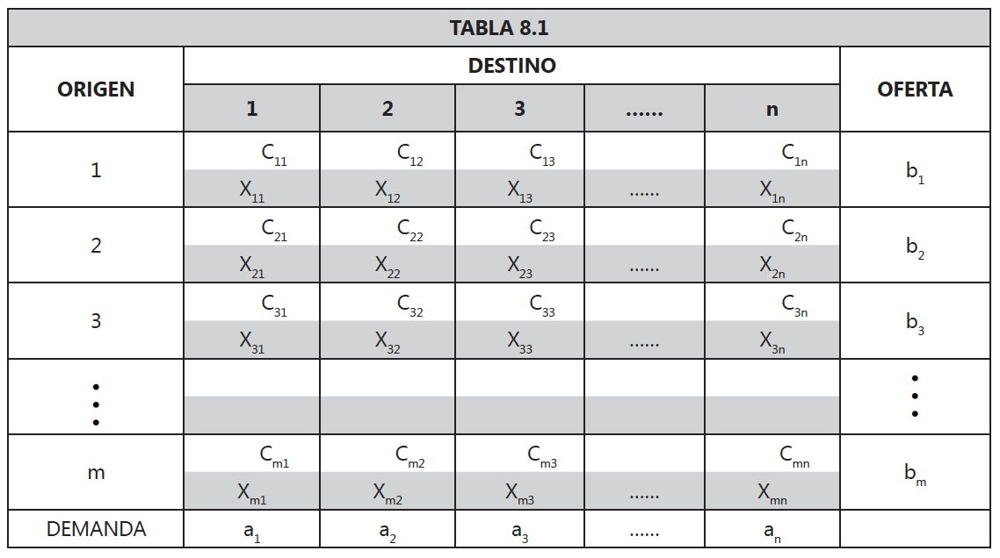
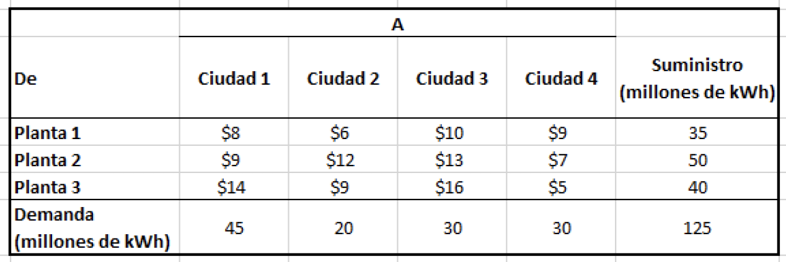
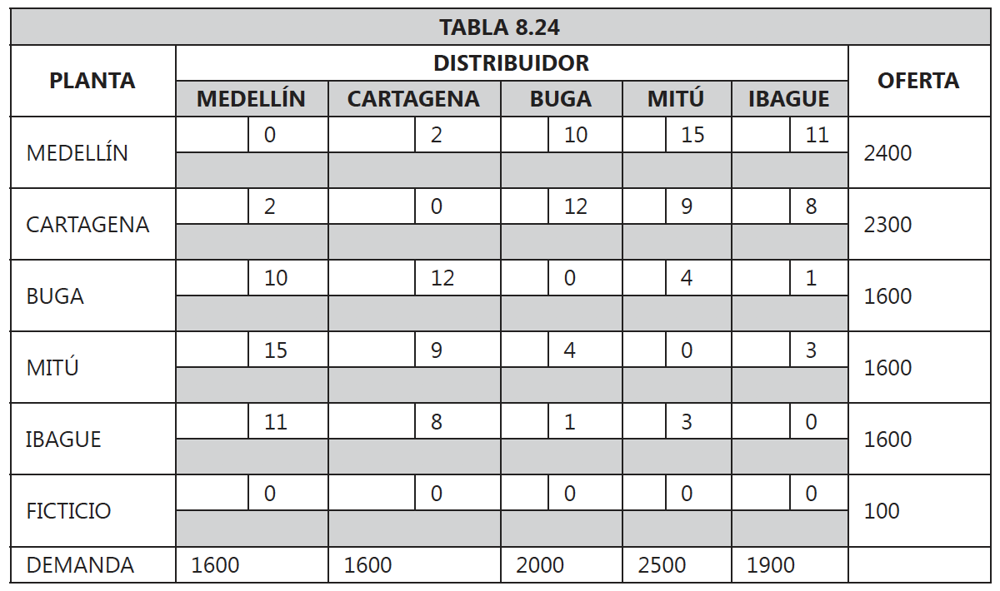
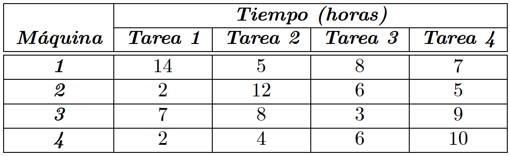

<div style="text-align: justify">
<br>
<br>


```{r setup, include = FALSE}
knitr::opts_chunk$set(echo = TRUE)
knitr::opts_chunk$set(warning = FALSE)
```


----

> ### PRESENTACIÓN
En el presente capítulo se presenta el proceso de consecución desoluciones de problemas de programación lineal que tienen que ver con el problema del transporte, el problema del trasbordo y el problema de asignación.
>
> ### OBJETIVO GENERAL
Al finalizar el capítulo el estudiante debe estar en capacidad de obtener la solución óptima de un problema transporte, un problema de trasbordo y un problema de asignación.
>
> ### OBJETIVOS ESPECÍFICOS
* Entender la estructura general de un problema de transporte, trasbordo y asignación.
* Obtener las condiciones de equilibrio de un problema de transporte, trasbordo y asignación.
* Generar la primera solución básica factible para un problema de transporte, trasbordo y asignación.
* Aplicar correctamente el procedimiento para obtener la solución óptima de un problema de transporte, trasbordo y asignación.
* Interpretar correctamente las soluciones óptimas obtenidas de un problema de transporte, trasbordo y asignación.
>
> ### COMPETENCIAS
El estudiante tendrá la capacidad de obtener soluciones óptimas a problemas de transporte, trasbordo y asignación.
>
> ### INDICADORES DE LOGRO
El estudiante deberá demostrar el manejo de los procedimientos para obtener soluciones óptimas a problemas de transporte, trasbordo y asignación.
>
> ### CONOCIMIENTOS PREVIOS
* Planteamiento de problemas de programación lineal.
* Estructura general de las matrices.

----


Existen cierto tipo de problemas de programación lineal que debido a su estructura hacen que el método simplex sea un algoritmo poco eficiente para su solución (esto no quiere decir que un problema de este tipo no se pueda solucionar mediante el algoritmo simplex). Dentro de este tipo de problemas se encuentran los tratados en este capítulo como lo son: el modelo del transporte, el modelo de trasbordo y el modelo de asignación. Para este tipo de problemas se han creado algoritmos especiales para su solución.


# 6.1. EL MODELO DE TRANSPORTE
## 6.1.1.ESTRUCTURA GENERAL

El desarrollo de este tipo de problemas consiste en determinar qué cantidad de un determinado artículo se debe enviar desde $m$ orígenes, hasta $n$ destinos. Además, se sabe que cada origen tiene una disponibilidad u oferta y que cada destino tienen una demanda. El objetivo final es minimizar los costos totales de transporte generados por la cantidad enviada de cada origen a cada destino (por lógica se conoce el costo de transportar una unidad de cada origen a cada destino). En la siguiente tabla se presenta la estructura general de la información para aplicar el modelo de transporte.



De la tabla anterior se puede definir lo siguiente:

$$ 
\begin{array}{ll}
m = \text{Número de orígenes.} \\
n = \text{Número de destinos.} \\
b_i = \text{Oferta del origen} \ i \ (\text{donde} \ i = 1, 2, 3,\cdots , m). \\
a_j = \text{Demanda del destino} \ j \ (\text{donde} \ j = 1, 2, 3,\cdots , n). \\
C_{ij} = \text{Costo unitario de transporte de una unidad del origen} \ i \ \text{al destino} \ j. \\
X_{ij} = \text{Variable de decisión que denota la cantidad enviada del origen} \ i \ \text{al destino} \ j.
\end{array}
$$

Con base en las anteriorte definiciones, se expresa el modelo del transporte en forma generalizada de la siguiente manera: 
$$
\begin{array}{ll}
\min Z = \sum_{i = 1}^m \sum_{j = 1}^n C_{ij}X_{ij} \\
\text{S.A.} \\
\sum_{j = 1}^n X_{ij} = b_i, \ \forall i = 1,2,3,\cdots,m \ \ \text{(Garantiza la capacidad de origen)} \\
\sum_{i = 1}^m X_{ij} = a_j, \ \forall j = 1,2,3,\cdots,n \ \ \ \text{(Garantiza la demanda de los destinos)} \\
\sum_{j = 1}^n a_{j \ \ } = \ \sum_{i = 1}^m b_i \ \ \ \ \ \ \ \ \ \ \ \ \ \ \ \ \ \ \ \ \ \ \ \text{(Restricción de equilibrio entre oferta y demanda)} \\
\ \ \ \ \ \ \ \ \ \ x_{ij} \geq 0 \ \ \ \ \ \ \ \ \ \ \ \ \ \ \ \ \ \ \ \ \ \ \ \ \ \ \ \ \ \ \ \ \ \ \ \text{(Restricciones de no negatividad)} 
\end{array}
$$

### EJEMPLO 6.1. 
_PowerCo_ tiene tres centrales eléctricas que cubren las necesidades de cuatro ciudades. Cada central suministra los siguientes kilowatts-hora (kWh) de electricidad: **Planta 1 -** $35$ millones, **Planta 2 -** $50$ millones, **Planta 3 -** $40$ millones. Las demandas de potencia máxima en las ciudades, que ocurren al mismo tiempo ($2$ p.m.), son las siguientes (en kWh): **Ciudad 1 -** $45$ millones, **Ciudad 2 -** $20$ millones, **Ciudad 3 -** $30$ millones, **Ciudad 4 -** $30$ millones. Los costos por enviar un millon de kWh de electricidad desde cada planta a cada cuidad, dependen de la distancia que debe viajar la electricidad, y son los siguientes: $\$8$ desde la Planta 1 a la Ciudad 1, $\$6$ hacia la Ciudad 2, $\$10$ hacia la Ciudad 3 y $\$9$ hacia la Ciudad 4; $\$9$ desde la Planta 2 hacia la Ciudad 1, $\$12$ hasta la Ciudad 2, $\$13$ hasta la Ciudad 3, y $\$7$ hasta la Ciudad 4; finalmente, desde la Planta 3 hasta cada una de las cuatro ciudades son respectivamente $\$14$, $\$9$, $\$16$ y $\$5$.

(a) Resuma en una tabla la información entregada.
(b) Formule un problema de Programación Lineal para minimizar el costo de satisfacer la demanda de potencia
máxima de electricidad de cada ciudad.
(c) Encuentre una solución factible inicial para el problema.
(d) Interprete los resultados óptimos obtenidos.  

#### SOLUCIÓN.
**Tabla Resumen.** La tabla a continuación resumen la información del problema.



<br>

**Definicion de las variables de decisión.** Sean las siguientes las variables de decisión del problema:
$$
\begin{array}{ll}
x_{11} : \text{millones de kWh producidos por la planta 1, enviados a la ciudad 1.} \\ 
x_{12} : \text{millones de kWh producidos por la planta 1, enviados a la ciudad 2.} \\  
x_{13} : \text{millones de kWh producidos por la planta 1, enviados a la ciudad 3.} \\  
x_{14} : \text{millones de kWh producidos por la planta 1, enviados a la ciudad 4.} \\   
x_{21} : \text{millones de kWh producidos por la planta 2, enviados a la ciudad 1.} \\  
x_{22} : \text{millones de kWh producidos por la planta 2, enviados a la ciudad 2.} \\  
x_{23} : \text{millones de kWh producidos por la planta 2, enviados a la ciudad 3.} \\  
x_{24} : \text{millones de kWh producidos por la planta 2, enviados a la ciudad 4.} \\  
x_{31} : \text{millones de kWh producidos por la planta 3, enviados a la ciudad 1.} \\ 
x_{32} : \text{millones de kWh producidos por la planta 3, enviados a la ciudad 2.} \\ 
x_{33} : \text{millones de kWh producidos por la planta 3, enviados a la ciudad 3.} \\ 
x_{34} : \text{millones de kWh producidos por la planta 3, enviados a la ciudad 4.}  
\end{array}
$$

<br>

De manera resumida podemos definir las 12 variables anteriores mediante una sola expresión. En efecto, para $i = 1, 2, 3$ y $j = 1, 2, 3, 4$, sea:
$$
 x_{ij} : \text{millones de kWh producidos por la planta} \ i, \ \text{enviados a la ciudad} \ j.
$$

<br>

**Modelo matemático completo.** En base a la definición anterior para las variables de decisión, y a la información entregada, matemáticamente el modelo de Programación Lineal a resolver es el siguiente: 
$$
\begin{array}{ll}
\min Z = \ \ 8x_{11} + \ \ 6x_{12} + 10x_{13} + 9x_{14} \\
\ \ \ \ \ \ \ \ \ \ + \ \ 9x_{21} + 12x_{22} + 13x_{23} + 7x_{24} \\
\ \ \ \ \ \ \ \ \ \ + 14x_{31} + \ \ 9x_{32} + 16x_{33} + 5x_{34} \\
\text{S.A.} \\
\ \ \ \ \ \ \ \ \ \ x_{11} + x_{12} + x_{13} + x_{14} = 35 \ \text{(suministro planta 1).} \\     
\ \ \ \ \ \ \ \ \ \ x_{21} + x_{22} + x_{23} + x_{24} = 50 \ \text{(suministro planta 2).} \\    
\ \ \ \ \ \ \ \ \ \ x_{31} + x_{32} + x_{33} + x_{34} = 40 \ \text{(suministro planta 3).} \\    
\ \ \ \ \ \ \ \ \ \ x_{11} + x_{21} + x_{31} \ \ \ \ \ \ \ \ \ \ = 45 \ \text{(demanda ciudad 1).} \\    
\ \ \ \ \ \ \ \ \ \ x_{12} + x_{22} + x_{32} \ \ \ \ \ \ \ \ \ \ = 20 \ \text{(demanda ciudad 2).} \\    
\ \ \ \ \ \ \ \ \ \ x_{13} + x_{23} + x_{33} \ \ \ \ \ \ \ \ \ \ = 30 \ \text{(demanda ciudad 3).} \\    
\ \ \ \ \ \ \ \ \ \ x_{14} + x_{24} + x_{34} \ \ \ \ \ \ \ \ \ \ = 30 \ \text{(demanda ciudad 4).} \\      
\ \ \ \ \ \ \ \ \ \ \ \ \ \ \ \ \ \ \ \ \ \ \ \ \ \ \ \ \ \ \ \ \ \ \ \ \ \ \ \ \  x_{ij} \geq \ \ 0 \ \text{(no negatividad de las variables).}
\end{array}
$$

<br>

**Transcribimos el modelo anterior a R.** 

* Matriz de costos
```{r}
cost_mat_1 <- matrix(c( 8,  6, 10, 9,
                        9, 12, 13, 7,
                       14,  9, 16, 5), 
                     ncol = 4, 
                     byrow = TRUE)

cost_mat_1
```

* Direccion de las desigualdades de las restricciones para las filas (oferta)
```{r}
row_constr_signs_1 <- c("==", "==", "==")

row_constr_signs_1
```

* Coeficientes de las restricciones para las filas (oferta)
```{r}
row_rhs_1 <- c(35, 50, 40)

row_rhs_1
```

* Direccion de las desigualdades de las restricciones para las columnas (demanda)
```{r}
col_constr_signs_1 <- c("==", "==", "==", "==")

col_constr_signs_1
```

* Coeficientes de las restricciones para las columnas (demanda)
```{r}
col_rhs_1 <- c(45, 20, 30, 30)

col_rhs_1
```

<br>

**Resolvemos.** 
```{r}
#install.packages("lpSolve")
library(lpSolve)

solucion_1 <- lp.transport(cost.mat = cost_mat_1,
                           direction = "min",
                           row.signs = row_constr_signs_1,
                           row.rhs = row_rhs_1,
                           col.signs = col_constr_signs_1,
                           col.rhs = col_rhs_1, 
                           presolve = 0,
                           compute.sens = 0)

solucion_1$solution
```

<br>

**Valores óptimos para las variables de decisión.** (Plan optimo de transporte)

* millones de kWh producidos por la planta 1 son transportados a la ciudad 2.  

$$x_{12} = 10$$

* millones de kWh producidos por la planta 1 son transportados a la ciudad 3.  

$$x_{13} = 25$$

* millones de kWh producidos por la planta 2 son transportados a la ciudad 1.  

$$x_{21} = 45$$

* millones de kWh producidos por la planta 2 son transportados a la ciudad 3.  

$$x_{23} = 5$$

* millones de kWh producidos por la planta 3 son transportados a la ciudad 2.  

$$x_{32} = 10$$

* millones de kWh producidos por la planta 3 son transportados a la ciudad 4.  

$$x_{34} = 30$$

<br>

**Costo mínimo asociado al plan de transporte.**
```{r}
solucion_1
```

$$Z^* = \$1.020$$

<!-- ### EJEMPLO 6.2.  -->
<!-- Suponga en el problema anterior que la demanda para la Ciudad 1 se redujo a $40$ millones de kWh. -->

<!-- (a) Formule un problema de Programación Lineal equilibrado para minimizar el costo de satisfacer la demanda de potencia máxima de electricidad de cada ciudad. -->
<!-- (b) Encuentre una solución factible inicial para el problema. -->
<!-- (c) Interprete los resultados óptimos obtenidos. -->

<!-- #### SOLUCIÓN. -->
<!-- En este caso, debido a que la demanda disminuyó en una de las ciudades, nos enfrentamos a un problema de transporte que no está equilibrado. Por lo tanto, debemos equilibrarlo. Para esto, es necesario incluir un punto de demanda ficticio, que demande los 5 millones de kWh de capacidad sin uso. En efecto, el problema queda formulado ahora así: -->

<!-- **Definición de las variables de decisión.** Sean las siguientes las variables de decisión del problema: -->
<!-- $$ -->
<!-- \begin{array}{ll} -->
<!-- x_{11} : \text{millones de kWh producidos por la planta 1, enviados a la ciudad 1.} \\  -->
<!-- x_{12} : \text{millones de kWh producidos por la planta 1, enviados a la ciudad 2.} \\   -->
<!-- x_{13} : \text{millones de kWh producidos por la planta 1, enviados a la ciudad 3.} \\   -->
<!-- x_{14} : \text{millones de kWh producidos por la planta 1, enviados a la ciudad 4.} \\ -->
<!-- x_{15} : \text{millones de kWh producidos por la planta 1, enviados a la ciudad 5 (ficticia).} \\ -->
<!-- x_{21} : \text{millones de kWh producidos por la planta 2, enviados a la ciudad 1.} \\   -->
<!-- x_{22} : \text{millones de kWh producidos por la planta 2, enviados a la ciudad 2.} \\   -->
<!-- x_{23} : \text{millones de kWh producidos por la planta 2, enviados a la ciudad 3.} \\   -->
<!-- x_{24} : \text{millones de kWh producidos por la planta 2, enviados a la ciudad 4.} \\  -->
<!-- x_{25} : \text{millones de kWh producidos por la planta 2, enviados a la ciudad 5 (ficticia).} \\ -->
<!-- x_{31} : \text{millones de kWh producidos por la planta 3, enviados a la ciudad 1.} \\  -->
<!-- x_{32} : \text{millones de kWh producidos por la planta 3, enviados a la ciudad 2.} \\  -->
<!-- x_{33} : \text{millones de kWh producidos por la planta 3, enviados a la ciudad 3.} \\  -->
<!-- x_{34} : \text{millones de kWh producidos por la planta 3, enviados a la ciudad 4.} \\ -->
<!-- x_{35} : \text{millones de kWh producidos por la planta 3, enviados a la ciudad 5 (ficticia).} -->
<!-- \end{array} -->
<!-- $$ -->

<!-- De manera resumida podemos definir las 15 variables anteriores mediante una sola expresión. En efecto, para $i = 1, 2, 3$ y $j = 1, 2, 3, 4, 5$, sea: -->
<!-- $$ -->
<!--  x_{ij} : \text{millones de kWh producidos por la planta} \ i, \ \text{enviados a la ciudad} \ j. -->
<!-- $$ -->

<!-- <br> -->

<!-- **Modelo matemático completo.** En base a la definición anterior para las variables de decisión, y a la información entregada, matemáticamente el modelo de Programación Lineal a resolver es el siguiente:  -->
<!-- $$ -->
<!-- \begin{array}{ll} -->
<!-- \min Z = \ \ 8x_{11} + \ \ 6x_{12} + 10x_{13} + 9x_{14} + 0x_{15} \\ -->
<!-- \ \ \ \ \ \ \ \ \ \ + \ \ 9x_{21} + 12x_{22} + 13x_{23} + 7x_{24} + 0x_{25}   \\ -->
<!--  \ \ \ \ \ \ \ \ \ \ + 14x_{31} + \ \ 9x_{32} + 16x_{33} + 5x_{34} + 0x_{35}  \\ -->
<!-- \text{S.A.} \\ -->
<!-- x_{11} + x_{12} + x_{13} + x_{14} + x_{15} = 35 \ \text{(suministro planta 1).} \\      -->
<!-- x_{21} + x_{22} + x_{23} + x_{24} + x_{25} = 50 \ \text{(suministro planta 2).} \\     -->
<!-- x_{31} + x_{32} + x_{33} + x_{34} + x_{35} = 40 \ \text{(suministro planta 3).} \\     -->
<!-- x_{11} + x_{21} + x_{31} \ \ \ \ \ \ \ \ \ \ \ \ \ \ \ \ \ \ \ \ = 40 \ \text{(demanda ciudad 1).} \\     -->
<!-- x_{12} + x_{22} + x_{32} \ \ \ \ \ \ \ \ \ \ \ \ \ \ \ \ \ \ \ \ = 20 \ \text{(demanda ciudad 2).} \\     -->
<!-- x_{13} + x_{23} + x_{33} \ \ \ \ \ \ \ \ \ \ \ \ \ \ \ \ \ \ \ \ = 30 \ \text{(demanda ciudad 3).} \\     -->
<!-- x_{14} + x_{24} + x_{34} \ \ \ \ \ \ \ \ \ \ \ \ \ \ \ \ \ \ \ \ = 30 \ \text{(demanda ciudad 4).} \\  -->
<!-- x_{15} + x_{25} + x_{35} \ \ \ \ \ \ \ \ \ \ \ \ \ \ \ \ \ \ \ \ = \ \ 5 \ \text{(demanda ciudad ficticia 5).} \\ -->
<!-- \ \ \ \ \ \ \ \ \ \ \ \ \ \ \ \ \ \ \ \ \ \ \ \ \ \ \ \ \ \ \ \ \ \ \ \ \ \ \ \ \  x_{ij} \geq \ \ 0 \ \text{(no negatividad de las variables).} -->
<!-- \end{array} -->
<!-- $$ -->

<!-- <br> -->

<!-- **Transcribimos el modelo anterior a R.**  -->

<!-- * Matriz de costos -->
<!-- ```{r} -->
<!-- cost_mat_2 <- matrix(c( 8,  6, 10, 9, 0, -->
<!--                         9, 12, 13, 7, 0, -->
<!--                        14,  9, 16, 5, 0), ncol = 5, byrow = TRUE) -->

<!-- cost_mat_2 -->
<!-- ``` -->

<!-- * Direccion de las desigualdades de las restricciones para las filas (oferta) -->
<!-- ```{r} -->
<!-- row_constr_signs_2 <- c("==", "==", "==") -->

<!-- row_constr_signs_2 -->
<!-- ``` -->

<!-- * Coeficientes de las restricciones para las filas (oferta) -->
<!-- ```{r} -->
<!-- row_rhs_2 <- c(35, 50, 40) -->

<!-- row_rhs_2 -->
<!-- ``` -->

<!-- * Direccion de las desigualdades de las restricciones para las columnas (demanda) -->
<!-- ```{r} -->
<!-- col_constr_signs_2 <- c("==", "==", "==", "==", "==") -->

<!-- col_constr_signs_2 -->
<!-- ``` -->

<!-- * Coeficientes de las restricciones para las columnas (demanda) -->
<!-- ```{r} -->
<!-- col_rhs_2 <- c(40, 20, 30, 30, 5) -->

<!-- col_rhs_2 -->
<!-- ``` -->

<!-- <br> -->

<!-- **Resolvemos.**  -->
<!-- ```{r} -->
<!-- #install.packages("lpSolve") -->
<!-- #library(lpSolve) -->

<!-- solucion_2 <- lp.transport(cost.mat = cost_mat_2, -->
<!--                            direction = "min", -->
<!--                            row.signs = row_constr_signs_2, -->
<!--                            row.rhs = row_rhs_2, -->
<!--                            col.signs = col_constr_signs_2, -->
<!--                            col.rhs = col_rhs_2,  -->
<!--                            presolve = 0) -->

<!-- solucion_2$solution -->
<!-- ``` -->

<!-- <br> -->

<!-- **Valores óptimos para las variables de decisión.** (Plan optimo de produccion) -->

<!-- * millones de kWh producidos por la planta 1 son transportados a la ciudad 2.   -->

<!-- $$x_{12} = 10$$ -->

<!-- * millones de kWh producidos por la planta 1 son transportados a la ciudad 3.   -->

<!-- $$x_{13} = 25$$ -->

<!-- * millones de kWh producidos por la planta 2 son transportados a la ciudad 1.   -->

<!-- $$x_{21} = 40$$ -->

<!-- * millones de kWh producidos por la planta 2 son transportados a la ciudad 3.   -->

<!-- $$x_{23} = 5$$ -->

<!-- * millones de kWh producidos por la planta 2 son transportados a la ciudad 5.   -->

<!-- $$x_{25} = 5$$ -->

<!-- * millones de kWh producidos por la planta 3 son transportados a la ciudad 2.   -->

<!-- $$x_{32} = 10$$ -->

<!-- * millones de kWh producidos por la planta 3 son transportados a la ciudad 4.   -->

<!-- $$x_{34} = 30$$ -->

<!-- <br> -->

<!-- **Costo mínimo asociado al plan de transporte.** -->
<!-- ```{r} -->
<!-- solucion_2 -->
<!-- ``` -->

<!-- $$Z^* = \$975$$ -->

<!-- Notar que debido a que $x_{25} = 5$, se tiene que hay $5$ millones de kWh de capacidad de la planta 2 que no se usan. Tanto las capacidades de las otras dos plantas, como las demandas de las cuatro ciudades reales, son completamente satisfechas. -->

<br>

# 6.2. EL MODELO DE TRASBORDO
## 6.2.1 ESTRUCTURA GENERAL
El modelo del transporte visto en la sección anterior considera que una ruta directa entre un origen y un destino genera el costo mínimo, mientras que el modelo del trasbordo no considera envíos directos de los orígenes hacia los destinos sino que evalúa la posibilidad de hacer envíos entre orígenes y entre destinos. Es decir, la nueva formulación tiene la característica adicional de permitir que un envío (parcial o completo) pase en forma transitoria por otras fuentes y destinos antes de que llegue por último a su destino designado.

Esto supone que cada evento o nodo de la red del transporte se puede considerar como un origen, un destino, un origen provisional o un destino provisional. Por lo tanto, todos los orígenes se deben establecer como destinos y todos los destinos se deben considerar como orígenes, lo que significa que la cantidad de orígenes y la cantidad de destinos en este modelo es igual a la suma de orígenes y destinos del modelo del transporte original. Para este modelo obviamente se requiere de la información de costos de transporte entre orígenes y entre destinos; además, de necesitar calcular los costos desde cada destino a cada origen. Generalmente no es lo mismo transportar desde $A$ hasta $B$, que desde 
$B$ hasta $A$, es posible que las rutas y vías por donde se transite no sean las mismas.

Este modelo considera que para que sea posible el paso transitorio o provisional de la mercancía, se debe aprovisionar a cada origen y cada destino de una cantidad de almacenaje de reserva. El procedimiento a seguir lleva los siguientes pasos:

**PASO 1.** Establecer la cantidad de reserva que se deja en todo origen y todo destino original. Esta cantidad de reserva $R$ se determina de la siguiente manera:
$$R = \max \{\sum_{j = 1}^n a_j; \sum_{i = 1}^m b_i \}$$
esto quiere decir que el valor de la cantidad de reserva es el máximo valor entre la suma de todas las demandas y la suma de todas las ofertas.

**PASO 2.** A la oferta de cada origen y la demanda de cada destino se le suma la cantidad de reserva $R$.

**PASO 3.** Colocar todos los destinos como orígenes asignándole una oferta igual a la cantidad de reserva $R$.

**PASO 4.** Colocar todos los orígenes como destinos asignándole una demanda igual a la cantidad de reserva $R$.

**PASO 5.** Establecer las condiciones de equilibrio entre oferta y demanda tal como se hace en el modelo del transporte.

**PASO 6.** Aplicar el mismo procedimiento del modelo del transporte para obtener una primera solución básica factible y luego llegar a la solución optima.

### EJEMPLO 6.2.
Una empresa de electrodomésticos fabrica neveras en sus dos plantas (Medellín y Cartagena) en los cuales hay una capacidad de producción de $800$ y $700$ unidades mensuales respectivamente. El producto se comercializa a través de tres distribuidores ubicados en Buga, Mitú e Ibagué, para los cuales se ha establecido una demanda mensual de $400$, $900$ y $300$ neveras respectivamente. Además, se ha establecido que el costo de transportar una nevera Medellín a Buga es $\$10$, a Mitú es $\$15$ y a Ibagué es $\$11$; mientras que el costo unitario de transportar cada nevera de Cartagena a Buga es $\$12$, a Mitú es $\$9$ y a Ibagué es $\$8$. 

Se acepta transportes entre plantas y entre distribuidores, razón por la cual se requiere de la información de costos de transporte de cada nevera entre las plantas y entre los distribuidores. Así, suponga que el costo de transportar una nevera entre Medellín y Cartagena es $\$2$, entre Buga y Mitú es $\$4$, entre Buga e Ibagué es $\$1$ y entre Mitú e Ibagué es $\$3$.

Se han definido los costos de transportar en un solo sentido y se necesita también en sentido contrario, para simplificar esta información se supondrá que el costo de transportar una nevera en sentido contrario a los sitios establecidos es el mismo (mismo costo de Medellín a Cartagena que de Cartagena a Medellín, como se dijo anteriormente, no siempre es así).

#### SOLUCIÓN.
**PASO 1.** Establecer la cantidad de reserva. La suma de demandas es $400 + 900 + 300 = 1.600$, mientras que la suma de ofertas es $800 + 700 = 1500$. Por lo tanto la cantidad de reserva es: $R = \max \{1.600;1.500\} = 1600$.

**PASO 2.** A la oferta de cada origen y la demanda de cada destino se le suma la cantidad de reserva $R = 1.600$. Las ofertas quedan asi: Medellín con $2.400$ y Cartagena queda con $2.300$; mientras que las demandas se convierten en: Buga con $2.000$, Mitú con $2.500$ e Ibagué con $1.900$.

**PASO 3.** Colocar todos los destinos como orígenes asignándole una oferta igual a la cantidad de reserva $R$. Al colocar los destinos (distribuidores) Buga, Mitú e Ibagué como orígenes (plantas) quedan con una oferta de $1.600$ unidades.

**PASO 4.** Colocar todos los orígenes como destinos asignándole una demanda igual a la cantidad de reserva $R$. Cuando se colocan los orígenes (Plantas) Medellín y Cartagena como destinos (distribuidores) se les asigna una demanda de $1.600$ unidades.

**PASO 5.** Establecer las condiciones de equilibrio entre oferta y demanda tal como se hace en el modelo del transporte. 

En la siguiente tabla aparece el problema transformado en condiciones de equilibrio; además de aparecer los costos unitarios de transporte.



<br>

**Definición de las variables de decisión.** Sean las siguientes las variables de decisión del problema transformado:
$$
\begin{array}{ll}
x_{11} : \text{cantidad mensual de neveras producidos por el origen 1, enviados al destino 1.} \\ 
x_{12} : \text{cantidad mensual de neveras producidos por el origen 1, enviados al destino 2.} \\  
x_{13} : \text{cantidad mensual de neveras producidos por el origen 1, enviados al destino 3.} \\  
x_{14} : \text{cantidad mensual de neveras producidos por el origen 1, enviados al destino 4.} \\
x_{15} : \text{cantidad mensual de neveras producidos por el origen 1, enviados al destino 5.} \\
x_{21} : \text{cantidad mensual de neveras producidos por el origen 2, enviados al destino 1.} \\  
x_{22} : \text{cantidad mensual de neveras producidos por el origen 2, enviados al destino 2.} \\  
x_{23} : \text{cantidad mensual de neveras producidos por el origen 2, enviados al destino 3.} \\  
x_{24} : \text{cantidad mensual de neveras producidos por el origen 2, enviados al destino 4.} \\ 
x_{25} : \text{cantidad mensual de neveras producidos por el origen 2, enviados al destino 5.} \\
x_{31} : \text{cantidad mensual de neveras producidos por el origen 3, enviados al destino 1.} \\ 
x_{32} : \text{cantidad mensual de neveras producidos por el origen 3, enviados al destino 2.} \\ 
x_{33} : \text{cantidad mensual de neveras producidos por el origen 3, enviados al destino 3.} \\ 
x_{34} : \text{cantidad mensual de neveras producidos por el origen 3, enviados al destino 4.} \\
x_{35} : \text{cantidad mensual de neveras producidos por el origen 3, enviados al destino 5.} \\
x_{41} : \text{cantidad mensual de neveras producidos por el origen 4, enviados al destino 1.} \\ 
x_{42} : \text{cantidad mensual de neveras producidos por el origen 4, enviados al destino 2.} \\ 
x_{43} : \text{cantidad mensual de neveras producidos por el origen 4, enviados al destino 3.} \\ 
x_{44} : \text{cantidad mensual de neveras producidos por el origen 4, enviados al destino 4.} \\
x_{45} : \text{cantidad mensual de neveras producidos por el origen 4, enviados al destino 5.} \\
x_{51} : \text{cantidad mensual de neveras producidos por el origen 5, enviados al destino 1.} \\ 
x_{52} : \text{cantidad mensual de neveras producidos por el origen 5, enviados al destino 2.} \\ 
x_{53} : \text{cantidad mensual de neveras producidos por el origen 5, enviados al destino 3.} \\ 
x_{54} : \text{cantidad mensual de neveras producidos por el origen 5, enviados al destino 4.} \\
x_{55} : \text{cantidad mensual de neveras producidos por el origen 5, enviados al destino 5.} \\
x_{61} : \text{cantidad mensual de neveras producidos por el origen (ficticio) 6, enviados al destino 1.} \\ 
x_{62} : \text{cantidad mensual de neveras producidos por el origen (ficticio) 6, enviados al destino 2.} \\ 
x_{63} : \text{cantidad mensual de neveras producidos por el origen (ficticio) 6, enviados al destino 3.} \\ 
x_{64} : \text{cantidad mensual de neveras producidos por el origen (ficticio) 6, enviados al destino 4.} \\
x_{65} : \text{cantidad mensual de neveras producidos por el origen (ficticio) 6, enviados al destino 5.}
\end{array}
$$

De manera resumida podemos definir las 30 variables anteriores mediante una sola expresión. En efecto, para $i = 1, 2, 3, 4, 5, 6$ y $j = 1, 2, 3, 4, 5$, sea:
$$
 x_{ij} : \text{cantidad mensual de neveras producidos por el origen} \ i, \ \text{enviados al destino} \ j.
$$

<br>

**Modelo matemático completo.** En base a la definición anterior para las variables de decisión, y a la información entregada, matemáticamente el modelo de Programación Lineal a resolver es el siguiente: 
$$
\begin{array}{ll}
\min Z = \ \              0x_{11} + \ \ 2x_{12} +    10x_{13} +    15x_{14} +    11x_{15} \\
\ \ \ \ \ \ \ \ \ \ + \ \ 2x_{21} + \ \ 0x_{22} +    12x_{23} + \ \ 9x_{24} + \ \ 8x_{25} \\
\ \ \ \ \ \ \ \ \ \ +    10x_{31} +    12x_{32} + \ \ 0x_{33} + \ \ 4x_{34} + \ \ 1x_{35} \\
\ \ \ \ \ \ \ \ \ \ +    15x_{41} + \ \ 9x_{42} + \ \ 4x_{43} + \ \ 0x_{44} + \ \ 3x_{45} \\
\ \ \ \ \ \ \ \ \ \ +    11x_{51} + \ \ 8x_{52} + \ \ 1x_{53} + \ \ 3x_{54} + \ \ 0x_{55} \\
\ \ \ \ \ \ \ \ \ \ + \ \ 0x_{61} + \ \ 0x_{62} + \ \ 0x_{63} + \ \ 0x_{64} + \ \ 0x_{65} \\
\text{S.A.} \\
\ \ \ \ \ \ \ \ \ \ x_{11} + x_{12} + x_{13} + x_{14} + x_{15} \ \ \ \ \ \ \ \ \ \ = 2400 \ \text{(oferta origen 1).} \\     
\ \ \ \ \ \ \ \ \ \ x_{21} + x_{22} + x_{23} + x_{24} + x_{25} \ \ \ \ \ \ \ \ \ \ = 2300 \ \text{(oferta origen 2).} \\    
\ \ \ \ \ \ \ \ \ \ x_{31} + x_{32} + x_{33} + x_{34} + x_{35} \ \ \ \ \ \ \ \ \ \ = 1600 \ \text{(oferta origen 3).} \\ 
\ \ \ \ \ \ \ \ \ \ x_{41} + x_{42} + x_{43} + x_{44} + x_{45} \ \ \ \ \ \ \ \ \ \ = 1600 \ \text{(oferta origen 4).} \\ 
\ \ \ \ \ \ \ \ \ \ x_{51} + x_{52} + x_{53} + x_{54} + x_{55} \ \ \ \ \ \ \ \ \ \ = 1600 \ \text{(oferta origen 5).} \\ 
\ \ \ \ \ \ \ \ \ \ x_{61} + x_{62} + x_{63} + x_{64} + x_{65} \ \ \ \ \ \ \ \ \ \ = \ \ 100 \ \text{(oferta origen ficticio 6).} \\ 
\ \ \ \ \ \ \ \ \ \ x_{11} + x_{21} + x_{31} + x_{41} + x_{51} + x_{61} = 1600 \ \text{(demanda destino 1).} \\    
\ \ \ \ \ \ \ \ \ \ x_{12} + x_{22} + x_{32} + x_{42} + x_{52} + x_{62} = 1600 \ \text{(demanda destino 2).} \\    
\ \ \ \ \ \ \ \ \ \ x_{13} + x_{23} + x_{33} + x_{43} + x_{53} + x_{63} = 2000 \ \text{(demanda destino 3).} \\    
\ \ \ \ \ \ \ \ \ \ x_{14} + x_{24} + x_{34} + x_{44} + x_{54} + x_{64} = 2500 \ \text{(demanda destino 4).} \\ 
\ \ \ \ \ \ \ \ \ \ x_{15} + x_{25} + x_{35} + x_{45} + x_{55} + x_{65} = 1900 \ \text{(demanda destino 5).} \\
\ \ \ \ \ \ \ \ \ \ \ \ \ \ \ \ \ \ \ \ \ \ \ \ \ \ \ \ \ \ \ \ \ \ \ \ \ \ \ \ \ \ \ \ \ \ \ \ \ \ \ \ \ \ \ \ \ \ \ \ x_{ij} \geq \ \ \ \ \ \ 0 \ \text{(no negatividad de las variables).}
\end{array}
$$

<br>


**Transcribimos el modelo anterior a R.** 

* Matriz de costos
```{r}
cost_mat_3 <- matrix(c( 0,  2, 10, 15, 11,
                        2,  0, 12,  9,  8,
                       10, 12,  0,  4,  1,
                       15,  9,  4,  0,  3,
                       11,  8,  1,  3,  0,
                        0,  0,  0,  0,  0), ncol = 5, byrow = TRUE)

cost_mat_3
```

* Direccion de las desigualdades de las restricciones para las filas (oferta)
```{r}
row_constr_signs_3 <- c("==", "==", "==", "==", "==", "==")

row_constr_signs_3
```

* Coeficientes de las restricciones para las filas (oferta)
```{r}
row_rhs_3 <- c(2400, 2300, 1600, 1600, 1600, 100)

row_rhs_3
```

* Direccion de las desigualdades de las restricciones para las columnas (demanda)
```{r}
col_constr_signs_3 <- c("==", "==", "==", "==", "==")

col_constr_signs_3
```

* Coeficientes de las restricciones para las columnas (demanda)
```{r}
col_rhs_3 <- c(1600, 1600, 2000, 2500, 1900)

col_rhs_3
```

<br>

**Resolvemos.**
```{r}
#install.packages("lpSolve")
#library(lpSolve)

solucion_3 <- lp.transport(cost.mat = cost_mat_3,
                           direction = "min",
                           row.signs = row_constr_signs_3,
                           row.rhs = row_rhs_3,
                           col.signs = col_constr_signs_3,
                           col.rhs = col_rhs_3, 
                           presolve = 0)

solucion_3$solution
```

<br>

**Valores optimos para las variables de decision.** (Plan optimo de transporte)

La solución encontrada se interpreta de la siguiente manera: obsérvese de la diagonal (mismo origen y mismo destino) que todas sus casillas absorbieron la reserva de $1.600$ unidades, excepto la celda correspondiente a Cartagena. Este hecho es justamente lo que genera la operación de trasbordo, en este caso entre las plantas.

* La planta de Medellín envía $400$ unidades a la planta de Cartagena. Esta asignación es la que genera el trasbordo:  

$$x_{12} = 400$$

* La planta de Medellín envía $400$ unidades a Buga:  

$$x_{13} = 400$$

* La planta de Cartagena envía $800$ unidades directamente al distribuidor Mitú:  

$$x_{24} = 800$$

* La planta de Cartagena envía $300$ unidades directamente al distribuidor Ibagué.  

$$x_{25} = 300$$

* La demanda de Mitú no se satisface en $100$ unidades:  

$$x_{64} = 100$$

<br>

**Costo mínimo asociado al plan de transporte.**
```{r}
solucion_3
```

$$Z^* = \$ 14.400$$

<br>

# 6.3. EL MODELO DE ASIGNACIÓN
## 6.3.1.ESTRUCTURA GENERAL

El modelo de asignación es otra variante del modelo del transporte en el que se considera en forma generalizada la asignación de $m$ trabajos a $n$ máquinas. Este tipo de problemas también se puede resolver mediante la técnica del modelo del transporte tomando uno como oferta en todos los orígenes y en todos los destinos. La estructura general de este modelo es como se presenta a continuación:

$$
\begin{array}{ll}
\min Z = \sum_{i = 1}^m \sum_{j = 1}^n C_{ij}X_{ij} \\ 
\text{S.A.} \\
\sum_{j = 1}^n X_{ij} = 1, \ \forall i = 1,2,3,\cdots,m \ \ \text{(Garantiza la asignación de cada trabajo)} \\   
\sum_{i = 1}^m X_{ij} = 1, \ \forall j = 1,2,3,\cdots,n \ \ \text{(Garantiza un trabajo a cada máquina)}  \\
\ \ \ \ \ \ \ \ \ X_{ij} = 0 \ \ \text{ó} \ \ X_{ij} = 1 \ \ \ \ \ \ \ \ \ \ \ \ \ \ \ \ \text{(Posibles valores de las variables)}
\end{array}
$$

Obsérvese que este modelo es una aplicación del modelo del transporte en donde las ofertas y demandas son iguales a uno. Además, la condición necesaria en este modelo es que la variable es binaria, ya que sólo puede tomar valores de cero ó uno. Es decir, $X_{ij} = 0$, si no se asigna el trabajo $i$ a la maquina $j$ y $X_{ij} = 1$ si se asigna el trabajo $i$ a la máquina $j$.

### EJEMPLO 6.3.
_MachineCo_ tiene cuatro máquinas y cuatro tareas por completar. Cada máquina se debe asignarcpara completar una tarea. El tiempo requerido para preparar cada máquina para completar cada tarea se muestra en la tabla a continuación.



<br>

_MachineCo_ desea reducir el tiempo de preparación total necesario para completar las cuatro tareas.

(a) Formule un problema de Programación Lineal acorde con los objetivos de la empresa.
(b) Encuentre una solución óptima para este problema de asignación.
(c) Interprete los resultados óptimos obtenidos.

#### SOLUCIÓN.
**Definicion de las variables de decision.** Sean las siguientes las variables de decisión del problema:
$$
\begin{array}{ll}
x_{11} : \text{máquina 1 asignada a la tarea 1.} \\ 
x_{12} : \text{máquina 1 asignada a la tarea 2.} \\  
x_{13} : \text{máquina 1 asignada a la tarea 3.} \\  
x_{14} : \text{máquina 1 asignada a la tarea 4.} \\
x_{21} : \text{máquina 2 asignada a la tarea 1.} \\  
x_{22} : \text{máquina 2 asignada a la tarea 2.} \\  
x_{23} : \text{máquina 2 asignada a la tarea 3.} \\  
x_{24} : \text{máquina 2 asignada a la tarea 4.} \\ 
x_{31} : \text{máquina 3 asignada a la tarea 1.} \\ 
x_{32} : \text{máquina 3 asignada a la tarea 2.} \\ 
x_{33} : \text{máquina 3 asignada a la tarea 3.} \\ 
x_{34} : \text{máquina 3 asignada a la tarea 4.} \\
x_{41} : \text{máquina 4 asignada a la tarea 1.} \\
x_{42} : \text{máquina 4 asignada a la tarea 2.} \\ 
x_{43} : \text{máquina 4 asignada a la tarea 3.} \\
x_{44} : \text{máquina 4 asignada a la tarea 4.}
\end{array}
$$

De manera resumida podemos definir las 16 variables anteriores mediante una sola expresión. En efecto, para $i = 1, 2, 3, 4$ y $j = 1, 2, 3, 4$, sea:
$$
 x_{ij} : \text{máquina} \ i, \ \text{asignada a la tarea} \ j.
$$

<br>

**Modelo matemático completo.** En base a la definición anterior para las variables de decisión, y a la información entregada, matemáticamente el modelo de Programación Lineal a resolver es el siguiente: 
$$
\begin{array}{ll}
\min Z = 14x_{11} + \ \ 5x_{12} + 8x_{13} + \ \ 7x_{14} \\
\ \ \ \ \ \ \ \ \ \ + \ \ 2x_{21} + 12x_{22} + 6x_{23} + \ \ 5x_{24} \\
\ \ \ \ \ \ \ \ \ \ + \ \ 7x_{31} + \ \ 8x_{32} + 3x_{33} + \ \ 9x_{34} \\
\ \ \ \ \ \ \ \ \ \ + \ \ 2x_{41} + \ \ 4x_{42} + 6x_{43} + 10x_{44} \\ 
\text{S.A.} \\
\ \ \ \ \ \ \ \ \ \ x_{11} + x_{12} + x_{13} + x_{14} = 1 \ \ \text{(restricción de máquina 1).} \\     
\ \ \ \ \ \ \ \ \ \ x_{21} + x_{22} + x_{23} + x_{24} = 1 \ \ \text{(restricción de máquina 2).} \\    
\ \ \ \ \ \ \ \ \ \ x_{31} + x_{32} + x_{33} + x_{34} = 1 \ \ \text{(restricción de máquina 3).} \\   
\ \ \ \ \ \ \ \ \ \ x_{41} + x_{42} + x_{43} + x_{44} = 1 \ \ \text{(restricción de máquina 4).} \\   
\ \ \ \ \ \ \ \ \ \ x_{11} + x_{21} + x_{31} + x_{41} = 1 \ \ \text{(restricción de trabajo 1).} \\   
\ \ \ \ \ \ \ \ \ \ x_{12} + x_{22} + x_{32} + x_{42} = 1 \ \ \text{(restricción de trabajo 2).} \\       
\ \ \ \ \ \ \ \ \ \ x_{13} + x_{23} + x_{33} + x_{43} = 1 \ \ \text{(restricción de trabajo 3).} \\       
\ \ \ \ \ \ \ \ \ \ x_{42} + x_{24} + x_{34} + x_{44} = 1 \ \ \text{(restricción de trabajo 4).} \\       
\ \ \ \ \ \ \ \ \ \ \ \ \ \ \ \ \ \ \ \ \ \ \ x_{ij} = 0 \ \ \text{o} \ \ x_{ij} = 1 \ \ \text{(posibles valores de las variables).} 
\end{array}
$$

<br>

**Transcribimos el modelo anterior a R.** 

* Matriz de costos
```{r}
cost_mat_4 <- matrix(c(14,  5, 8,  7,
                        2, 12, 6,  5,
                        7,  8, 3,  9,
                        2,  4, 6, 10), ncol = 4, byrow = TRUE)
cost_mat_4
```

<br>

**Resolvemos.**
```{r}
#install.packages("lpSolve")
#library(lpSolve)

solucion_4 <- lp.assign(cost.mat = cost_mat_4, 
                        direction = "min", 
                        presolve = 0, 
                        compute.sens = 0)


solucion_4$solution
```

<br>

**Valores optimos para las variables de decision.** (Plan óptimo de asignación)

* Máquina 1 no es asignada a la tarea 1.  

$$x_{11} = 0$$

* Máquina 1 si es asignada a la tarea 2.  

$$x_{12} = 1$$

* Máquina 1 no es asignada a la tarea 3.  

$$x_{13} = 0$$

* Máquina 1 no es asignada a la tarea 4.  

$$x_{14} = 0$$

* Máquina 2 no es asignada a la tarea 1.  

$$x_{21} = 0$$

* Máquina 2 no es asignada a la tarea 2.  

$$x_{22} = 0$$

* Máquina 2 no es asignada a la tarea 3.  

$$x_{23} = 0$$

* Máquina 2 si es asignada a la tarea 4.  

$$x_{24} = 1$$

* Máquina 3 no es asignada a la tarea 1.  

$$x_{31} = 0$$

* Máquina 3 no es asignada a la tarea 2.  

$$x_{32} = 0$$

* Máquina 3 si es asignada a la tarea 3.  

$$x_{33} = 1$$

* Máquina 3 no es asignada a la tarea 4.  

$$x_{34} = 0$$

* Máquina 4 si es asignada a la tarea 1.  

$$x_{41} = 1$$

* Máquina 4 no es asignada a la tarea 2.  

$$x_{42} = 0$$

* Máquina 4 no es asignada a la tarea 3.  

$$x_{43} = 0$$

* Máquina 4 no es asignada a la tarea 4.  

$$x_{44} = 0$$

<br>

**Costo mínimo asociado al plan de asignación.**
```{r}
solucion_4
```

El tiempo mínimo de preparación asociado a esta asignación óptima es de horas.

$$Z^* = 15 \ \ \text{horas}$$

